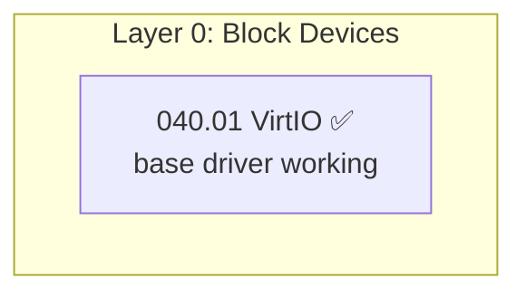

# Synchronize TODO Master + Sub-Files

Analyze a TODO master file (e.g., `TODO-040-Filesystem.md`) alongside every TODO file
in its corresponding sub-directory (e.g., `TODO-040-Filesystem/`). Fix implementation
order, section numbering, and cross-file inconsistencies. Optionally update the
global index (`TODO-000-INDEX.md`).

## When to Run

- After creating or deleting TODO sub-files
- After moving sections from the master into sub-files (or vice versa)
- When sub-files have been added by other agents and the master is stale
- Periodically to keep the master roadmap accurate
- Before starting a new implementation phase

## Input

A **master TODO file path**, e.g., `todo/010-Kernel-Foundations/TODO-040-Filesystem.md`.
The workflow automatically discovers the sub-directory from the master's base number.

## Steps

### 1. Discover all files

1. Read the **master TODO file** in full.
2. List the corresponding **sub-directory** (same base number, e.g., `TODO-040-Filesystem/`).
3. Read the **first 30 lines** of every sub-file to extract:
   - File number (e.g., `040.01`, `040.02`)
   - Title (H1 heading)
   - Goal blockquote
   - Completion status (scan for `[x]` vs `[ ]` ratios)
4. Read the **global index** (`TODO-000-INDEX.md`).

### 2. Build an inventory table

Create a working inventory of every section and sub-file:

```markdown
| Number | Source          | Title                    | Status      | In Master Roadmap? | In Phase Table? | In Priority? | In OS Comp? |
|--------|----------------|--------------------------|-------------|--------------------|-----------------|--------------|-------------|
| 040.01 | sub-file       | VirtIO Block Driver      | ⬜ pending  | ✅                  | ✅               | ✅            | ✅           |
| 040.12 | sub-file       | Btrfs                    | ⬜ pending  | ❌ MISSING          | ❌ MISSING       | ❌ MISSING    | ❌ MISSING   |
| §3.6   | master §3.6    | Win32 File API           | ⬜ pending  | ✅                  | ✅               | ✅            | ✅           |
| §8.11  | master §8.11   | NVMe Driver (deleted)    | 🗑️ removed  | ✅ STALE            | ✅ STALE         | ✅ STALE      | —           |
```

Flag:
- **MISSING**: Item exists in a sub-file or master section but is not listed in the master's roadmap/phase/priority/comparison tables.
- **STALE**: Item is listed in the master but the corresponding sub-file or section has been deleted or moved.
- **MISMATCH**: Item status differs between the master table and the actual section/sub-file.

### 3. Fix the master roadmap table

The **TODO Completion Roadmap (Cross-File)** table near the top of the master lists all
sub-files with their scope descriptions.

**Rules:**
- Every sub-file in the sub-directory **must** appear in this table.
- Files that no longer exist **must** be removed.
- Files must be listed in **numeric order** by file number (e.g., `040.01`, `040.02`, …, `040.16`).
- The `Scope` column must match the sub-file's Goal blockquote (first sentence).
- The master file itself should always be the first row.
- Use consistent column widths (align with dashes).

**Format:**
```markdown
> | File                            | Scope                                             |
> | ------------------------------- | ------------------------------------------------- |
> | `TODO-040-Filesystem.md`        | Master file — sections, priorities, OS comparison |
> | `TODO-040.01-VirtIO.md`         | VirtIO block driver hardening                     |
```

### 4. Fix section numbering in the master

Sections that are **inline in the master** (not in sub-files) should have consistent numbering.

**Rules:**
- Top-level sections use `## N.` numbering (e.g., `## 6.`, `## 7.`, `## 8.`)
- Sub-sections use `### N.M` (e.g., `### 8.1`, `### 8.2`)
- Numbering must be **sequential within each group** — no gaps inside a section block
- Gaps **between** major groups are fine (e.g., `§4.8` → `§6.1` is OK if §5 is in a sub-file)
- Sections that have been **moved to sub-files** must be removed from the master (no duplicates)
- References to removed sections (in other sections' prompts, XREFs) must be updated to point
  to the sub-file instead

**Check for orphaned section references:**
- Search the master for `§N.M` patterns
- Verify each reference points to either a section in the master or a section in a sub-file
- Fix or remove stale references

### 5. Fix the dependency graph

The mermaid dependency graph must reflect the current state of all files and sections.

**Rules:**
- Every sub-file should appear as a node (use the file number and short name)
- Every inline master section should appear as a node
- Deleted sections/files must be removed from the graph
- New sections/files must be added
- Edges must reflect real prerequisite relationships
- Group nodes into layers (Layer 0: Block Devices, Layer 1: Partitions, etc.)
- Status indicators (✅/⬜) in node labels must match actual completion state

**Format reference:**


### 6. Fix the Phase-by-Phase Implementation Order table

This table assigns every section to an implementation phase and tracks status.

**Rules:**
- **Every** section (both inline master sections and sub-file sections) must appear
- Deleted sections must be removed
- New sub-files/sections must be added with appropriate phase assignments
- The `Status` column must match actual completion state:
  - `✅` — all checkboxes in the section are `[x]`
  - `⬜` — section has unchecked `[ ]` items
  - `⚠️` — section is partially complete (mix of `[x]` and `[ ]`)
- Dependencies must be consistent with the mermaid graph
- Phase numbers must be logical (lower phases = prerequisites)

> [!IMPORTANT]
> The Phase table does **not** have a `⭐/💎` icon column. That column is only for
> the OS Comparison table. If you find one in a Phase table, remove it.

**Format:**
```markdown
| Phase  | TODO File           | Section(s)                         | What It Delivers                                              | Depends On               | Status |
| :----: | -------------------- | ---------------------------------- | ------------------------------------------------------------- | ------------------------ | :----: |
| **1**  | `040.01-VirtIO.md`  | §1 PCI Transport                   | Modern PCI capability discovery                               | —                        |   ⬜   |
```

### 7. Fix the Priority Order table

The priority table ranks all sections by implementation importance.

**Rules:**
- **Every** section must appear exactly once
- Deleted sections must be removed
- New sections must be added at the correct priority level
- Completed sections show `✅ Done` priority
- Priority levels: 🔴 P0, 🟠 P1, 🟡 P2, 🟢 P3, 🔵 P4
- Priority descriptions should be concise (one line)

**Check for inconsistencies:**
- If a section is `✅ Done` in the phase table but not marked `✅ Done` in priority → fix
- If a section is listed in priority but doesn't exist → remove
- If a section exists but isn't in priority → add

### 8. Fix the OS Comparison table

**Rules:**
- Every major feature area should have a row
- New sub-files (e.g., new filesystem drivers) must have rows
- Deleted features must be removed
- Status must match actual completion
- Use canonical format:

```markdown
| Feature                          | 🪟 Windows 11                     | 🐧 Linux                            | 🚀 Impossible OS                                |
| -------------------------------- | --------------------------------- | ------------------------------------ | ----------------------------------------------- |
| Feature name                     | ✅ How Windows does it             | ✅ How Linux does it                  | ⬜ §N.M PN — brief plan                         |
```

- Include summary blockquote after the table

### 9. Validate cross-references between files

For each sub-file, check:
1. Does it reference the master file correctly? (e.g., `→ XREF: TODO-040-Filesystem.md §N.M`)
2. Does the master reference the sub-file correctly? (e.g., `→ XREF: TODO-040.01-VirtIO.md §N.M`)
3. Do sub-files cross-reference each other correctly?

For each XREF:
- Verify the target file exists
- Verify the target section (`§N.M`) exists in that file
- Fix or remove broken references

### 10. Update the global index

Check `TODO-000-INDEX.md`:

1. Every master TODO file should have an entry in the appropriate layer table
2. Sub-files that have their own index entries (e.g., `TODO-060.02-PCIe.md`) should be listed
3. Status column should reflect current state
4. Numbering should be consistent
5. File paths and links should be correct

**Don't add every sub-file to the index** — only the master file and any sub-files that
represent a separate top-level concern (at the agent's discretion).

### 11. Align all tables

After all content changes, re-align every table in the master file:
- Pad all cells to the width of the widest cell in that column
- Use consistent separator row style
- Keep table width ≤ 120 characters where possible

### 12. Final consistency sweep

Re-read the master file end-to-end and verify:
- [ ] No duplicate sections (content that exists in both master and a sub-file)
- [ ] No references to deleted sections or files
- [ ] All sub-files appear in the roadmap table
- [ ] All sections appear in the phase table
- [ ] All sections appear in the priority table
- [ ] Dependency graph matches phase table dependencies
- [ ] Section numbering is sequential within each group
- [ ] Status emojis are consistent across all tables (✅/⬜/⚠️)
- [ ] No broken mermaid syntax
- [ ] Notes/Tips/Warnings are still relevant after changes

### 13. Commit

If any fixes were made:

```bash
git add -A && git commit -m "todo: sync master + sub-files for <master-file-name>

- Synced N sub-files with master roadmap
- Fixed N stale/missing references
- Updated phase table (N additions, N removals)
- Updated priority table (N additions, N removals)
- <key changes summary>"
```

## Common Scenarios

### Scenario: New sub-files were added
1. They'll show as **MISSING** in step 2
2. Add to: roadmap (step 3), dependency graph (step 5), phase table (step 6), priority (step 7), OS comparison (step 8)

### Scenario: Sections were moved from master to sub-files
1. Master sections will be **duplicates** — remove from master
2. Update all `§N.M` references in the master to point to the sub-file
3. Update dependency graph nodes
4. Phase and priority tables should reference the sub-file instead of `040-Filesystem.md`

### Scenario: Sub-files were deleted
1. They'll show as **STALE** in step 2
2. Remove from: roadmap, dependency graph, phase table, priority table, OS comparison
3. Check for broken XREFs in other files

### Scenario: Section renumbering needed
1. After deleting inline sections, remaining sections may have gaps
2. Renumber to be sequential within each group
3. Update ALL references: phase table, priority table, OS comparison, XREFs, dependency graph
4. **Never renumber sub-file numbers** (e.g., `040.01` stays `040.01` even if `040.02` is deleted)

## Checklist

Before committing, verify:
- [ ] Every sub-file in the directory appears in the master roadmap table
- [ ] No deleted files/sections remain in any table
- [ ] Phase table covers all sections (inline and sub-file)
- [ ] Priority table covers all sections
- [ ] OS Comparison table covers all major features
- [ ] Dependency graph has no orphan nodes
- [ ] Section numbering is sequential within groups
- [ ] All cross-references (XREF) are valid
- [ ] Status emojis are consistent across all tables
- [ ] Global index is up to date
- [ ] All tables are column-aligned
