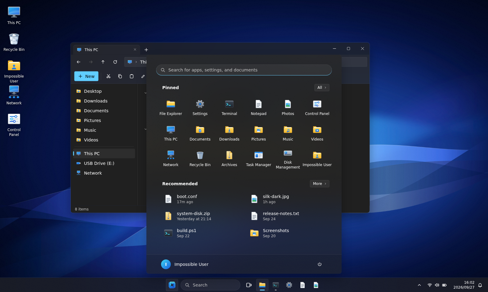
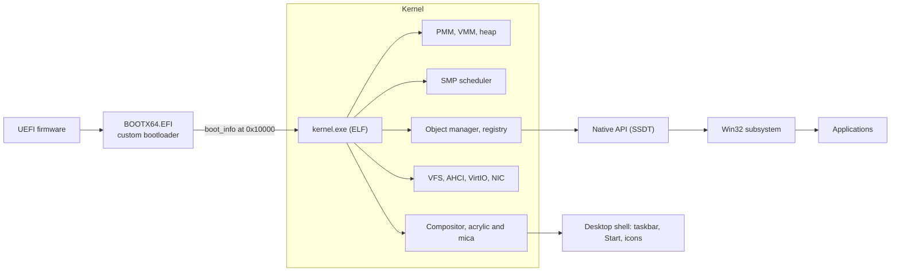

<div align="center">

<br>

<a href="https://impossibleos.co/">
  <picture>
    <source media="(prefers-color-scheme: dark)" srcset="resources/brand/wordmark-dark-bg.png">
    <source media="(prefers-color-scheme: light)" srcset="resources/brand/wordmark-light-bg.png">
    
  </picture>
</a>

<br>
<br>

<p><strong>A 64-bit operating system built from scratch for modern x86-64 hardware.</strong><br>UEFI boot, an SMP kernel, a frosted-glass compositing desktop, and a native Win32 API. No Linux kernel, no borrowed foundations.</p>

[](https://github.com/rizonesoft/impossible-os/actions/workflows/build.yml)
[](https://github.com/rizonesoft/impossible-os/actions/workflows/release.yml)
[](https://impossibleos.co/docs/)
[](https://github.com/rizonesoft/impossible-os/releases)
[](https://github.com/rizonesoft/impossible-os/commits/main)
<br>
[](LICENSE)
[](#architecture)
[](docs/boot/boot-protocol.md)
[](docs/infrastructure/development-tooling.md)
[](https://www.nasm.us/)
<!-- COUNT-BADGE:START (auto-generated by .githooks/post-commit from COUNT.md; do not hand-edit) -->
  
<!-- COUNT-BADGE:END -->
  <a href="https://www.paypal.com/donate/?hosted_button_id=YKAQFQPPNJEZQ"></a>
  <a href="https://github.com/sponsors/rizonesoft"></a>

<br>



</div>

**Website:** [impossibleos.co](https://impossibleos.co/) · **Documentation:** [impossibleos.co/docs](https://impossibleos.co/docs/), generated from [`docs/`](docs/index.md) · **Design system:** [`docs/design/`](docs/design/index.md)

> [!NOTE]
> **Status: pre-alpha, targeting a first public release on <!-- project:release_date_long -->August 8, 2028<!-- /project -->.** It boots on real hardware and runs a desktop, but it is not ready for daily use. The roadmap spans <!-- project:stat_todo_files -->232<!-- /project --> planning files across <!-- project:stat_todo_domains -->18<!-- /project --> domains, and <!-- project:stat_test_suites -->3,517<!-- /project --> kernel test suites (<!-- project:stat_test_assertions -->15,535<!-- /project --> assertion sites) run after every commit.

## Contents

- [Why Impossible OS](#why-impossible-os)
- [Features](#features)
- [Quick start](#quick-start)
- [Architecture](#architecture)
- [Testing](#testing)
- [Documentation](#documentation)
- [Roadmap](#roadmap)
- [FAQ](#faq)
- [Contributing](#contributing)
- [Acknowledgements](#acknowledgements)
- [License](#license)

## Why Impossible OS

*"It always seems impossible until it's done."* Nelson Mandela

They said building a fully functional, feature-rich operating system from scratch was impossible, so we named it after the challenge. Everything is written from the ground up: a custom UEFI bootloader, a 64-bit SMP kernel, a compositing desktop, and everything in between.

- **Windows 11 where it matters.** Win32 is the native API, paths look like `C:\Impossible\System32\`, and the desktop follows Windows 11 closely, with a slightly frostier glass.
- **Linux where it widens reach.** Linux binaries are planned through a compatibility layer, not a renamed POSIX API.
- **Bare metal first.** Virtual machines are for fast iteration. A feature is done when it works on real hardware.
- **SMP from day one.** Per-CPU data, real locking and atomics everywhere, with no big kernel lock to remove later.

## Features

Legend: ✅ shipped · 🚧 in progress · 📋 planned

| Area | Status | What you get |
| --- | :---: | --- |
| Custom UEFI bootloader | ✅ | Hand-written PE/COFF application with a versioned `boot_info` ABI, A/B rollback and a boot menu. No GRUB. |
| Secure Boot | 🚧 | Shim chain-loading is implemented; no shim is pinned while the Microsoft UEFI CA 2011 transition settles. |
| 64-bit SMP kernel | ✅ | Long mode, APIC timers, per-CPU data, guard-paged stacks, and structured exception handling in the kernel. |
| Preemptive multitasking | ✅ | Flat round-robin scheduler across all runnable threads, mutexes, semaphores and seqlocks. |
| Virtual memory | ✅ | Four-level paging, swap and pagefile, `mmap`, clock page replacement. |
| Storage and filesystems | ✅ | AHCI and VirtIO with DMA, GPT and MBR, FAT32, and IXFS (our own filesystem) behind a VFS. |
| Compositing desktop | ✅ | Dirty-rectangle compositor with acrylic and mica materials, drop shadows and TrueType text. |
| Networking | ✅ | RTL8139, Ethernet, ARP, IPv4, ICMP, UDP and DHCP. |
| Win32 Registry | ✅ | Hierarchical key-value store with disk persistence. |
| ACPI | ✅ | Vendored ACPICA with a kernel OS services layer. |
| TPM measured boot | 🚧 | TPM 2.0 transport, PCR measurement, sealing and attestation. |
| Win32 API surface | 🚧 | Native API through the SSDT, with `ntdll` and the Win32 subsystem on top. |
| Windows 11 shell | 🚧 | Centered taskbar, Start menu and system icons redesigned in the [design system](docs/design/index.md). |
| NTFS, TCP, USB | 📋 | Planned; each has its own roadmap file under [`todo/`](todo/TODO-00-INDEX.md). |

## Quick start

```bash
git clone https://github.com/rizonesoft/impossible-os.git
cd impossible-os
bash scripts/setup.sh          # install the toolchain and emulators
bash scripts/build.sh run      # build, then boot in QEMU
```

<details open>
<summary><strong>Supported build hosts</strong></summary>

| Tier | Hosts |
| --- | --- |
| Fully supported | Ubuntu or Debian 24.04+, WSL2 with Ubuntu, GitHub Actions `ubuntu-latest`, the committed `.devcontainer` |
| Best effort | Fedora and Arch (need the LLVM-19 and OVMF shim described in the [host bootstrap contract](docs/infrastructure/development-tooling.md#host-bootstrap-contract)) |
| Unsupported | Native Windows (use WSL2) and macOS |

`bash scripts/setup.sh --verify` re-checks a host at any time, and `bash scripts/setup.sh --versions` prints the version floors.

</details>

<details>
<summary><strong>Build commands</strong></summary>

| Command | What it does |
| --- | --- |
| `bash scripts/build.sh` | Incremental build |
| `bash scripts/build.sh clean` | Full clean build |
| `bash scripts/build.sh run` | Incremental build, then boot in QEMU |
| `bash scripts/build.sh clean run` | Clean build, then boot in QEMU |

Always build through `scripts/build.sh`, never raw `make`. A good build ends with `=== BUILD OK ===` in `build/build.log`.

</details>

**Downloads.** Disk images are published on the [Releases](https://github.com/rizonesoft/impossible-os/releases) page: a raw GPT `system-disk.img` for QEMU or a USB stick, and a `system-disk.vdi` for VirtualBox.

## Architecture



<details>
<summary><strong>Boot chain, memory model and storage stack</strong></summary>

1. **UEFI firmware** initialises the hardware and provides the GOP framebuffer.
2. **BOOTX64.EFI** loads the kernel ELF and hands over a validated `boot_info` structure ([boot protocol](docs/boot/boot-protocol.md)).
3. **The kernel** brings up the GDT, IDT, APIC, memory managers, VFS and drivers, then starts the application processors.
4. **The desktop shell** starts the compositor, the taskbar and the terminal.

Memory flows from the physical page allocator through the page tables to `kmalloc` for small objects (4 KiB and under); anything larger comes from `pmm_alloc_contiguous()`. Storage runs AHCI or VirtIO, then the block layer, then GPT or MBR, then FAT32 or IXFS, then the VFS that presents `C:\`.

</details>

<details>
<summary><strong>Repository layout</strong></summary>

| Path | Contents |
| --- | --- |
| `src/boot/uefi/` | UEFI bootloader |
| `src/kernel/` | Kernel core: memory, scheduler, drivers, filesystems, graphics, networking, SMP |
| `src/desktop/` | Window manager, compositor, desktop shell, terminal |
| `include/` | Headers, mirroring `src/` |
| `user/` | User-mode programs, including `cmd.exe` |
| `resources/` | Fonts, icons, cursors, wallpapers, brand assets |
| `docs/` | Documentation, published to [impossibleos.co/docs](https://impossibleos.co/docs/) |
| `todo/` | The roadmap: one planning file per subsystem |
| `scripts/` | Build, test, lint and site generation |

</details>

## Testing

| Platform | How |
| --- | --- |
| QEMU (KVM or TCG) | `bash scripts/build.sh run` for everyday iteration |
| Unit tests | `bash scripts/test.sh`, or one category with `SUITE=mm` |
| Boot smoke matrix | `bash scripts/test-smoke-matrix.sh` boots TCG and KVM at 1 and 2 CPUs |
| VirtualBox | A 64-bit EFI VM, or `scripts/machines/run-vbox.bat` on Windows |
| Real hardware | Write `build/system-disk.img` to USB with `bash scripts/deploy/write-usb.sh` |

Install the local git hooks (lint on commit, line counts and README sync after commit) with `bash scripts/install-hooks.sh`. Serial output lands in `build/serial.log`. The full launcher matrix is in the [machine matrix](docs/infrastructure/machine-matrix.md), and local git hooks are covered in [local CI hooks](docs/infrastructure/development-tooling.md#local-ci-hooks).

## Documentation

The documentation site at [impossibleos.co/docs](https://impossibleos.co/docs/) is generated from the Markdown in [`docs/`](docs/index.md) by [`scripts/site/build.py`](scripts/site/build.py) on every push. The same generator keeps the website and this README honest: project facts come from [`project.json`](project.json), and a drift check fails the commit on a dead link, a stale fact or an undocumented new roadmap file. <!-- project:stat_docs_covered -->215<!-- /project --> of the roadmap files are documented so far; the [coverage page](https://impossibleos.co/docs/coverage.html) tracks the rest.

## Roadmap

Development is planned in [`todo/`](todo/TODO-00-INDEX.md): <!-- project:stat_todo_files -->232<!-- /project --> planning files across <!-- project:stat_todo_domains -->18<!-- /project --> domains, from boot and the kernel core through drivers, the desktop, applications and the installer. Each file breaks its subsystem into sections with tests, a verification plan, and a comparison against Windows 11 and Linux.

## FAQ

<details>
<summary><strong>Is it actually possible to write an OS entirely from scratch?</strong></summary>

Technically, no. Practically, also no. We are doing it anyway.

</details>

<details>
<summary><strong>Can a solo developer compete with a 500-person engineering team?</strong></summary>

Absolutely not. But why let a little thing like impossible odds get in the way?

</details>

<details>
<summary><strong>Will it work like Windows 11?</strong></summary>

That is the goal for the parts people touch every day: the taskbar, the Start menu, File Explorer and the Win32 API. Some corners will take longer than others.

</details>

<details>
<summary><strong>Is it stable enough for daily use?</strong></summary>

If daily use means kernel panics and debugging C at 3 AM, it is perfect. Otherwise, wait for the release.

</details>

<details>
<summary><strong>When will it be finished?</strong></summary>

The first public release is planned for <!-- project:release_date_long -->August 8, 2028<!-- /project -->. Good software takes time; impossible software takes a little longer.

</details>

## Contributing

Start with [CONTRIBUTING.md](CONTRIBUTING.md). Report security issues privately as described in [SECURITY.md](SECURITY.md), and follow the [code of conduct](CODE_OF_CONDUCT.md). Hardware reports are especially welcome: the bug tracker has a template for them.

## Acknowledgements

Impossible OS stands on excellent open source work, including [ACPICA](https://github.com/acpica/acpica), [Mbed TLS](https://github.com/Mbed-TLS/mbedtls), [LZ4](https://github.com/lz4/lz4), [miniz](https://github.com/richgel999/miniz), [cJSON](https://github.com/DaveGamble/cJSON), [Monocypher](https://monocypher.org), [stb](https://github.com/nothings/stb), [Fluent UI System Icons](https://github.com/microsoft/fluentui-system-icons), [Inter](https://rsms.me/inter/), [Selawik](https://github.com/microsoft/Selawik), [OVMF/EDK2](https://github.com/tianocore/edk2) and the [OSDev Wiki](https://wiki.osdev.org/). The full list with licenses is in [CREDITS.md](CREDITS.md).

## License

Impossible OS is licensed under **GPL-3.0-only**. See [LICENSE](LICENSE).

<div align="center">
<sub>Made in the open by <a href="https://rizonetech.com">Rizonetech (Pty) Ltd</a> · <a href="https://impossibleos.co/">impossibleos.co</a> · <a href="https://www.paypal.com/donate/?hosted_button_id=YKAQFQPPNJEZQ">Donate</a> · <a href="https://github.com/sponsors/rizonesoft">Sponsor</a></sub>
</div>
