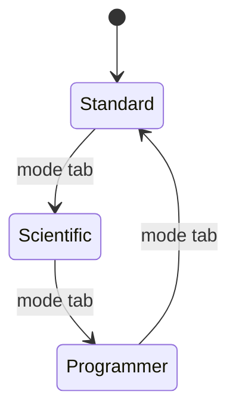

<!-- docs: covers=todo/11-apps/TODO-09-calculator.md sources=include/libc/math.h,include/kernel/kmath.h,include/gfx.h,include/desktop/theme_tokens.h,include/desktop/wm.h reviewed=2026-09-29 order=9 -->
# Calculator

## What is it?

Calculator is the planned three-mode calculator: Standard, Scientific and Programmer, with a history panel, memory keys, keyboard input and copy to clipboard. The desktop shell's utilities roadmap already plans a basic Standard calculator and lists the other modes as stretch goals; this roadmap turns those into full sections. Nothing is built yet; most of the maths the scientific mode needs has shipped, but four double functions are still font-grade.

## How does it work?

**Today.** There is no calculator program. What it will use:

- **Maths.** [`math.h`](../../include/libc/math.h) provides `kmath_sin()`, `kmath_tan()`, `kmath_asin()`, `kmath_atan()`, `kmath_exp()`, `kmath_log()` and `kmath_log10()`. The double `kmath_cos()`, `kmath_acos()`, `kmath_pow()` and `kmath_sqrt()` in [`kmath.h`](../../include/kernel/kmath.h) are font-grade helpers kept for the TrueType rasterizer: `kmath_acos(1.0)` returns about 0.254 instead of 0, and `kmath_cos()` never returns for an infinite input. The scientific keys need those unified onto the hardened float path first.
- **Drawing.** `gfx_fill_rounded_rect()`, `gfx_fill_rect()` and `gfx_draw_rect()` ([`gfx.h`](../../include/gfx.h)) for the keypad.
- **Design tokens.** Keypad button size, tab height, corner radius and animation timing come from generated `THEME_*` constants ([`theme_tokens.h`](../../include/desktop/theme_tokens.h)), not literals.
- **Windows.** `wm_create_window(title, x, y, w, h, flags)` ([`wm.h`](../../include/desktop/wm.h)); a fixed-size window is one without `WM_FLAG_RESIZABLE`.

**Planned design.**

1. **Standard UI.** A 320 by 480 window, a right-aligned display with the pending operation above it, a 5 by 4 keypad with hover and pressed states, mode tabs and a history toggle.
2. **Arithmetic engine.** A two-operand model with chaining, percent, sign change, reciprocal, square and square root, "Error" on division by zero, and full keyboard input (numbers, operators, Enter, Backspace, Delete and Escape).
3. **Memory and history.** MS, MR, M+, M- and MC with an indicator, and a 20-entry history panel where clicking an entry copies it to the clipboard; history persists in the Registry.
4. **Scientific mode.** Trigonometric functions and their inverses, logarithms, powers, factorial, modulo and the constants pi and e, with a degrees and radians toggle.
5. **Programmer mode.** Hexadecimal, decimal, octal and binary shown together, word sizes from byte to 64-bit that clamp the value, a row of bits you can click to flip, bitwise AND, OR, XOR, NOT and shifts, and A to F input in hexadecimal.

## What are its interfaces?

| Interface | Status |
| --- | --- |
| `kmath_sin()`, `kmath_tan()`, `kmath_atan()`, `kmath_exp()`, `kmath_log()` | Shipped |
| Accurate double `kmath_cos()`, `kmath_acos()`, `kmath_pow()`, `kmath_sqrt()` | Planned: today's are font-grade, and unifying them is deferred in the kernel libraries roadmap |
| `gfx_fill_rounded_rect()` and the other `gfx_*` calls, `THEME_*` tokens | Shipped |
| `calc_t` and the calculator engine | Planned in this roadmap and the utilities roadmap |
| `clipboard_set()` | Planned in the [Clipboard](../desktop/clipboard.md) roadmap |
| Tab control for the mode switch | Planned in the [widget library](../graphics/widget-library.md) roadmap |

## How do I use it?

The calculator cannot be launched yet. Nothing in this roadmap is runnable today.

## Which roadmap owns the calculator?

The utilities roadmap ([Task Manager, Device Manager and Core Utilities](../desktop/utilities.md)) owns the basic calculator in its section 2: the window, keypad, memory keys and keyboard input. This roadmap is the full app on top: history, scientific mode with degrees and radians, and programmer mode with word sizes. Both restate the same keypad and engine, and they name different header paths; that is filed in [section 1](../../todo/11-apps/TODO-09-calculator.md#1-standard-calculator-ui-sonnet) so one layout wins.

## What is not implemented yet?

No calculator code exists yet, and only part of the maths section 4 relies on is ready:

- [Standard Calculator UI](../../todo/11-apps/TODO-09-calculator.md#1-standard-calculator-ui-sonnet)
- [Arithmetic Engine](../../todo/11-apps/TODO-09-calculator.md#2-arithmetic-engine-sonnet)
- [Memory and History](../../todo/11-apps/TODO-09-calculator.md#3-memory--history-sonnet), which needs the clipboard
- [Scientific Mode](../../todo/11-apps/TODO-09-calculator.md#4-scientific-mode-sonnet), which waits on the double maths unification in the [Kernel Embedded Libraries](../kernel/kernel-libraries.md) roadmap
- [Programmer Mode](../../todo/11-apps/TODO-09-calculator.md#5-programmer-mode-sonnet)

## How does it compare with Windows 11 and Linux?

Windows Calculator has Standard, Scientific and Programmer modes, a history and memory sidebar, word sizes and all four number bases on screen at once, plus graphing and unit conversion. On Linux, GNOME Calculator and KCalc cover scientific and programmer work with fewer programmer conveniences. The Impossible OS plan matches the Windows three-mode layout, including the clickable bit row, on the kernel's own maths library once its double functions are hardened. It does not exist yet.

## See also

- [Calculator roadmap](../../todo/11-apps/TODO-09-calculator.md)
- [Task Manager, Device Manager and Core Utilities](../desktop/utilities.md)
- [Clipboard](../desktop/clipboard.md)
- [Core Widgets](../graphics/widget-library.md)
- [Controls design spec](../design/controls.md)
