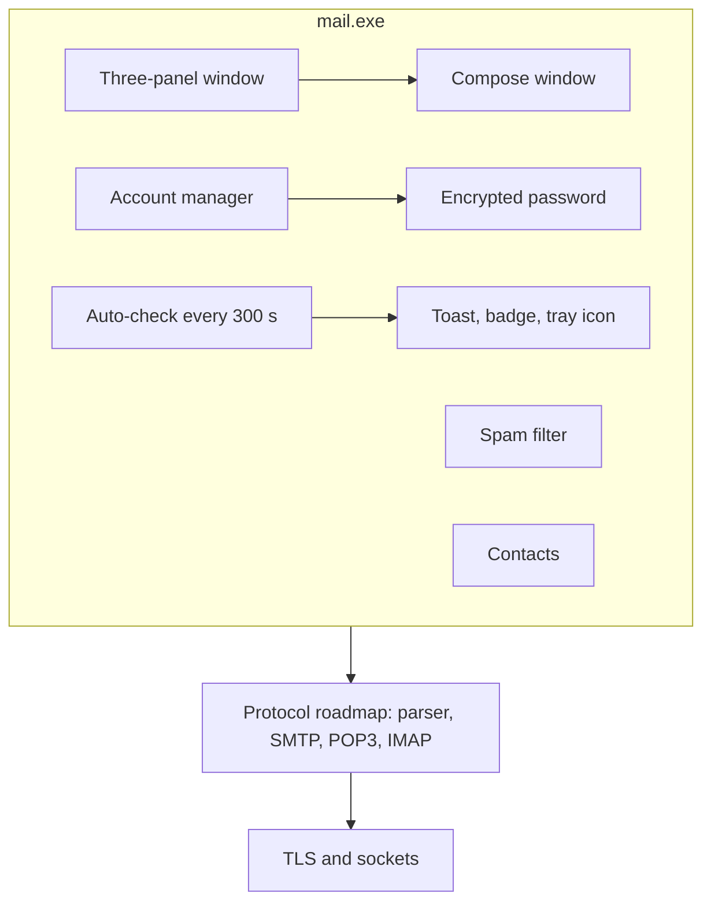

<!-- docs: covers=todo/11-apps/TODO-04-email-client.md sources=include/kernel/kcodec.h,include/kernel/csprng.h,include/registry.h,include/desktop/controls.h,src/libs/PROVENANCE.md reviewed=2026-09-29 order=4 -->
# Email Client App

## What is it?

The Email Client app is the planned `mail.exe`: a three-panel mail window, a compose window, account setup with encrypted password storage, a five-minute new-mail check with toasts and a tray icon, a contacts store and a keyword spam filter. It sits on top of the protocol roadmap, which parses messages and speaks SMTP, POP3 and IMAP. Nothing of either exists yet.

## How does it work?

**Today.** There is no mail code. The app will build on:

- **Codecs.** `base64_encode()` and `base64_decode()` with a MIME mode for attachments ([`kcodec.h`](../../include/kernel/kcodec.h)).
- **Registry.** `RegCreateKeyEx()`, `RegSetString()`, `RegGetString()`, `RegEnumKeyEx()` and `RegDeleteKey()` ([`registry.h`](../../include/registry.h)) for account settings.
- **Randomness.** `csprng_fill()` ([`csprng.h`](../../include/kernel/csprng.h)) for the nonce that protects a stored password.
- **TLS** is vendored as Mbed TLS but not yet built ([`PROVENANCE.md`](../../src/libs/PROVENANCE.md)), and the control library has no list view yet ([`controls.h`](../../include/desktop/controls.h)).

**Planned design.**

1. **Sending and receiving.** SMTP with STARTTLS and `AUTH LOGIN`, retrying on a 421 reply and reporting a 550 rejection; POP3 over TLS on port 995, saving each message as an `.eml` file; IMAP with `IDLE` as a stretch.
2. **Three-panel window.** An account and folder tree with unread counts, a message list with read and attachment markers, and a viewer that wraps the body and shows inline images, plus a search bar.
3. **Compose.** To-field autocomplete, attachments sent as MIME multipart, reply and forward pre-filled, and a draft saved every 60 seconds.
4. **Accounts.** Settings under `HKCU\Software\Impossible\Mail\Accounts\{name}\`, with the password encrypted by AES-256-GCM under a key held by the CNG key store.
5. **Notifications.** A scheduled check every five minutes, a toast for new mail, a taskbar badge and an envelope tray icon.
6. **Contacts** with autocomplete, and a **spam filter** that scores keywords, keeps allow and block lists, and learns from Mark as Spam and Not Spam.

## What are its interfaces?

| Interface | Status |
| --- | --- |
| `base64_encode()`, `base64_decode()`, Registry API, `csprng_fill()` | Shipped |
| Message parser, SMTP, POP3, IMAP | Planned in the [Email Protocols](../networking/email-client.md) roadmap |
| AES-256-GCM encryption and the key store | Planned in the [CNG Crypto](../desktop/cng-crypto.md) roadmap |
| Toasts, tray icons, taskbar badges | Planned in the [notifications](../graphics/start-menu-tray-notifications.md) roadmap |
| Scheduled tasks | Planned in the [task scheduler](../desktop/recycle-bin-zip-scheduler.md) roadmap |
| List view control | Planned in the [widget library](../graphics/widget-library.md) roadmap |

## How do I use it?

The mail app cannot be launched yet, and the OS cannot open a TCP or TLS connection. Nothing in this roadmap is runnable today.

## Which roadmap owns which half?

The [Email Protocols](../networking/email-client.md) roadmap owns the message parser, SMTP, POP3, IMAP, server autodiscovery and search; its window, compose and notification sections are marked as moved here. This roadmap owns the app, the credential store, notifications, contacts and the spam filter. Two details disagree between the files and are filed in [section 8](../../todo/11-apps/TODO-04-email-client.md#8-contacts-store-sonnet): contacts are a CSV file under the user's folder here and a JSON file under `C:\Users\Default\` there, and the message store path differs the same way.

## What is not implemented yet?

Nothing in this roadmap has started:

- [SMTP Client](../../todo/11-apps/TODO-04-email-client.md#1-smtp-client-sonnet) and [POP3 Client](../../todo/11-apps/TODO-04-email-client.md#2-pop3-client--message-storage-sonnet), which need TLS
- [IMAP Client](../../todo/11-apps/TODO-04-email-client.md#3-imap-client-stretch-opus), a stretch goal
- [Three-Panel Email GUI](../../todo/11-apps/TODO-04-email-client.md#4-three-panel-email-gui-opus) and the [Compose Window](../../todo/11-apps/TODO-04-email-client.md#5-compose-window-sonnet)
- [Account Management and Credential Store](../../todo/11-apps/TODO-04-email-client.md#6-account-management--credential-store-sonnet), which needs AES-GCM in the CNG roadmap
- [Auto-Check, Notifications and Tray](../../todo/11-apps/TODO-04-email-client.md#7-auto-check--notifications--tray-sonnet)
- [Contacts Store](../../todo/11-apps/TODO-04-email-client.md#8-contacts-store-sonnet) and the [Spam and Junk Filter](../../todo/11-apps/TODO-04-email-client.md#9-spam--junk-filter-sonnet)

## How does it compare with Windows 11 and Linux?

Windows 11 ships the new Outlook, which stores credentials with Credential Manager and DPAPI and relies on the server for junk filtering. On Linux, Thunderbird and Evolution are the usual clients, with passwords in their own store or the desktop keyring and spam filtering through a local learning filter or SpamAssassin. The Impossible OS plan keeps everything on the OS's own stack: its TLS, its Registry for settings, its CNG key store for passwords, and a small local spam filter. It does not exist yet.

## See also

- [Email Client roadmap](../../todo/11-apps/TODO-04-email-client.md)
- [Email Protocols](../networking/email-client.md)
- [HTTP and TLS](../networking/http-tls.md)
- [CNG Crypto and Certificate Store](../desktop/cng-crypto.md)
- [Start Menu, System Tray and Notifications](../graphics/start-menu-tray-notifications.md)
- [Registry](../kernel/registry.md)
