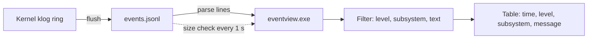

<!-- docs: covers=todo/13-tools-accessories/TODO-02-event-viewer.md sources=src/kernel/klog_disk.c,include/kernel/klog.h reviewed=2026-09-29 order=15 -->
# Event Viewer

## What is it?

Event Viewer is the planned `eventview.exe`: a viewer for the kernel's structured log, `events.jsonl`, that shows each event's time, level, subsystem and message in a colour-coded table, filters by level, subsystem and text, and follows new events live. It lets you diagnose a boot or driver problem on the machine itself instead of attaching a serial cable. The log it reads is written today; nothing reads it yet.

## How does it work?

**Today.** The kernel logger ([`klog_disk.c`](../../src/kernel/klog_disk.c)) flushes its in-memory ring (1,000 entries, [`klog.h`](../../include/kernel/klog.h)) to disk, and alongside the text log it writes one JSON object per line to `events.jsonl`:

```json
{"ts":12340,"lvl":"INFO","sub":"ob","cpu":0,"pid":0,"tid":0,"msg":"...","dropped":0}
```

- **Fields.** `ts` is milliseconds since boot, not wall-clock time; `lvl` is one of `DEBUG`, `INFO`, `WARN`, `ERROR` or `FATAL`; `sub` is the subsystem tag; `cpu`, `pid` and `tid` say where the event came from; `msg` is the escaped message; `dropped` is a snapshot, taken at flush time, of how many messages the rate limiter has dropped for that subsystem in its current window; it resets when the window expires, so it is neither a running total nor tied to the event on its line.
- **Location.** `X:\Logs\events.jsonl` when the BlackBox partition is mounted, otherwise `C:\Impossible\System\Logs\events.jsonl`.
- **Rotation.** When the file grows too large the writer renames it and creates a new `events.jsonl`, keeping up to three older generations (`.1` to `.3`, possibly LZ4-compressed), so a reader has to notice a new file even when it is already as large as the old one.

**Planned design.**



1. **Console viewer.** `eventview` prints the log as a table with ANSI colours per level and accepts level and subsystem filter arguments.
2. **GUI viewer.** An 800 by 500 window with a filter bar, sortable columns, a date range, Export and a status bar showing counts.
3. **Live tail.** Check the file every second, append new lines, keep the view at the bottom, and pause with a Live and Paused toggle.

## What are its interfaces?

| Interface | Status |
| --- | --- |
| `events.jsonl` writer and its eight fields | Shipped |
| Log directory selection (`X:\Logs\` or `C:\Impossible\System\Logs\`) | Shipped |
| Security events and `kevent_log()` | Planned in the [System Restore, Recovery and Observability](../services/restore-recovery.md) roadmap |
| A JSON parser in user mode | Not available; the vendored cJSON is built into the kernel only |
| Table and filter controls | Planned in the widget roadmaps |

## How do I use it?

The viewer does not exist yet. To read the log today, open `events.jsonl` from the log directory with `type` in the shell, or pull it off a disk image on the host. The host-side BlackBox extractor roadmap plans a `blackbox events` command for that.

## What is not implemented yet?

Nothing in this roadmap has started:

- [Console-Mode Log Viewer](../../todo/13-tools-accessories/TODO-02-event-viewer.md#1-console-mode-log-viewer)
- [GUI Event Viewer](../../todo/13-tools-accessories/TODO-02-event-viewer.md#2-gui-event-viewer), whose Security filter needs security events that are not logged yet
- [Live Tail and Auto-Refresh](../../todo/13-tools-accessories/TODO-02-event-viewer.md#3-live-tail-and-auto-refresh), which has to follow the file across rotation by identity rather than size, and mark any events it could not read

Two limits come from the log itself. Times are milliseconds since boot, so a date-range filter needs a wall-clock reference the file does not carry. And the log is not signed: the HMAC chain planned in the [System Logging](../kernel/system-logging.md) roadmap is deferred, so the viewer cannot promise the events were not edited.

## How does it compare with Windows 11 and Linux?

Windows 11 has Event Viewer, a management console snap-in over the Windows event logs, with filters by level and source and a manual refresh. Linux has `journalctl`, which filters by priority with `-p` and follows new entries with `-f`, but only at the command line. The Impossible OS plan offers both: a colour-coded window and a live tail over one plain JSON Lines file. It does not exist yet.

## See also

- [Event Viewer roadmap](../../todo/13-tools-accessories/TODO-02-event-viewer.md)
- [System Logging (klog)](../kernel/system-logging.md)
- [System Restore, Recovery and Observability](../services/restore-recovery.md)
- [BlackBox Diagnostic Artifacts](../boot/black-box-artifacts.md)
- [Terminal](../desktop/terminal.md)
