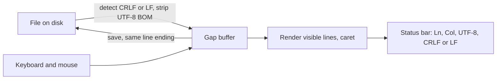

<!-- docs: covers=todo/11-apps/TODO-08-notepad.md sources=include/font_mgr.h,include/kernel/fs/vfs.h,include/kernel/timer.h,include/desktop/controls.h reviewed=2026-09-29 order=8 -->
# Notepad App

## What is it?

This roadmap is the app-layer companion to the desktop shell's Notepad roadmap, which remains the main specification. It restates the editor in five sections (a gap buffer, rendering and caret, file operations, editing, file associations) and adds three things of its own: line-ending detection with a status bar that shows the encoding and line ending, file-type associations for common text formats, and a recent-files list with font zoom. There is no text editor in the OS yet.

## How does it work?

**Today.** No editor exists; `type` in the shell is the only way to read a text file. The building blocks are shipped:

- **Text.** `ttf_get()`, `ttf_draw_string()` and `ttf_measure_width()` with the `FONT_MONO` face ([`font_mgr.h`](../../include/font_mgr.h)).
- **Files.** `vfs_open()`, `vfs_read()`, `vfs_write()`, `vfs_create()` and `vfs_stat()` ([`vfs.h`](../../include/kernel/fs/vfs.h)).
- **Caret timing.** `system_get_ticks()` ([`timer.h`](../../include/kernel/timer.h)) for the 500 ms blink.
- **Controls.** A vertical scroll bar exists ([`controls.h`](../../include/desktop/controls.h)); the menu bar and status bar controls do not yet.

**Planned design.**

1. **Gap buffer.** A 64 KiB buffer from the page allocator that doubles when full, with insert, delete, cursor movement, line lookup and `text_detect_line_ending()`.
2. **Rendering and caret.** One `ttf_draw_string()` per visible line, a blinking I-beam, Home, End, Page Up and Page Down, a scroll bar, visual word wrap, and a status bar showing `Ln N, Col N | UTF-8 | CRLF`.
3. **File operations.** New, Open, Save and Save As through the file dialogs, the UTF-8 byte order mark stripped on load, the original line ending kept on save, an asterisk in the title while modified, a save-changes prompt, a command-line argument and drag and drop.
4. **Editing.** Click to place the caret, drag to select, Ctrl+A, C, X and V through the clipboard, a 200-step undo history that merges single-character typing, and find, find next and replace all.
5. **Associations.** Open `.txt`, `.log`, `.ini`, `.conf` and `.md` files in Notepad, an Open with Notepad verb, ten recent files, and Ctrl plus and minus to zoom the font.

## What are its interfaces?

| Interface | Status |
| --- | --- |
| `ttf_*` text calls, `vfs_*` file calls, `system_get_ticks()` | Shipped |
| `text_buffer` and its functions | Planned in this roadmap and the shell's [Notepad](../desktop/notepad.md) roadmap |
| `clipboard_set()`, `clipboard_get()` | Planned in the [Clipboard](../desktop/clipboard.md) roadmap |
| `dialog_file_open()`, `dialog_file_save()`; menu bar and status bar controls | Planned in the [Complex Controls and Dialogs](../graphics/complex-controls-dialogs.md) roadmap |
| `file_assoc_set()` | Planned in the [File Associations, Shortcuts and System Resources](../desktop/file-associations.md) roadmap |

## How do I use it?

Notepad cannot be launched yet. To read a text file today, use `type` (or `cat`) in the shell.

## Which roadmap is the specification?

The desktop shell's [Notepad](../desktop/notepad.md) roadmap is the canonical specification; this file says so itself and asks to be read alongside it. The two plan different source file names and different default extensions (`.c`, `.h` and `.asm` there; `.log`, `.ini` and `.conf` here), and the default file associations themselves are owned by the file associations roadmap. Those differences are filed in [section 5](../../todo/11-apps/TODO-08-notepad.md#5-file-associations--app-registration-sonnet) so one list and one file layout win.

## What is not implemented yet?

Nothing in this roadmap has started:

- [Gap Buffer Text Engine](../../todo/11-apps/TODO-08-notepad.md#1-gap-buffer-text-engine-opus)
- [Text Rendering and Cursor](../../todo/11-apps/TODO-08-notepad.md#2-text-rendering--cursor-sonnet)
- [File Operations](../../todo/11-apps/TODO-08-notepad.md#3-file-operations-sonnet), which needs the file dialogs
- [Editing Features](../../todo/11-apps/TODO-08-notepad.md#4-editing-features-sonnet), which needs the clipboard
- [File Associations and App Registration](../../todo/11-apps/TODO-08-notepad.md#5-file-associations--app-registration-sonnet)

## How does it compare with Windows 11 and Linux?

Windows 11 Notepad shows the line ending and encoding in its status bar, has find and replace, and now has tabs. On Linux, gedit and Kate build on GTK and KDE text components with the same basics and much more. The Impossible OS plan is a small native editor whose status bar and save path treat line endings as a first-class property of the file. It does not exist yet.

## See also

- [Notepad App roadmap](../../todo/11-apps/TODO-08-notepad.md)
- [Notepad](../desktop/notepad.md)
- [Clipboard](../desktop/clipboard.md)
- [File Associations, Shortcuts and System Resources](../desktop/file-associations.md)
- [Text and Fonts](../graphics/text-fonts.md)
- [WordPad](wordpad.md)
