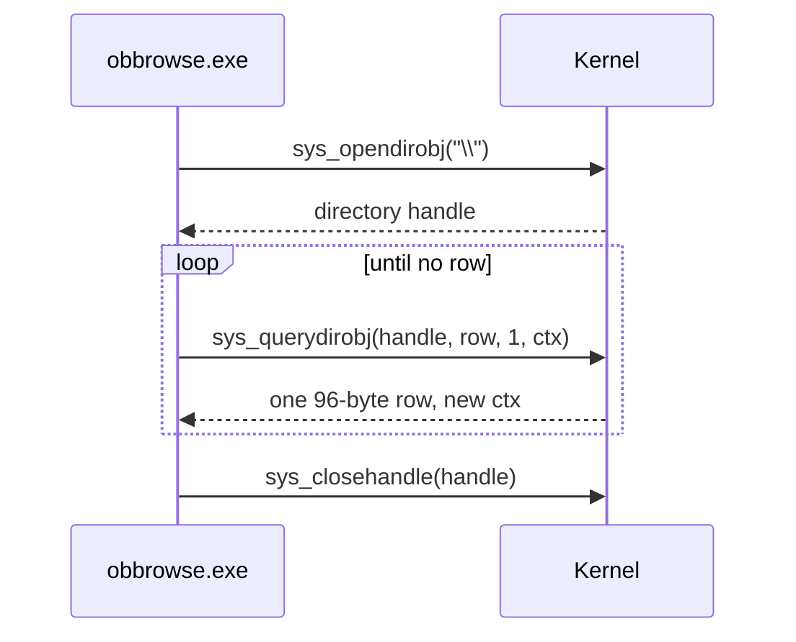

<!-- docs: covers=todo/13-tools-accessories/TODO-01-obbrowse-namespace-browser.md sources=include/kernel/ob/ob.h,src/kernel/ob/ob.c,src/kernel/ob/ob_ns.c,src/kernel/sched/syscall.c,user/include/syscall.h,user/test/test_syscall.c reviewed=2026-09-29 order=14 -->
# ObBrowse: Object Namespace Browser

## What is it?

ObBrowse is the planned `obbrowse.exe`, a tool that shows the kernel's object namespace as a tree, the way Sysinternals WinObj does on Windows: directories such as `\Device` and `\BaseNamedObjects`, the objects inside them, their types, and later their reference counts and security descriptors. It is a debugging aid for the Object Manager. The kernel side it reads from already ships, including user-mode wrappers; only the tool itself is missing.

## How does it work?

**Today.** The Object Manager builds its namespace at boot ([`ob_ns.c`](../../src/kernel/ob/ob_ns.c)) with six root directories: `\Device`, `\KernelObjects`, `\DosDevices`, `\BaseNamedObjects`, `\ObjectManager` and `\Sessions`. Two entries are symbolic links a browser must treat specially: `\Sessions\0\BaseNamedObjects` points at `\BaseNamedObjects`, and `C:` in `\DosDevices` points at `\Device\HardDisk0\Partition0`.

Enumeration is already reachable from a user-mode program:

- **Syscalls.** `SYS_OPENDIROBJ` (42) and `SYS_QUERYDIROBJ` (43) call `NtOpenDirectoryObject()` and `NtQueryDirectoryObject()` ([`ob.h`](../../include/kernel/ob/ob.h), [`ob.c`](../../src/kernel/ob/ob.c)).
- **Wrappers.** `sys_opendirobj(path, access)` and `sys_querydirobj(dir, buf, count, &ctx)` ([`syscall.h`](../../user/include/syscall.h)) pack the count and a resume cookie into one argument, and `sys_closehandle()` closes the directory.
- **Rows.** Each entry is an `OBJECT_DIRECTORY_INFORMATION` row of 96 bytes: a 64-byte name and a 32-byte type name, pinned by static asserts.
- **One row per call.** This legacy syscall carries no buffer length, so the kernel returns exactly one row per call and the caller loops on the cookie ([`syscall.c`](../../src/kernel/sched/syscall.c)). A multi-row path exists through the native SSDT handler.

**Planned design.**

1. **Wrappers.** The roadmap's first section plans the wrappers above; they already exist under the `sys_*` names, so it reduces to a small helper that walks a directory.
2. **Console tool.** A recursive, indented text tree of the whole namespace.
3. **GUI.** A 640 by 480 window with a tree on the left that expands directories lazily, a list on the right, a toolbar and a status bar.
4. **Details and icons.** A glyph per object type, and a detail panel with reference and handle counts, flags and the security descriptor.

## What are its interfaces?

| Interface | Status |
| --- | --- |
| `SYS_OPENDIROBJ`, `SYS_QUERYDIROBJ`, `sys_opendirobj()`, `sys_querydirobj()` | Shipped |
| `OBJECT_DIRECTORY_INFORMATION` (name and type name) | Shipped |
| Object details (reference counts, flags, security descriptor) | Not in the directory row; needs `NtQueryObject()` and symbolic-link queries exposed to user mode |
| Tree view, toolbar, status bar controls | Planned in the widget roadmaps |

## How do I use it?

`obbrowse.exe` does not exist yet. The same enumeration it will use runs in the user-mode test suite: [`test_syscall.c`](../../user/test/test_syscall.c) opens the root with `sys_opendirobj("\\")`, reads entries with `sys_querydirobj()` and closes the handle. The kernel logs the namespace's root directories during boot.

## What is not implemented yet?

The tool itself has not started; only the wrappers in section 1 already exist:

- [User-Mode Syscall Wrappers](../../todo/13-tools-accessories/TODO-01-obbrowse-namespace-browser.md#1-user-mode-syscall-wrappers), largely already shipped as `sys_opendirobj()` and `sys_querydirobj()`
- [Console-Mode ObBrowse](../../todo/13-tools-accessories/TODO-01-obbrowse-namespace-browser.md#2-console-mode-obbrowse)
- [GUI ObBrowse with Tree View](../../todo/13-tools-accessories/TODO-01-obbrowse-namespace-browser.md#3-gui-obbrowse-with-tree-view)
- [Object Detail and Type Icons](../../todo/13-tools-accessories/TODO-01-obbrowse-namespace-browser.md#4-object-detail-and-type-icons), which needs a user-mode path to object details

On the kernel side, `NtQueryDirectoryObject()` reports its return length as an entry count rather than bytes; that fix is parked in the [Object Manager](../kernel/object-manager.md) roadmap.

## How does it compare with Windows 11 and Linux?

Windows has no inbox namespace browser: WinObj is a free Sysinternals download, and Process Explorer shows handles. Linux has no single object namespace; `/proc` and `/sys` expose parts of it, and `lsof` lists open files. The Impossible OS plan ships the browser in the box, and security descriptor details are the part neither system offers built in. It does not exist yet.

## See also

- [ObBrowse roadmap](../../todo/13-tools-accessories/TODO-01-obbrowse-namespace-browser.md)
- [Object Manager](../kernel/object-manager.md)
- [Native API and SSDT](../kernel/native-api-ssdt.md)
- [User-Mode Test Framework](../infrastructure/usermode-test-framework.md)
- [Icons design spec](../design/icons.md)
