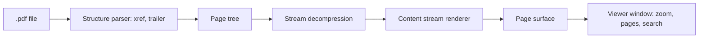

<!-- docs: covers=todo/11-apps/TODO-05-pdf-viewer.md sources=include/kernel/image.h,include/stb_image.h,include/gfx.h,include/font_mgr.h,include/desktop/controls.h reviewed=2026-09-29 order=5 -->
# PDF Viewer App

## What is it?

The PDF Viewer app is the planned `pdfview.exe`: a window that opens a PDF, shows its pages with zoom and page navigation, searches its text, scrolls continuously as a stretch, and is registered as the handler for `.pdf` files. This roadmap also carries its own plan for the PDF engine underneath (parsing, decompression, page rendering), which overlaps the networking PDF roadmap. Nothing exists yet.

## How does it work?

**Today.** No PDF code exists. The decoding and drawing it will use is in the kernel:

- **Images.** `image_load_mem()` ([`image.h`](../../include/kernel/image.h)) decodes JPEG, PNG, BMP, GIF and TGA to BGRA, which covers the JPEG (`DCTDecode`) images most PDFs embed.
- **Inflate.** `stbi_zlib_decode_buffer()` ([`stb_image.h`](../../include/stb_image.h)) is a compiled zlib decoder that can undo `FlateDecode` streams. The vendored miniz library this roadmap names is not built yet.
- **Drawing.** `gfx_surface_create()`, `gfx_fill_rect()`, `gfx_blit()` and `gfx_drop_shadow()` ([`gfx.h`](../../include/gfx.h)), and the `ttf_*` text calls ([`font_mgr.h`](../../include/font_mgr.h)).
- **Controls.** Horizontal and vertical scroll bars exist ([`controls.h`](../../include/desktop/controls.h)); the toolbar and zoom drop-down do not yet.

**Planned design.**

1. **Structure parser.** Find `startxref`, walk the cross-reference table, read the trailer's `/Root`, and cache up to 1,024 objects.
2. **Page tree.** Flatten nested `Kids` arrays, inherit `MediaBox`, and expose `pdf_page_count()` and `pdf_get_page()`.
3. **Stream decompression.** `FlateDecode`, `ASCIIHexDecode`, `ASCII85Decode` and raw streams.
4. **Content renderer.** Text operators (`BT`, `ET`, `Tf`, `Td`, `Tj`, `TJ`), path operators (`m`, `l`, `c`, `re`, `f`, `S`, `B`), the current transformation matrix, the graphics state stack and colours, then images through `image_load_mem()`.
5. **Viewer.** A toolbar with previous, next, a page box, zoom, fit width and fit page; the page centred with a shadow; scroll bars; Ctrl plus wheel zoom; and a status bar.
6. **Search.** Ctrl+F opens a find bar, matches are highlighted with the selection colour, and next and previous jump between pages.
7. **Continuous scroll** (a stretch) renders only the pages near the viewport, and **file association** makes `.pdf` open here.

## What are its interfaces?

| Interface | Status |
| --- | --- |
| `image_load_mem()`, `stbi_zlib_decode_buffer()` | Shipped |
| `gfx_*` drawing, `ttf_*` text, scroll bars | Shipped |
| `pdf_page_count()`, `pdf_get_page()`, the renderer | Planned in this roadmap and in the [PDF Viewer Engine](../networking/pdf-viewer.md) roadmap |
| Toolbar, combo box, status bar controls | Planned in the [widget library](../graphics/widget-library.md) roadmap |
| `file_assoc_set()` | Planned in the [File Associations, Shortcuts and System Resources](../desktop/file-associations.md) roadmap |

## How do I use it?

The viewer cannot be launched yet. Nothing in this roadmap is runnable today.

## Which roadmap owns the engine?

The networking [PDF Viewer Engine](../networking/pdf-viewer.md) roadmap owns the parser, object model, fonts, page renderer, opening PDFs from the web and forms, and marks its own viewer window section as moved here. This roadmap's sections 1 to 5 plan the same engine again, with different file names and a different decompressor. Only one engine should be built; both roadmaps carry an item in their structure parser sections to settle which, so treat the engine plan on this page as provisional. The viewer window, search, continuous scroll and file association are this roadmap's alone.

## What is not implemented yet?

Nothing in this roadmap has started:

- [PDF Structure Parser](../../todo/11-apps/TODO-05-pdf-viewer.md#1-pdf-structure-parser-sonnet), including the engine-owner decision
- [Page Tree Traversal](../../todo/11-apps/TODO-05-pdf-viewer.md#2-page-tree-traversal-sonnet) and [Stream Decompression](../../todo/11-apps/TODO-05-pdf-viewer.md#3-stream-decompression-sonnet)
- [Content Stream Renderer](../../todo/11-apps/TODO-05-pdf-viewer.md#4-content-stream-renderer-opus) and [Image Rendering](../../todo/11-apps/TODO-05-pdf-viewer.md#5-image-rendering-sonnet)
- [PDF Viewer UI](../../todo/11-apps/TODO-05-pdf-viewer.md#6-pdf-viewer-ui-sonnet) and [Text Search](../../todo/11-apps/TODO-05-pdf-viewer.md#7-text-search-sonnet)
- [Continuous Scroll View](../../todo/11-apps/TODO-05-pdf-viewer.md#8-continuous-scroll-view-stretch-sonnet), a stretch goal, and [File Association](../../todo/11-apps/TODO-05-pdf-viewer.md#9-file-association-sonnet)

Encrypted PDFs and annotations are not planned.

## How does it compare with Windows 11 and Linux?

Windows 11 opens PDFs in Microsoft Edge's built-in reader, and many users add Adobe Acrobat Reader. Linux desktops ship Evince or Okular, with Zathura and MuPDF as lighter options; these build on Poppler or MuPDF. The Impossible OS plan writes its own reader with no third-party PDF library, renders text through the OS's own TrueType stack and decodes images with the same code as the rest of the desktop. It does not exist yet.

## See also

- [PDF Viewer roadmap](../../todo/11-apps/TODO-05-pdf-viewer.md)
- [PDF Viewer Engine](../networking/pdf-viewer.md)
- [2D Graphics and Visual Assets](../graphics/graphics-assets.md)
- [Text and Fonts](../graphics/text-fonts.md)
- [File Associations, Shortcuts and System Resources](../desktop/file-associations.md)
- [WordPad](wordpad.md)
