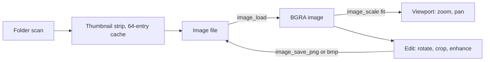

<!-- docs: covers=todo/11-apps/TODO-11-photos-image-viewer.md sources=include/kernel/image.h,src/kernel/image.c,src/desktop/desktop.c,include/desktop/desktop.h,include/kernel/fs/vfs.h reviewed=2026-09-29 order=11 -->
# Photos

## What is it?

Photos is the planned `photos.exe` image viewer: open a picture, fit it to the window, zoom and pan, step through the folder with a thumbnail strip, run a slideshow, read EXIF details, and make simple edits (rotate, crop, auto-enhance). It wires the image decoder and scaler the desktop already uses for its wallpaper into a full app. Nothing of the app exists yet.

## How does it work?

**Today.** There is no viewer window. The image pipeline it needs ships in the kernel ([`image.h`](../../include/kernel/image.h)):

- `image_load()` and `image_load_mem()` decode JPEG, PNG, BMP, GIF and TGA through stb_image into a BGRA `image_t` ([`image.c`](../../src/kernel/image.c)); `image_free()` releases it.
- `image_scale()` resizes with five fit modes (stretch, fill, fit, centre, tile).
- `image_save_bmp()` and `image_save_png()` write edits back.

Its only callers today are the desktop's wallpaper loader and the icon loader. The wallpaper path and mode are read from `HKLM\SYSTEM\Theme` (values `Wallpaper` and `WallpaperMode`) by a private loader in [`desktop.c`](../../src/desktop/desktop.c); `desktop_draw_wallpaper()` ([`desktop.h`](../../include/desktop/desktop.h)) only redraws the image already loaded.

**Planned design.**

1. **Load and display.** Fit the image to the window, centred on a dark background, from a command-line argument or the Open dialog, with the file name, size and dimensions in the status bar.
2. **Zoom and pan.** 5 to 3,200 percent, the wheel zooming around the cursor, double-click between fit and 100 percent, keyboard shortcuts, and drag to pan within the image edges.
3. **Folder and thumbnails.** Scan the folder alphabetically, step with the arrow keys or toolbar, and show an 80 by 60 thumbnail strip backed by a 64-entry least-recently-used cache.
4. **Toolbar and menus**, including Set as Wallpaper and ten recent files.
5. **Slideshow.** Fullscreen with a timed advance, a 300 ms crossfade and controls that hide themselves.
6. **EXIF panel.** Read the JPEG APP1 segment and its TIFF directory for camera make and model, date, exposure, aperture, ISO, focal length and GPS.
7. **Editing.** Rotate (patching the EXIF orientation in place for JPEG), crop with a rule-of-thirds overlay, a histogram-stretch auto-enhance, one level of undo, and save as PNG or BMP.
8. **Associations** for common image types and an Open with Photos verb.

## What are its interfaces?

| Interface | Status |
| --- | --- |
| `image_load()`, `image_load_mem()`, `image_scale()`, `image_free()`, `image_save_bmp()`, `image_save_png()` | Shipped |
| Wallpaper from `HKLM\SYSTEM\Theme` | Shipped (read at desktop start) |
| `wallpaper_set()`, a public call to reload the wallpaper | Planned in the [Desktop Shell Features](../graphics/desktop-shell-features.md) roadmap; today the loader is private to `desktop.c` |
| `dialog_file_open()`, list and status bar controls | Planned in the [Complex Controls and Dialogs](../graphics/complex-controls-dialogs.md) roadmap |
| `file_assoc_set()` | Planned in the [File Associations, Shortcuts and System Resources](../desktop/file-associations.md) roadmap |

## How do I use it?

Photos cannot be launched yet. The image pipeline it will use runs at every boot: the desktop reads the wallpaper path from `HKLM\SYSTEM\Theme\Wallpaper` and the fit mode from `WallpaperMode` (`fill`, `fit`, `center`, `tile`, anything else meaning stretch), then decodes and scales the file with the calls above.

## What is not implemented yet?

Nothing in this roadmap has started:

- [Image Loading and Display](../../todo/11-apps/TODO-11-photos-image-viewer.md#1-image-loading--display-sonnet)
- [Zoom and Pan](../../todo/11-apps/TODO-11-photos-image-viewer.md#2-zoom--pan-sonnet) and [Folder Navigation and Thumbnail Strip](../../todo/11-apps/TODO-11-photos-image-viewer.md#3-folder-navigation--thumbnail-strip-sonnet)
- [Toolbar and Menus](../../todo/11-apps/TODO-11-photos-image-viewer.md#4-toolbar--menus-sonnet), whose Set as Wallpaper step needs `wallpaper_set()` from the [Desktop Shell Features](../graphics/desktop-shell-features.md) roadmap, which also moves the setting to `HKCU\Control Panel\Desktop`
- [Slideshow](../../todo/11-apps/TODO-11-photos-image-viewer.md#5-slideshow-sonnet), [EXIF Metadata Panel](../../todo/11-apps/TODO-11-photos-image-viewer.md#6-exif-metadata-panel-opus) and [Basic Editing](../../todo/11-apps/TODO-11-photos-image-viewer.md#7-basic-editing-opus)
- [File Associations and App Registration](../../todo/11-apps/TODO-11-photos-image-viewer.md#8-file-associations--app-registration-sonnet)

WebP and TIFF are not decodable: stb_image has no decoder for either, so those formats need a new decoder before Photos can open them; that choice is filed in section 1. The desktop shell's utilities roadmap also plans a basic image viewer in its section 3; this roadmap is the full app.

## How does it compare with Windows 11 and Linux?

Windows 11 Photos handles viewing, folders, slideshows, EXIF details and basic edits, with extra codecs for formats such as HEIC. On Linux, Eye of GNOME, Gwenview and feh cover viewing and slideshows, with editing mostly left to other apps. The Impossible OS plan keeps viewing, slideshow, EXIF and light editing in one inbox app, decoding with the same code that draws the wallpaper. It does not exist yet.

## See also

- [Photos roadmap](../../todo/11-apps/TODO-11-photos-image-viewer.md)
- [2D Graphics and Visual Assets](../graphics/graphics-assets.md)
- [Paint](../services/paint-app.md)
- [Task Manager, Device Manager and Core Utilities](../desktop/utilities.md)
- [Desktop Shell Features](../graphics/desktop-shell-features.md)
- [Screenshot Tool and Archive Manager](screenshot-archive.md)
