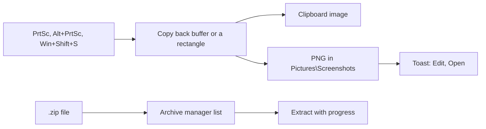

<!-- docs: covers=todo/11-apps/TODO-12-screenshot-archive.md sources=include/kernel/drivers/framebuffer.h,include/kernel/image.h,src/kernel/image_save.c,src/libs/PROVENANCE.md,Makefile reviewed=2026-09-29 order=12 -->
# Screenshot Tool and Archive Manager

## What is it?

This roadmap plans two apps. `sniptool.exe` takes screenshots (full screen, one window, or a dragged region) with global hotkeys, then copies, saves, annotates or hands the capture to Photos. `archiver.exe` browses, extracts and creates ZIP files, with Extract Here and Send to Compressed folder in the file manager. Neither exists yet; the frame buffer reads and the PNG writer a capture needs already ship.

## How does it work?

**Today.** There is no screenshot code and no PrintScreen handling. What exists:

- **Frame buffer.** `fb_get_width()`, `fb_get_height()` and `fb_get_backbuffer()` ([`framebuffer.h`](../../include/kernel/drivers/framebuffer.h)) expose the composed desktop, which is what a capture copies.
- **Saving.** `image_save_png()` and `image_save_bmp()` ([`image.h`](../../include/kernel/image.h)); the PNG writer is the vendored stb_image_write ([`image_save.c`](../../src/kernel/image_save.c)). Nothing calls either yet.
- **ZIP.** The miniz library is vendored ([`PROVENANCE.md`](../../src/libs/PROVENANCE.md)) but excluded from the kernel build (see the `libs/miniz` exclusion in the [`Makefile`](../../Makefile)), and there is no `zip_*` API over it.

**Planned design.**

1. **Full and window capture.** PrtSc copies the whole screen, Alt+PrtSc the focused window, and both save a timestamped PNG under `C:\Users\{name}\Pictures\Screenshots\`, put the image on the clipboard and show a toast.
2. **Region select.** Win+Shift+S dims the screen and lets you drag a rectangle with corner handles; Escape cancels.
3. **Snipping tool window.** Rectangle, window or full-screen mode, a 0, 1, 3 or 5 second delay with a countdown, recent captures, and an annotation view with pen, highlighter, crop, eraser and undo.
4. **Archive manager.** A list of names, types, sizes, compressed sizes and dates; extract with a progress dialog; add, delete and create; folder navigation; drag to extract; a clear refusal for encrypted archives.
5. **Shell integration.** `.zip` opens here, Extract Here and Extract to a folder verbs, Send to Compressed folder, and reading `.tar.gz` as a stretch.

## What are its interfaces?

| Interface | Status |
| --- | --- |
| `fb_get_backbuffer()`, `image_save_png()`, `image_save_bmp()` | Shipped |
| miniz (`mz_*`) | Vendored, not built |
| `zip_open()`, `zip_extract()`, `zip_create()` and the rest of the ZIP API | Planned in the [Recycle Bin, ZIP and Task Scheduler](../desktop/recycle-bin-zip-scheduler.md) roadmap, section 4 |
| Global hotkey table | Planned in the [Window Manager Enhancements](../graphics/window-manager.md) roadmap |
| `clipboard_set()` with an image format | Planned in the [Clipboard](../desktop/clipboard.md) roadmap |
| `notify_send()` toasts | Planned in the [notifications](../graphics/start-menu-tray-notifications.md) roadmap, section 5 |

## How do I use it?

Neither app can be launched, and pressing PrtSc does nothing yet. Nothing in this roadmap is runnable today.

## Which roadmap owns which part?

Screenshots and archives are planned in three places, and the overlap is not yet settled:

- **Screenshots.** The [Desktop Shell Features](../graphics/desktop-shell-features.md) roadmap owns the basic PrtSc and Alt+PrtSc capture in its section 5, and the utilities roadmap ([Task Manager, Device Manager and Core Utilities](../desktop/utilities.md)) owns Win+Shift+S region capture in its section 4. This roadmap restates both and adds the snipping tool window and annotation.
- **Archives.** The utilities roadmap's section 5 plans an archive manager at the same source path this roadmap uses, and the ZIP API and shell commands belong to the ZIP roadmap.

These are filed in [section 1](../../todo/11-apps/TODO-12-screenshot-archive.md#1-full--window-capture--hotkeys-sonnet) and [section 4](../../todo/11-apps/TODO-12-screenshot-archive.md#4-archive-manager-sonnet) so that each capability has one owner.

## What is not implemented yet?

Nothing in this roadmap has started:

- [Full and Window Capture and Hotkeys](../../todo/11-apps/TODO-12-screenshot-archive.md#1-full--window-capture--hotkeys-sonnet), which needs the hotkey table and clipboard
- [Region Select Overlay](../../todo/11-apps/TODO-12-screenshot-archive.md#2-region-select-overlay-opus)
- [Snipping Tool UI](../../todo/11-apps/TODO-12-screenshot-archive.md#3-snipping-tool-ui-sonnet)
- [Archive Manager](../../todo/11-apps/TODO-12-screenshot-archive.md#4-archive-manager-sonnet), which needs the ZIP API and miniz in the build
- [ZIP Shell Integration](../../todo/11-apps/TODO-12-screenshot-archive.md#5-zip-shell-integration-sonnet)

## How does it compare with Windows 11 and Linux?

Windows 11 has the Snipping Tool (Win+Shift+S, delays, annotation) and PrtSc to the clipboard, and File Explorer opens and creates ZIP files natively. On Linux, GNOME Screenshot, Spectacle or Flameshot capture and annotate, and Ark or File Roller handle archives, including `.tar.gz`. The Impossible OS plan follows the Windows shape: hotkeys, a snipping window with annotation, and ZIP handling built into the shell. It does not exist yet.

## See also

- [Screenshot Tool and Archive Manager roadmap](../../todo/11-apps/TODO-12-screenshot-archive.md)
- [Desktop Shell Features](../graphics/desktop-shell-features.md)
- [Recycle Bin, ZIP and Task Scheduler](../desktop/recycle-bin-zip-scheduler.md)
- [Photos](photos.md)
- [Clipboard](../desktop/clipboard.md)
- [Shell design spec](../design/shell.md)
