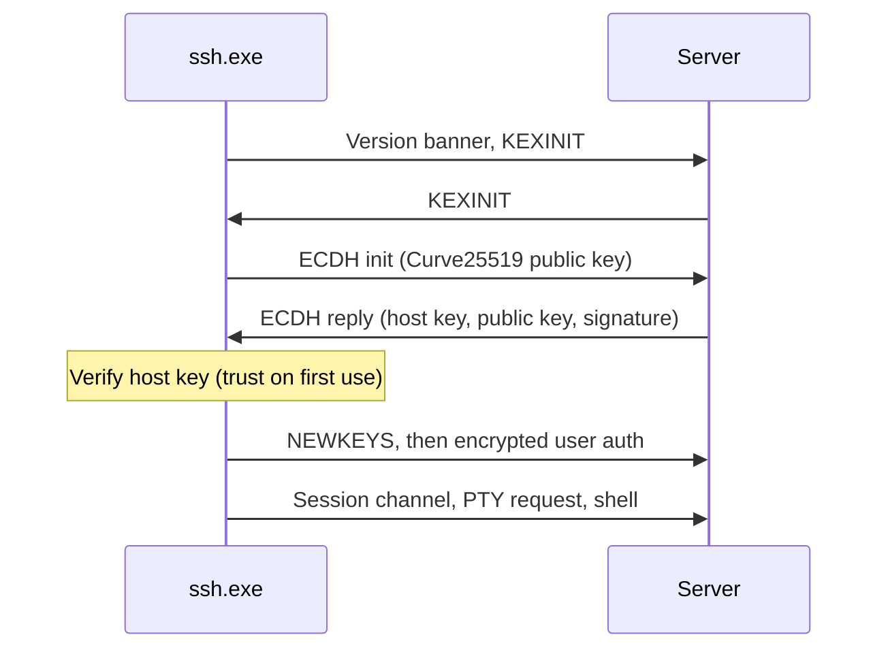

<!-- docs: covers=todo/11-apps/TODO-03-ssh-client.md sources=src/libs/monocypher/monocypher.h,src/libs/monocypher/monocypher-ed25519.h,include/kernel/crypto/sha256.h,include/kernel/csprng.h,include/desktop/terminal.h,src/kernel/test/test_klibs.c,src/kernel/ci/ci_crypto.c reviewed=2026-09-29 order=3 -->
# SSH Client

## What is it?

The SSH Client is the planned `ssh.exe`: an SSH2 client with an interactive remote shell in the terminal, host-key trust on first use, a Windows-style configuration file, `scp` file transfer and a stretch `sftp` command. The wire protocol is specified by the networking roadmap; this roadmap adds the user-facing program around it. Nothing is built yet, but every cryptographic primitive it needs already ships in the kernel.

## How does it work?

**Today.** No SSH code exists, and the network stack has no TCP yet. The crypto it will use is in the tree:

- **Monocypher** (vendored, [`monocypher.h`](../../src/libs/monocypher/monocypher.h)): `crypto_x25519()` and `crypto_x25519_public_key()` for the key exchange, ChaCha20 and Poly1305 for packet encryption, and BLAKE2b.
- **Ed25519** ([`monocypher-ed25519.h`](../../src/libs/monocypher/monocypher-ed25519.h)): `crypto_ed25519_key_pair(secret_key, public_key, seed)`, `crypto_ed25519_sign()` and `crypto_ed25519_check()`, the SHA-512 form that the `ssh-ed25519` key type uses.
- **SHA-256** ([`sha256.h`](../../include/kernel/crypto/sha256.h)) for the exchange hash and key derivation, and the kernel CSPRNG's `csprng_fill()` ([`csprng.h`](../../include/kernel/csprng.h)) for ephemeral keys and cookies.
- **The terminal** ([`terminal.h`](../../include/desktop/terminal.h)): `terminal_puts()` and `terminal_trygetchar()` are what the remote shell relay reads and writes.

**Planned design.**

1. **Transport.** Version exchange, `curve25519-sha256` key exchange, an `ssh-ed25519` host key and `chacha20-poly1305@openssh.com` packets. Session keys come from the RFC 4253 section 7.2 hash construction over SHA-256, which is what OpenSSH servers expect.
2. **Authentication.** Password with three attempts, then public key with an Ed25519 key pair created on first use under `C:\Users\{name}\AppData\`.
3. **Interactive channel.** A session channel with a PTY request, relaying bytes between the socket and the terminal, with window adjustment.
4. **Host trust.** Trust on first use: the first connection records the server's key, and a later mismatch shows a warning and refuses.
5. **`scp`** upload and download in 64 KiB chunks with a progress bar, and **`sftp`** as a stretch.
6. **Configuration**: an INI-style file with `Host` stanzas so `ssh alias` resolves to a host, user and port.

## What are its interfaces?

| Interface | Status |
| --- | --- |
| Monocypher X25519, ChaCha20, Poly1305, BLAKE2b; Ed25519 | Shipped (vendored) |
| SHA-256, `csprng_fill()` | Shipped |
| `terminal_puts()`, `terminal_trygetchar()` | Shipped |
| Kernel TCP sockets | Planned in the [DNS and Sockets](../networking/dns-sockets.md) roadmap, section 5 |
| `ssh`, `scp`, `sftp` commands | Planned in this roadmap |

## How do I use it?

`ssh` cannot be run yet. The primitives it depends on already run: the kernel unit tests exercise X25519 and Ed25519 ([`test_klibs.c`](../../src/kernel/test/test_klibs.c)), and code integrity checks signatures with `crypto_ed25519_check()` ([`ci_crypto.c`](../../src/kernel/ci/ci_crypto.c)). See [Kernel Embedded Libraries](../kernel/kernel-libraries.md) for the vendored crypto.

## Which roadmap owns which half?

The networking roadmap [SSH, FTP and SMB Clients](../networking/ssh-ftp.md) owns the protocol: transport, authentication, channels, `ssh-keygen` and the agent. This roadmap owns the program the user runs: host trust, the configuration file, `scp` and `sftp` sessions. Three details still disagree between the two files and are filed in [section 4](../../todo/11-apps/TODO-03-ssh-client.md#4-shell-integration--tofu--known-hosts-sonnet) for a decision: where known host keys live (a `known_hosts` file there, a Registry key here), the case of the `AppData` folder name, and the fingerprint format.

## What is not implemented yet?

Nothing in this roadmap has started:

- [SSH2 Transport Layer](../../todo/11-apps/TODO-03-ssh-client.md#1-ssh2-transport-layer-opus), which needs TCP sockets
- [SSH Authentication](../../todo/11-apps/TODO-03-ssh-client.md#2-ssh-authentication-opus)
- [Interactive Channel and PTY Relay](../../todo/11-apps/TODO-03-ssh-client.md#3-interactive-channel--pty-relay-sonnet)
- [Shell Integration and Known Hosts](../../todo/11-apps/TODO-03-ssh-client.md#4-shell-integration--tofu--known-hosts-sonnet)
- [SCP File Transfer](../../todo/11-apps/TODO-03-ssh-client.md#5-scp-file-transfer-sonnet) and the [SSH Config File](../../todo/11-apps/TODO-03-ssh-client.md#6-ssh-config-file-sonnet)
- [`sftp`](../../todo/11-apps/TODO-03-ssh-client.md#7-sftp-command-stretch-sonnet), a stretch goal

## How does it compare with Windows 11 and Linux?

Windows 11 ships OpenSSH's `ssh.exe`, `scp.exe` and `sftp.exe`, keeping `known_hosts` and `config` in `%USERPROFILE%\.ssh`. Linux ships the same OpenSSH tools with files in `~/.ssh`. The Impossible OS plan uses the kernel's own vendored crypto instead of a ported OpenSSH, relays the shell through its own terminal rather than a POSIX pty or ConPTY, and keeps settings in Windows-style locations. It does not exist yet.

## See also

- [SSH Client roadmap](../../todo/11-apps/TODO-03-ssh-client.md)
- [SSH, FTP and SMB Clients](../networking/ssh-ftp.md)
- [Terminal](../desktop/terminal.md)
- [DNS and Sockets](../networking/dns-sockets.md)
- [Kernel Embedded Libraries](../kernel/kernel-libraries.md)
- [CNG Crypto and Certificate Store](../desktop/cng-crypto.md)
