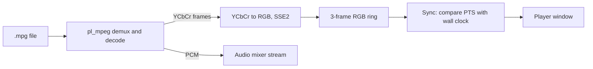

<!-- docs: covers=todo/11-apps/TODO-06-video-player.md sources=include/gfx.h,include/kernel/timer.h,include/kernel/sched/task.h,include/font_mgr.h,src/kernel/gfx/gfx_simd.c,src/libs/PROVENANCE.md reviewed=2026-09-29 order=6 -->
# Video Player

## What is it?

The Video Player is the planned `player.exe`: a movie player built on the single-file pl_mpeg decoder for MPEG-1 video and MP2 audio, with SSE2 colour conversion, audio and video kept in sync against the wall clock, a seek bar, fullscreen, a playlist and SRT subtitles as a stretch. Later phases add H.264 and the AVI and MKV containers. Nothing exists yet, and pl_mpeg is not vendored.

## How does it work?

**Today.** There is no player, no video decoder and no audio output. The pieces a player would use are:

- **Drawing.** `gfx_surface_create()`, `gfx_fill_rect()` and `gfx_blit()` ([`gfx.h`](../../include/gfx.h)) for frames and the letterbox, and `ttf_draw_string()` ([`font_mgr.h`](../../include/font_mgr.h)) for the time display and subtitles.
- **Timing.** `system_get_ticks()` and `sleep_ms()` ([`timer.h`](../../include/kernel/timer.h)) for presentation timestamps.
- **Threads.** `task_create()` ([`task.h`](../../include/kernel/sched/task.h)) for a decode thread.
- **SIMD.** The kernel is built without SSE, but a separate module ([`gfx_simd.c`](../../src/kernel/gfx/gfx_simd.c)) is compiled with `-msse2`; the colour converter would follow the same pattern.

pl_mpeg has no row in [`PROVENANCE.md`](../../src/libs/PROVENANCE.md) yet, and the audio mixer it would feed is unstarted.

**Planned design.**

1. **pl_mpeg integration.** Vendor the library with its allocator pointed at the kernel's page allocator and its file access through the VFS; read width, height, frame rate and duration.
2. **Colour conversion.** BT.601 YCbCr to RGB in fixed point, with an SSE2 path that converts four pixels at a time, fast enough to finish well inside one frame period.
3. **A/V sync.** A three-frame RGB ring, each frame shown when its timestamp matches the wall clock; audio goes to a mixer stream, and drift beyond 200 ms drops or repeats a frame.
4. **Player UI.** Letterboxing at the right aspect ratio, a seek bar, a time display, a volume slider, and fullscreen with controls that hide after three seconds.
5. **Files and playlist.** File associations for `.mpg`, `.mpeg`, `.avi` and `.mp4`, drag and drop, a command-line argument, recent files, and a playlist with loop and shuffle.
6. **Subtitles** (a stretch): a `.srt` file with the same base name is loaded automatically and drawn in white with a black shadow.
7. **Formats roadmap**: H.264 through h264bsd, then AVI and MKV containers, then AAC and Vorbis audio. Each needs its own licence check before vendoring.

## What are its interfaces?

| Interface | Status |
| --- | --- |
| `gfx_*` drawing, `ttf_draw_string()`, `system_get_ticks()`, `task_create()` | Shipped |
| pl_mpeg (`plm_*`) | Planned; not vendored |
| `audio_mixer_stream_add()` and the mixer | Planned in the [Audio System](../services/audio-system.md) roadmap |
| Slider and list view controls, fullscreen windows | Planned in the [widget library](../graphics/widget-library.md) and window manager roadmaps |
| `file_assoc_set()` | Planned in the [File Associations, Shortcuts and System Resources](../desktop/file-associations.md) roadmap |

## How do I use it?

The player cannot be launched yet, and there is no audio driver for it to play through. Nothing in this roadmap is runnable today.

## What is not implemented yet?

Nothing in this roadmap has started:

- [pl_mpeg Integration](../../todo/11-apps/TODO-06-video-player.md#1-pl_mpeg-integration-sonnet), including vendoring and the provenance and credits rows
- [YCbCr to RGB Conversion](../../todo/11-apps/TODO-06-video-player.md#2-ycbcr--rgb-conversion-opus)
- [A/V Sync Engine](../../todo/11-apps/TODO-06-video-player.md#3-av-sync-engine-opus), which needs the audio mixer
- [Player UI](../../todo/11-apps/TODO-06-video-player.md#4-player-ui-sonnet), [File Operations](../../todo/11-apps/TODO-06-video-player.md#5-file-operations-sonnet) and the [Playlist](../../todo/11-apps/TODO-06-video-player.md#6-playlist-sonnet)
- [Subtitle Support](../../todo/11-apps/TODO-06-video-player.md#7-subtitle-support-stretch-sonnet), a stretch goal
- [Format Support Roadmap](../../todo/11-apps/TODO-06-video-player.md#8-format-support-roadmap-sonnet), planning only

The audio-only media player (transport controls, ID3 tags, a music playlist) is a separate app in the [Audio System and Media Player](../services/audio-system.md) roadmap.

## How does it compare with Windows 11 and Linux?

Windows 11 plays video in the Media Player and Films and TV apps through Media Foundation, with some codecs such as HEVC sold as add-ons. Linux users install VLC or mpv, which bundle FFmpeg's decoders. The Impossible OS plan starts much smaller, with MPEG-1 only through one small single-header decoder, and grows formats one vetted library at a time. It does not exist yet.

## See also

- [Video Player roadmap](../../todo/11-apps/TODO-06-video-player.md)
- [Audio System and Media Player](../services/audio-system.md)
- [2D Graphics and Visual Assets](../graphics/graphics-assets.md)
- [Window Manager Enhancements](../graphics/window-manager.md)
- [File Associations, Shortcuts and System Resources](../desktop/file-associations.md)
