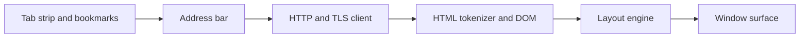

<!-- docs: covers=todo/11-apps/TODO-01-web-browser.md sources=include/kernel/image.h,include/font_mgr.h,include/desktop/wm.h,include/desktop/controls.h,include/registry.h reviewed=2026-09-29 order=1 -->
# Web Browser App

## What is it?

The Web Browser app is the planned `browser.exe`: the window, tab strip, command bar, bookmarks bar, context menu and settings page a user sees, plus a staged path from a text-only page fetcher to an HTML and CSS renderer. It is meant to show the network stack working end to end on the OS's own HTTP, TLS and Registry code. Nothing of the app exists yet; the image, font and window calls it will draw with already ship.

## How does it work?

**Today.** There is no browser window and no HTTP client. The pieces the plan builds on are in the tree:

- **Images.** `image_load_mem()` decodes a PNG, JPEG, BMP, GIF or TGA buffer into a BGRA `image_t` ([`image.h`](../../include/kernel/image.h)), which is how an `` would reach the screen.
- **Text.** `ttf_get()`, `ttf_draw_string()` and `ttf_measure_width()` ([`font_mgr.h`](../../include/font_mgr.h)) are what the layout engine's word wrap measures with.
- **Windows and controls.** `wm_create_window(title, x, y, w, h, flags)` ([`wm.h`](../../include/desktop/wm.h)); the control library has buttons, labels, text boxes and scroll bars only ([`controls.h`](../../include/desktop/controls.h)), so the planned `CTRL_TABSTRIP` does not exist yet.

**Planned design.** The roadmap grows the browser in stages:

1. **Text-only browser.** Fetch a page, strip the HTML, number the links, and add an address bar, back and forward history and a padlock for HTTPS.
2. **HTML tokenizer and DOM tree**, then a **layout engine** with block and inline flow, word wrap, images, tables and lists.
3. **CSS** (a stretch) and a **JavaScript engine** (a long-term stretch, a QuickJS or Duktape port).
4. **Port evaluation.** Before writing a custom parser, evaluate porting NetSurf or Dillo. The project is GPL-3.0-only, so a GPL-2.0-only upstream cannot be taken; the licence file decides.
5. **Browser chrome**: up to 16 tabs, the command bar, a Registry-backed bookmarks bar, a right-click menu and a new-tab page.
6. **Settings, history and cookies** under `HKCU\Software\Impossible\Browser\`, a download manager and find-in-page.

## What are its interfaces?

| Interface | Status |
| --- | --- |
| `image_load_mem()`, `ttf_*` text calls, `wm_create_window()` | Shipped |
| `http_get()`, `https_get()` | Planned in the [HTTP and TLS](../networking/http-tls.md) roadmap |
| `dom_parse()`, layout boxes, CSS cascade | Planned in this roadmap, sections 2 to 4 |
| `CTRL_TABSTRIP`, progress bar | Planned in the [widget library](../graphics/widget-library.md) roadmap |
| Registry keys under `HKCU\Software\Impossible\Browser\` | Planned; the Registry API itself ships ([`registry.h`](../../include/registry.h)) |

## How do I use it?

The browser cannot be launched yet, and the OS has no HTTP client for it to call. What runs today is the image decoding it will rely on: the desktop decodes and scales the wallpaper with the same `image_*` calls at every boot. See [2D Graphics and Visual Assets](../graphics/graphics-assets.md).

## Which roadmap owns which half?

Two roadmaps describe a browser. The networking roadmap ([Web Browser engine](../networking/web-browser.md)) owns the engine and its data: tabs as data, HTTP fetches, bookmarks, downloads and privacy state. This apps roadmap owns the app window and its chrome; its tab strip section is the single implementation, and the networking roadmap marks its own tab bar drawing as superseded by it. The split is not yet clean: sections 1 to 5 here restate the engine work with different file, function and Registry names (for example a bookmarks store in the Registry here and `bookmarks.json` there). That conflict is filed in [section 1](../../todo/11-apps/TODO-01-web-browser.md#1-text-only-browser-phase-1-sonnet) to be settled before either side is built.

## What is not implemented yet?

Nothing in this roadmap has started:

- [Text-Only Browser](../../todo/11-apps/TODO-01-web-browser.md#1-text-only-browser-phase-1-sonnet), which needs the HTTP client first
- [HTML Tokenizer and DOM Tree](../../todo/11-apps/TODO-01-web-browser.md#2-html-tokenizer--dom-tree-opus) and the [Layout Engine](../../todo/11-apps/TODO-01-web-browser.md#3-layout-engine-block--inline-flow-opus)
- [CSS](../../todo/11-apps/TODO-01-web-browser.md#4-css-parser--cascade-stretch-opus) and [JavaScript](../../todo/11-apps/TODO-01-web-browser.md#5-javascript-engine-long-term-stretch-opus), both stretch goals
- [NetSurf or Dillo Port Evaluation](../../todo/11-apps/TODO-01-web-browser.md#6-alternative-netsurf--dillo-port-evaluation-sonnet)
- [Browser Chrome](../../todo/11-apps/TODO-01-web-browser.md#7-browser-chrome-sonnet), which needs the tab strip control
- [Settings, History and Cookie Jar](../../todo/11-apps/TODO-01-web-browser.md#8-browser-settings--history--cookie-jar-sonnet)

## How does it compare with Windows 11 and Linux?

Windows 11 ships Edge, built on Blink and V8, with WebView2 for other apps. Linux distributions ship Firefox (Gecko and SpiderMonkey) or Chromium (Blink and V8). Both are full engines with decades of work behind them. The Impossible OS plan is deliberately smaller: a browser built entirely on the OS's own HTTP, TLS, font and Registry code, starting as a text browser and adding HTML layout, with CSS and JavaScript as stretch goals. It does not exist yet.

## See also

- [Web Browser roadmap](../../todo/11-apps/TODO-01-web-browser.md)
- [Web Browser engine](../networking/web-browser.md)
- [HTTP and TLS](../networking/http-tls.md)
- [DNS and Sockets](../networking/dns-sockets.md)
- [Core Widgets](../graphics/widget-library.md)
- [Registry](../kernel/registry.md)
