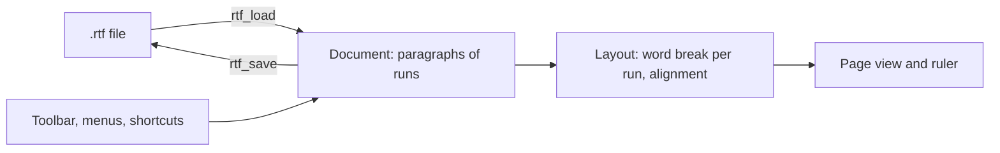

<!-- docs: covers=todo/11-apps/TODO-10-wordpad.md sources=include/font_mgr.h,include/desktop/wm.h,include/desktop/controls.h,include/registry.h reviewed=2026-09-29 order=10 -->
# WordPad

## What is it?

WordPad is the planned `wordpad.exe`: a rich text editor that sits between Notepad and a full word processor. It keeps a document as paragraphs of formatted runs, reads and writes a practical subset of RTF 1.5, lays text out with per-run fonts, sizes, colours and alignment under a draggable ruler, and prints to PDF as a stretch. Nothing is built yet.

## How does it work?

**Today.** No WordPad code exists. It will build on:

- **Text.** `ttf_get()`, `ttf_draw_char()`, `ttf_draw_string()` and `ttf_measure_width()` ([`font_mgr.h`](../../include/font_mgr.h)). Only fixed font slots exist today (Selawik regular, semibold and bold, Cascadia Code regular and bold, and the Fluent icon font); there is no lookup of a font by family name yet.
- **Windows.** `wm_create_window()` and `wm_mark_dirty()` ([`wm.h`](../../include/desktop/wm.h)).
- **Controls.** Buttons, labels, text boxes and scroll bars ([`controls.h`](../../include/desktop/controls.h)); the combo box, menu bar and status bar it needs do not exist yet.
- **Settings.** The Registry API ([`registry.h`](../../include/registry.h)) for the recent-files list.

**Planned design.**

1. **Document model.** A doubly linked list of paragraphs, each holding runs with their own character format (font, size, bold, italic, underline, strikethrough, colour) and a paragraph format (alignment, indents, spacing, tab stops), with a 100-step undo history of snapshots.
2. **RTF.** A stack-based reader for the font and colour tables and the common control words (`\b`, `\i`, `\ul`, `\strike`, `\fs`, `\cf`, `\highlight`, `\par`, `\pard`, `\qc`, `\qr`, `\qj`, indents and spacing), skipping unknown groups gracefully, and a writer that emits minimal RTF. Plain text opens as a fallback.
3. **Layout and rendering.** Word breaks measured run by run, justified alignment across runs, underline, strikethrough and highlight drawn per run, selection shading, and a horizontal ruler with draggable indent and tab markers.
4. **Toolbar and menus.** Font family and size boxes, bold, italic, underline and strikethrough toggles, text and highlight colour pickers, alignment and indent buttons, File, Edit, View, Insert and Format menus, and a page count in the status bar.
5. **Editing.** Ctrl+B, I and U, Tab to the next tab stop, Enter to split a paragraph, Backspace and Delete to merge, Shift plus arrows to select, click to place the caret.
6. **Files.** Open and save `.rtf` and `.txt`, a modified marker, a save-changes prompt, drag and drop, recent files, and associations for `.rtf` and `.doc`.
7. **Print** (a stretch): pagination, a preview window, page setup, and export through the PDF writer.

## What are its interfaces?

| Interface | Status |
| --- | --- |
| `ttf_*` text calls, `wm_create_window()`, Registry API | Shipped |
| `rtf_load()`, `rtf_save()`, the `doc_*` model | Planned in this roadmap |
| `font_mgr_find_family()`, bold, italic and weight matching | Planned in the [Text and Fonts](../graphics/text-fonts.md) roadmap, sections 1 and 2 |
| Combo box control | Planned in the [widget library](../graphics/widget-library.md) roadmap |
| `dialog_file_open()`, `dialog_color()` | Planned in the [Complex Controls and Dialogs](../graphics/complex-controls-dialogs.md) roadmap |
| `pdf_begin()`, `pdf_end()` | Planned in the print support section of [Long-Term Features](../services/long-term-features.md) |

## How do I use it?

WordPad cannot be launched yet. Nothing in this roadmap is runnable today.

## What is not implemented yet?

Nothing in this roadmap has started:

- [Rich Text Document Model](../../todo/11-apps/TODO-10-wordpad.md#1-rich-text-document-model-opus)
- [RTF File Format](../../todo/11-apps/TODO-10-wordpad.md#2-rtf-file-format-sonnet)
- [Rich Text Rendering and Layout Engine](../../todo/11-apps/TODO-10-wordpad.md#3-rich-text-rendering--layout-engine-opus), which needs the font catalog's lookup by family name
- [Toolbar and Menus](../../todo/11-apps/TODO-10-wordpad.md#4-toolbar--menus-sonnet), which needs the combo box and menu bar
- [Formatting Interactions](../../todo/11-apps/TODO-10-wordpad.md#5-formatting-interactions-sonnet)
- [File Operations and File Associations](../../todo/11-apps/TODO-10-wordpad.md#6-file-operations--file-associations-sonnet)
- [Print](../../todo/11-apps/TODO-10-wordpad.md#7-print-stretch-sonnet), a stretch goal that needs the PDF writer

## How does it compare with Windows 11 and Linux?

Windows WordPad was built on the RichEdit control with RTF as its native format; Microsoft removed it from Windows 11 in 2024 and points users to Word. On Linux, AbiWord and LibreOffice Writer cover rich text, with RTF import and export. The Impossible OS plan brings the WordPad middle ground back as an inbox app, on the OS's own TrueType stack rather than an external layout engine. It does not exist yet.

## See also

- [WordPad roadmap](../../todo/11-apps/TODO-10-wordpad.md)
- [Notepad](../desktop/notepad.md)
- [Notepad App](notepad.md)
- [Text and Fonts](../graphics/text-fonts.md)
- [Complex Controls and Dialogs](../graphics/complex-controls-dialogs.md)
- [Long-Term Features](../services/long-term-features.md)
