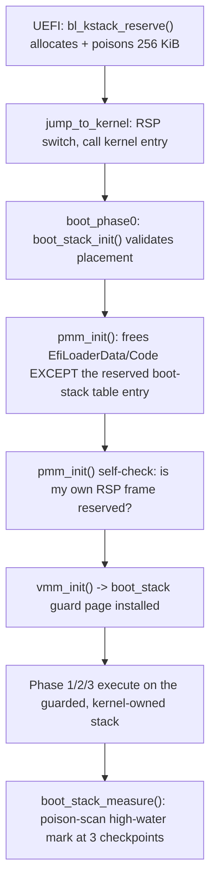

<!-- docs: covers=todo/01-boot-platform/TODO-10-bare-metal-hardening.md sources=src/kernel/main/boot_hw.c,include/kernel/boot_init.h,src/kernel/gdt.c,src/kernel/mm/boot_stack.c,include/kernel/mm/boot_stack.h,src/kernel/isr_stubs.asm,src/boot/uefi/bootx64.c reviewed=2026-09-28 order=10 -->
# Bare Metal Boot Hardening

## What is it?

This is the set of fixes and guardrails that make the kernel boot reliably on real x86-64 hardware, not just under an emulator or hypervisor. It covers dedicated interrupt stacks for fatal exceptions, ACPI-gated legacy device probing, MSI-to-polled storage fallback, graceful subsystem degradation instead of a halt, minimal per-process page tables, and a guarded, kernel-owned stack for every phase of early boot. It exists because several early bugs (a `clac` instruction faulting without SMAP, GS_BASE reading real-mode IVT garbage, an unguarded ring-0 entry stack) were invisible on QEMU and only surfaced on physical hardware; this file is where that lesson became policy.

## How does it work?

Two boot-time execution stacks now carry guard pages, closing what used to be the kernel's only two unguarded stacks. The BSP's ring-3-to-ring-0 entry stack (`TSS.rsp0`) is PMM-backed with a guard page below it, allocated by `bsp_entry_stack_alloc()` in `gdt.c` the same way IST stacks are. Separately, the bootloader itself now allocates a 256 KiB below-4-GiB run before `ExitBootServices`, poisons it, switches `RSP` to its top in `jump_to_kernel`, and publishes the bounds in `boot_info` (v24); `boot_stack_init()` in Phase 0 refuses to let this run overlap the kernel image, and `pmm_init()` proves its own live stack frame is marked reserved before continuing, because otherwise the free-memory walk would hand the running stack's frames back to the allocator.



Everywhere else, the design principle is graceful degradation: PMM, VMM, heap, GDT, IDT and VFS are the only subsystems that halt on failure (`boot_halt()`); everything else is meant to degrade instead. The infrastructure for that is shipped: `kernel_subsystem_apply_result()` records any non-OK result in `g_boot_info.degraded_mask` and lets boot continue, and the `BOOT_TRY(subsys, fn_call, name)` macro wraps a call in it. Adoption is partial: a handful of inits (UEFI variables and time, Secure Boot, TPM, NLS, the kernel notification facility, IPC and exec) report through `kernel_subsystem_apply_result()`, while RTC, keyboard, framebuffer and the synchronous AHCI path are still called directly with no result recorded, so an empty `degraded_mask` does not prove every device initialised. ACPI's FADT `IAPC_BOOT_ARCH` flags gate whether PS/2, RTC and legacy VGA are probed at all, so the kernel never touches hardware the platform declares absent. AHCI falls back from MSI to INTx to polled I/O depending on what the platform actually delivers.

## What are its interfaces?

| Interface | Purpose |
| --------- | ------- |
| `BOOT_TRY(subsys, fn_call, name)` / `kernel_subsystem_apply_result()` | Record a non-critical init result in `degraded_mask` instead of halting; the macro has no call sites yet ([`boot_init.h`](../../include/kernel/boot_init.h), [`boot_init.c`](../../src/kernel/main/boot_init.c)) |
| `g_boot_info.degraded_mask` | Bitmask of which non-critical subsystems failed, surfaced at Phase 3 | 
| `ist_alloc()` / `bsp_entry_stack_alloc()` | Guarded stack allocation for IST1-3 (#DF/NMI/MCE) and the BSP ring-0 entry stack ([`gdt.c`](../../src/kernel/gdt.c)) |
| `bl_kstack_reserve()` | Bootloader-side allocation of the Phase 0/1 execution stack before `ExitBootServices` ([`bootx64.c`](../../src/boot/uefi/bootx64.c)) |
| `boot_stack_init()` / `boot_stack_measure()` | Phase 0 placement validation and poison-scan high-water measurement for the kernel-owned boot stack ([`boot_stack.h`](../../include/kernel/mm/boot_stack.h), [`boot_stack.c`](../../src/kernel/mm/boot_stack.c)) |
| `vmm_map_mmio_uc()` | The only sanctioned way to map device MMIO (never through WB-cached pages) |
| `isr_common_stub` | Shared ISR entry path; no unconditional CPUID-gated opcode (`clac`) runs here until SMAP is actually enabled ([`isr_stubs.asm`](../../src/kernel/isr_stubs.asm)) |

## How do I use it?

```bash
bash scripts/test.sh SUITE=boot       # boot init, IST/guard-page structural tests
make test-boot                        # same, as a make target
bash scripts/test-smoke-matrix.sh     # TCG+KVM x 1+2 CPUs; catches boot-path regressions fast
```

At boot completion, serial reports the guarded-stack measurements directly, for example `BSP entry stack peak at boot completion: N of 16384 bytes used (M bytes margin; ...)` and `PMM: kernel boot stack run 0x7ce51000+0x40000 is reserved (64 frames)`. A non-critical init whose result is recorded through this path and fails sets its bit in `degraded_mask`, and boot continues to the desktop. The full four-platform bare-metal checkpoint sequence (QEMU WHPX, QEMU TCG, VirtualBox, bare metal) is documented as the roadmap file's "Bare Metal Testing Plan".

## What is not implemented yet?

- Full acceptance validation (BM Test 5) is still open: a forced-degradation boot, a deliberate kernel stack overflow proving IST routes to a labelled BSOD instead of a silent reset, and a guard-page-fault acceptance run on both the ring-0 entry stack and the Phase 0/1 execution stack, all need an operator on real hardware: [Bare-Metal Testing Plan](../../todo/01-boot-platform/TODO-10-bare-metal-hardening.md#bare-metal-testing-plan).
- Most non-critical Phase 1-3 inits (`rtc`/`keyboard`/`mouse`/`fb_init`) are still void-returning and `ahci_init`'s return is ignored, so a real failure in most of them never reaches `degraded_mask`. The infrastructure exists but most callers are not wired to it yet: [Resilient Boot with Graceful Degradation](../../todo/01-boot-platform/TODO-10-bare-metal-hardening.md#7-resilient-boot-with-graceful-degradation).
- SMEP/SMAP stay skipped on every platform, not only bare metal: the boot page table still carries the User bit on all kernel 2 MiB pages, so `hv_supports_cr4_smep_smap()` returns 0 until the KPTI clean kernel page table (owned by the [kernel security hardening roadmap](../../todo/02-kernel-core/TODO-10-kernel-security-hardening.md)) lands: [CPU Security Activation and Verification](../../todo/01-boot-platform/TODO-10-bare-metal-hardening.md#9-cpu-security-activation-and-verification).
- IST stacks exist only for the BSP; every AP still shares one `kernel_tss`/IST1-3 region with no per-CPU `ltr`, so AP-side #DF/NMI/MCE delivery is not SMP-isolated: [IST Stacks for Critical Exceptions](../../todo/01-boot-platform/TODO-10-bare-metal-hardening.md#2-ist-stacks-for-critical-exceptions).
- Two user-task ring-0 entry stacks (`task_create_user`, `task_fork`) still come from an unguarded `kmalloc()` rather than a guarded PMM allocation, so the class-audit this section ran is not yet fully closed: [Guard Page Under the BSP Ring-0 Entry Stack](../../todo/01-boot-platform/TODO-10-bare-metal-hardening.md#31-guard-page-under-the-bsp-ring-0-entry-stack).
- The kernel is not built with `-fstack-clash-protection`, so a single stack frame larger than a 4 KiB guard page can step over it without faulting: [Guard Page Under the BSP Ring-0 Entry Stack](../../todo/01-boot-platform/TODO-10-bare-metal-hardening.md#31-guard-page-under-the-bsp-ring-0-entry-stack).
- PID 0 still runs permanently on the loader-allocated boot stack rather than being migrated to an ordinary kernel task stack once the scheduler is up: [Guarded Kernel Stack for Phase 0/1 Execution](../../todo/01-boot-platform/TODO-10-bare-metal-hardening.md#32-guarded-kernel-stack-for-phase-01-execution).
- A panic does not stop the other CPUs: the panic owner is elected, but healthy CPUs keep running and can change the state the crash dump is capturing. Freezing them is deferred until the dump path no longer needs the VFS or the allocator: [Panic-Path Cross-CPU Ownership Residuals](../../todo/01-boot-platform/TODO-10-bare-metal-hardening.md#18-panic-path-cross-cpu-ownership-residuals-from-the-16-review).
- Nested-NMI safety on the shared IST2 stack has no latch/replay path yet, which blocks the LAPIC-NMI boot watchdog from being added safely: [IST Stacks for Critical Exceptions](../../todo/01-boot-platform/TODO-10-bare-metal-hardening.md#2-ist-stacks-for-critical-exceptions).
- Corrected and recoverable machine-check (RAS, WHEA-style) recovery has no owning roadmap section yet, so every machine check panics today; the gap is recorded in [IST Stacks for Critical Exceptions](../../todo/01-boot-platform/TODO-10-bare-metal-hardening.md#2-ist-stacks-for-critical-exceptions).

## How does it compare with Windows 11 and Linux?

The individual mechanisms match established practice: Linux's IST1-4 assignment for #DF/NMI/MCE, Windows HAL's ACPI FADT boot-architecture flag checks, both OSes' MSI-to-legacy storage fallback, and both OSes' graceful-degradation-over-halt policy for non-critical devices. Two areas go further than either mainstream OS publishes: a numbered four-platform bare-metal test matrix with recorded pass/fail history per checkpoint (Windows' WHQL testing is internal-only; Linux's hardware coverage is community-driven and undocumented per-machine), and a measured, poison-scan high-water mark for the early-boot execution stack (Linux's `CONFIG_DEBUG_STACK_USAGE` is the closest analogue and is not enabled by default; Windows publishes no such figure at all).

## See also

- [Bare Metal Boot Hardening roadmap](../../todo/01-boot-platform/TODO-10-bare-metal-hardening.md)
- [Bare Metal Gotchas](../infrastructure/bare-metal-gotchas.md)
- [CPU Boot Sequencing and AP Bringup](cpu-boot-sequencing.md)
- [boot_info Field Ownership](boot-info-fields.md)
