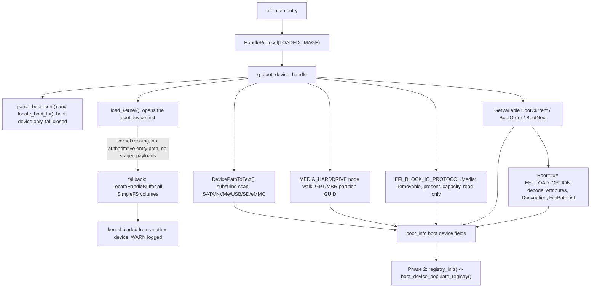

<!-- docs: covers=todo/01-boot-platform/TODO-05-boot-device-discovery.md sources=src/boot/uefi/bootx64.c,src/boot/uefi/efi.h,include/kernel/boot_info.h,src/kernel/main/boot_hw.c,src/kernel/test/test_boot_device.c reviewed=2026-09-28 order=5 -->
# Boot Device Discovery and Fallback Chain

## What is it?

Boot device discovery is how the UEFI bootloader figures out which physical device it actually booted from, keeps every subsequent file read on that same device, and falls back to another device if the kernel cannot be found there. It also classifies the device (SATA, NVMe, USB, SD, eMMC), extracts its GPT partition GUID, reads the UEFI boot variables (`BootOrder`, `BootCurrent`, `BootNext`), and hands all of it to the kernel through `struct boot_info` and the Registry. Without this, the bootloader could load `boot.conf` and the kernel from whichever filesystem UEFI's protocol database happened to enumerate first, which is wrong on any multi-disk machine.

## How does it work?

Everything starts from `EFI_LOADED_IMAGE_PROTOCOL`, the one UEFI structure that reliably names the device the bootloader itself was launched from. The bootloader resolves it once at entry, stores the handle in a single global, and every later stage (filesystem access, device classification, GUID extraction, removable-media and health checks) reads that same handle instead of re-discovering it.



Only one path may leave the boot device. `parse_boot_conf()` and `locate_boot_fs()` (which staged `module=`, `initrd=` and `recovery_image=` payloads use) read the boot device's filesystem and fail closed, so a wrong-disk `boot.conf` or payload is never read (`src/boot/uefi/bootx64.c:4362`). `load_kernel()` alone keeps a cross-volume fallback for recovery, and even that refuses to run when an authoritative SPLIT or SAFE entry path was selected or when staged payloads were already loaded from the boot device, because a kernel from another volume would then contradict the audit record or mix provenance.

Device type classification reads the ASCII text `DevicePathToText()` produces for the full device path, rather than walking the raw device-path nodes returned by `HandleProtocol`, because the partition-rooted path `HandleProtocol` returns omits the parent Messaging nodes (SATA/NVMe/USB bus identifiers) that only the text form retains (`src/boot/uefi/bootx64.c:7809`). The GPT partition GUID comes from a genuine node walk instead, looking for a `MEDIA_HARDDRIVE_DP` node per UEFI Table 10-58.

Once classified, the boot device information is written into `struct boot_info` (device type, path, partition GUID/style, removable flag, media-present flag, capacity, UEFI boot variables, Boot#### decode, and a set of NVMe/PCI/SD/eMMC identifiers added later), and after `registry_init()` runs in Phase 2, `boot_device_populate_registry()` mirrors it into `HKLM\SYSTEM\Boot\Device\*` (`src/kernel/main/boot_hw.c:752`, called from `src/kernel/registry.c:3178`).

## What are its interfaces?

| Interface | Purpose |
| --------- | ------- |
| `g_boot_device_handle` / `HandleProtocol(LOADED_IMAGE)` | Resolves the actual boot device once at entry ([`bootx64.c`](../../src/boot/uefi/bootx64.c)) |
| `locate_boot_fs()` | Filesystem access for staged payloads, scoped to the boot device and failing closed ([`bootx64.c`](../../src/boot/uefi/bootx64.c)) |
| Device-type classifier (`DevicePathToText` substring scan) | Classifies SATA / NVMe / USB / network / SD / eMMC ([`bootx64.c`](../../src/boot/uefi/bootx64.c)) |
| `struct boot_info` boot-device fields | Kernel-visible boot device record: type, path, partition GUID/style, removable, NVMe NSID/EUI-64, PCI device/function ([`boot_info.h`](../../include/kernel/boot_info.h)) |
| `boot_device_populate_registry()` | Writes `HKLM\SYSTEM\Boot\Device\*` after `registry_init()` ([`boot_hw.c`](../../src/kernel/main/boot_hw.c)) |
| `POST16_BL_BOOT_DEV` .. `POST16_BL_FALLBACK_OK` (`0xB090`-`0xB095`) | Serial POST codes that localize a bootloader hang to a specific discovery stage ([`bootx64.c`](../../src/boot/uefi/bootx64.c)) |
| `EFI_DP_TYPE_MESSAGING`/`EFI_DP_HW_PCI` node constants | UEFI device-path node types used by the classifier and GUID/NVMe/PCI walkers ([`efi.h`](../../src/boot/uefi/efi.h)) |

## How do I use it?

Build and run the kernel-side unit tests, which validate the `boot_info` fields this feature populates:

```bash
bash scripts/build.sh
bash scripts/test.sh SUITE=boot     # or: make test-boot
```

Boot in QEMU and read the serial log for the discovery trail:

```bash
bash scripts/test-smoke.sh
grep '\[BOOT\]' build/smoke-test.stripped.log
```

Expected lines (exact device path and GUID vary by firmware):

```text
[BOOT] Boot device: handle=0x...
[BOOT] Using boot device filesystem
[BOOT] Boot device path: PciRoot(0x0)/Pci(0x2,0x0)/Sata(0x0,0xFFFF,0x0)
[BOOT] Boot partition: GUID=XXXXXXXX-XXXX-XXXX-XXXX-XXXXXXXXXXXX (GPT)
[BOOT] Boot disk: NNN MiB (SATA)
[BOOT] BootCurrent=0x0000
[BOOT] BootOrder=[0x0000]
```

To rehearse the fallback chain, boot without a selected entry-store kernel path and without staged payloads, remove the kernel from the boot device's filesystem, and leave it on a second attached device; the bootloader logs `[WARN] Kernel found on non-boot device at \boot\kernel.exe` and continues. With an authoritative entry path or staged payloads the same setup halts with a `[FAIL]` or `[FATAL]` line explaining the refusal instead.

## What is not implemented yet?

Every section of the roadmap file has shipped (14/14, all `[x]`, no `[/]` or `**Deferred:**` items). Network/PXE/HTTP boot device discovery is explicitly out of scope here and owned by [Network PXE/HTTP Boot](../../todo/01-boot-platform/TODO-25-network-pxe-http-boot.md).

## How does it compare with Windows 11 and Linux?

Impossible OS matches both platforms on the fundamentals: Windows identifies its boot device through the BCD store plus the Loaded Image device path, and Linux's GRUB does an equivalent device search; both read UEFI boot variables (Windows via the Runtime API, Linux via `efibootmgr`/`efivarfs`) and both validate a stable partition identifier (Windows the BCD disk signature, Linux `PARTUUID`). Impossible OS goes further in two places neither competitor does at the bootloader stage: it logs a full enumeration of every filesystem-bearing device found at boot (Windows hides this in the Event Log, Linux does not log it at all), and it runs a pre-boot disk health check using `EFI_BLOCK_IO_PROTOCOL.Media` before the kernel loads, where both Windows (`storport.sys`) and Linux (`smartd`) only check disk health after boot.

## See also

- [Boot Device Discovery & Fallback Chain roadmap](../../todo/01-boot-platform/TODO-05-boot-device-discovery.md)
- [struct boot_info Field Ownership Matrix](boot-info-fields.md)
- [Boot Media, Image Pipeline & Installer Handoff](boot-media-image-pipeline.md)
