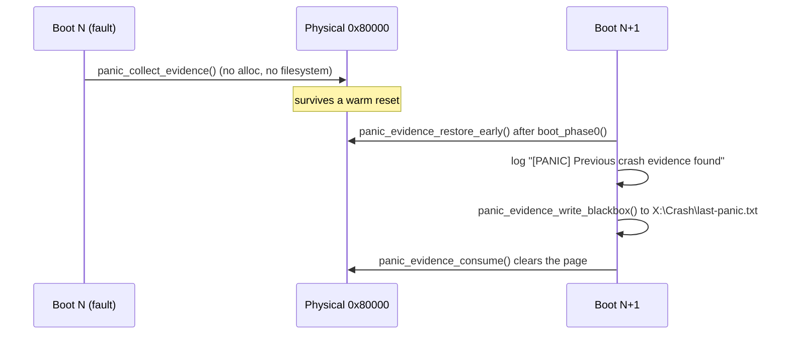

<!-- docs: covers=todo/01-boot-platform/TODO-14-boot-diagnostics.md sources=include/kernel/boot_progress.h,src/kernel/main/boot_progress.c,include/kernel/panic.h,src/kernel/panic.c,include/kernel/boot_load_status.h,src/kernel/main/boot_load_status.c,src/kernel/main.c,src/kernel/main/boot_desktop.c,src/kernel/main/boot_version.c,src/kernel/test/test_boot_diag.c reviewed=2026-09-28 order=14 -->
# Boot Diagnostics

## What is it?

Boot diagnostics turn a boot into something a developer or support engineer can read afterwards: a named-stage progress log on serial, a four-digit POST hex code on screen and on I/O port 0x80, a panic record that survives a warm reset, a per-subsystem load and status log, and a machine-readable boot timeline. It builds on the boot splash and arc spinner, which shipped earlier. Two features the roadmap names, a panic-screen QR code and an always-on vital-signs strip, are designed but not built.

## How does it work?

Each boot stage calls `boot_stage_report(stage, msg)`. It appends an entry (TSC timestamp, elapsed milliseconds, message) to a 32-entry history that never wraps, writes a `[+NNNms] STAGE_NAME: msg` line to serial, draws the stage's four-digit POST code in the top-right corner of the framebuffer, and forwards to the lower-level `boot_progress()` milestone hook. Elapsed time is measured from `BOOT_STAGE_KERNEL_ENTRY` using the calibrated TSC frequency (`boot_get_elapsed_ms()`). A static table maps the 15 stages, from `BOOT_STAGE_UEFI_INIT` to `BOOT_STAGE_DESKTOP_READY`, to their POST codes and names. The corner display (`post_display16()`) writes the code's high byte to port 0x80 for a hardware POST card and draws an 8x8 glyph font straight to video memory.

Panic forensics work across a reboot rather than within one boot. At fault time, `panic_collect_evidence()` writes a versioned, CRC32-checked `struct panic_evidence` (crash identity, register file, the last 16 stage-history entries and the last 8 klog lines) to physical address `0x80000`, with no allocation, filesystem access or lock. On the next boot `kernel_main()` calls `panic_evidence_restore_early()` right after `boot_phase0()`. A valid record logs `[PANIC] Previous crash evidence found (STOP 0x... rip=0x...)` and is later written to `X:\Crash\last-panic.txt` by `panic_evidence_write_blackbox()`. The record is kept, not cleared, on restore, so a boot that dies before the write can retry; only `panic_evidence_consume()` clears it.

The load and status log is finer grained than the stage list. Instead of one coarse "drivers" stage, `boot_load_begin()`, `boot_load_finish()` and `boot_load_record()` let each subsystem publish its own LOADED, SKIPPED, FAILED or DEGRADED verdict into a lock-free 64-entry pool, so parallel async storage probes can each publish without a lock. `boot_load_status_dump_to_blackbox()` writes the pool to `X:\Diag\boot-load-status.txt`, and `boot_timeline_dump_json()` writes a unified firmware-plus-TSC timeline to `boot-timeline.json`. Both run from the late-boot diagnostics dump in `boot_desktop.c`.



## What are its interfaces?

| Interface | Purpose |
| --------- | ------- |
| `boot_stage_report(stage, msg)` | Named-stage report: history, serial line, POST code, splash forward ([`boot_progress.c`](../../src/kernel/main/boot_progress.c)) |
| `boot_get_elapsed_ms()` / `boot_stage_history_get()` | Milliseconds since kernel entry, and the stage history panic forensics read ([`boot_progress.h`](../../include/kernel/boot_progress.h)) |
| `post_display16(code)` | Draws the four-digit POST code and writes port 0x80 ([`boot_progress.c`](../../src/kernel/main/boot_progress.c)) |
| `boot_timeline_dump_json()` | Writes `boot-timeline.json` ([`boot_progress.c`](../../src/kernel/main/boot_progress.c)); format in [`boot-timeline.json` Wire Format](boot-timeline-schema.md) |
| `panic_collect_evidence()` | Fault-time capture into `struct panic_evidence` at `0x80000` ([`panic.c`](../../src/kernel/panic.c), [`panic.h`](../../include/kernel/panic.h)) |
| `panic_evidence_restore_early()` / `panic_had_previous_crash()` | Next-boot restore and the previous-crash flag ([`panic.c`](../../src/kernel/panic.c)) |
| `panic_evidence_write_blackbox()` / `panic_evidence_consume()` | Write `X:\Crash\last-panic.txt`, then clear the cross-boot page ([`panic.c`](../../src/kernel/panic.c)) |
| `boot_load_begin()` / `boot_load_finish()` / `boot_load_record()` | Spanned and point events into the load and status pool ([`boot_load_status.h`](../../include/kernel/boot_load_status.h)) |
| `boot_load_status_dump_to_blackbox()` | Writes `X:\Diag\boot-load-status.txt` ([`boot_load_status.c`](../../src/kernel/main/boot_load_status.c)) |
| `boot_loader_identity_dump_to_blackbox()` | Bootloader git SHA, build time and label to `X:\Diag\boot-loader-identity.txt` ([`boot_version.c`](../../src/kernel/main/boot_version.c)) |

## How do I use it?

```bash
bash scripts/test.sh SUITE=boot            # boot diagnostics tests (test_boot_diag.c)
make test-boot                             # same, as a make target
scripts\debug\kernel\run-boot-tests.bat    # Windows equivalent
```

Set `crash_test=1` in `boot.conf` to trigger a deliberate stop during desktop init, or `crash_test=2` for a crash in the compositor's first frame. Reboot, then look for the `[PANIC] Previous crash evidence found` line on serial and read `X:\Crash\last-panic.txt`.

On every boot, serial shows a `[+NNNms] STAGE_NAME: msg` line per stage, and the top-right corner of the screen shows the current POST code until the desktop is ready. Afterwards, `X:\Diag\` holds `boot-load-status.txt` and `boot-loader-identity.txt`, and `X:\Perf\` holds `boot-timeline.json`; [BlackBox Diagnostic Artifacts](black-box-artifacts.md) lists every file.

## What is not implemented yet?

- The alive-blink heartbeat is permanently deferred, because drawing from an interrupt handler caused recursive interrupts on bare metal: [Alive Blink / Visual Heartbeat Indicator](../../todo/01-boot-platform/TODO-14-boot-diagnostics.md#4-alive-blink--visual-heartbeat-indicator-permanently-deferred----isr-fb_swap_rect-caused-recursive-interrupts-on-bare-metal).
- The panic-screen QR code has no code yet; it needs a larger QR encoder and phone-scan validation: [Panic QR Code](../../todo/01-boot-platform/TODO-14-boot-diagnostics.md#6-panic-qr-code-deferred----multi-version-qr-encoder-needs-segno-module-diff--phone-scan-validation-unavailable-in-the-autonomous-env-bootloader-v3-encoder-is-the-reuse-seed).
- The multi-instance spinner pool is not in the tree: [System-Wide Multi-Instance Spinner](../../todo/01-boot-platform/TODO-14-boot-diagnostics.md#7-system-wide-multi-instance-spinner-deferred----desktop-polish-single-spinner-works).
- The always-on vital-signs strip has no code yet: [Runtime Vital Signs Strip](../../todo/01-boot-platform/TODO-14-boot-diagnostics.md#8-runtime-vital-signs-strip-deferred----developer-tool-needs-scheduler-stats-first).
- `boot_progress_poll()` exists but nothing calls it on a timer yet: [Boot Progress Named-Stage API](../../todo/01-boot-platform/TODO-14-boot-diagnostics.md#2-boot-progress-named-stage-api).
- Per-driver load records (storage, input, ACPI and graphics each reporting instead of one aggregate entry) and separating an absent device from a failed probe: [Boot Load Status Granularity](../../todo/01-boot-platform/TODO-14-boot-diagnostics.md#12-boot-load-status-granularity-per-driver-records-probe-aggregation-nvme-partial-init).
- `klog` reads every numeric format argument as 64-bit regardless of its width: [klog Format-Width Contract](../../todo/01-boot-platform/TODO-14-boot-diagnostics.md#13-klog-format-width-contract-compiler-checked).
- The anti-rollback terminal give-up leaves no durable cross-boot record: [Anti-Rollback Terminal Give-Up](../../todo/01-boot-platform/TODO-14-boot-diagnostics.md#15-anti-rollback-terminal-give-up-durable-record).
- A panic during `boot_phase0()`, before the restore runs, still overwrites the previous boot's unread record: [Restore Panic Evidence Before Phase 0 Can Overwrite It](../../todo/01-boot-platform/TODO-14-boot-diagnostics.md#17-restore-panic-evidence-before-phase-0-can-overwrite-it).
- Whether the bootloader managed to reserve the `0x80000` page is not passed to the kernel: [Record the Panic-Page Pin Outcome](../../todo/01-boot-platform/TODO-14-boot-diagnostics.md#19-record-the-panic-page-pin-outcome-in-the-boot_info-handoff).

## How does it compare with Windows 11 and Linux?

POST codes, named boot progress, a per-driver load log and cross-boot panic forensics match what Windows (ETW boot trace, `ntbtlog.txt`, WER minidumps) and Linux (dmesg, `systemd-analyze`, kdump and pstore) provide. Two things go further: the bootloader build-identity file (Windows needs `bcdedit` or `msinfo32`, Linux `uname`), and the boot-timeline export, which offers both a Gantt SVG and a Chrome trace-event file. The panic QR code and the vital-signs overlay would have no kernel-level equivalent on either system, but they are planned, not shipped.

## See also

- [Boot Diagnostics, Heartbeat and Spinner roadmap](../../todo/01-boot-platform/TODO-14-boot-diagnostics.md)
- [Visual POST Display](visual-post-display.md)
- [`boot-timeline.json` Wire Format](boot-timeline-schema.md)
- [BlackBox Diagnostic Artifacts](black-box-artifacts.md)
- [Bare Metal Gotchas](../infrastructure/bare-metal-gotchas.md)
