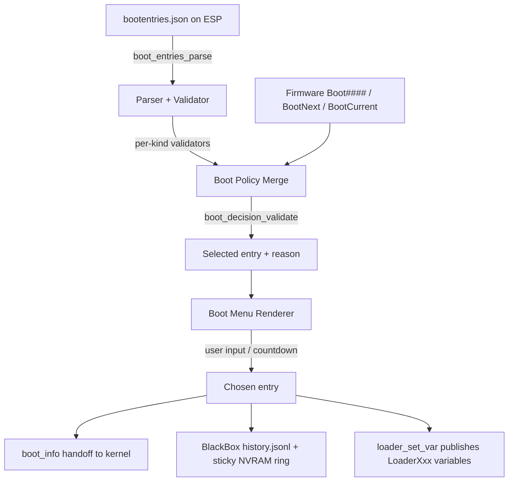

<!-- docs: covers=todo/01-boot-platform/TODO-07-boot-entry-store-menu-policy.md sources=include/boot/boot_entries.h,src/boot/uefi/boot_entries_parser.c,src/boot/uefi/boot_policy.c,src/kernel/main/boot_decision.c,src/kernel/main/boot_audit.c,tools/bootcfg/bootcfg.py,include/kernel/boot_info.h reviewed=2026-09-28 order=7 -->
# Boot Entries, Menu and Policy

## What is it?

This is Impossible OS's replacement for the Windows BCD store and the Linux Boot Loader Specification: a schema-versioned, CRC-checksummed JSON file on the ESP that lists every bootable entry (the running OS, previous kernels, safe mode, test mode, and eventually recovery, A/B slots and network boot), a renderer that shows them as a menu with hotkeys and countdown, and a merge layer that combines firmware-level `BootNext`/`BootOrder` with OS-side policy into one deterministic selection. It also owns the audit trail of every boot decision and the `LoaderXxx` UEFI variables userspace reads back.

Sections 1 through 20 of the roadmap are closed, but two of them (A/B and recovery entries, and previous-kernel entries) are closed as deferred with nothing implemented, because they wait on integration work elsewhere: A/B slot selection and slot mounting have shipped, but root-aware kernel loading for a slot entry, the recovery load path and recovery-entry registration have not. Sections 21, 22 and 23, filed from later reviews, are still open.

## How does it work?



- **Entry format.** [`boot_entries.h`](../../include/boot/boot_entries.h) defines the on-disk envelope: `schema_version`, a CRC-32 (IEEE 802.3) header, and an array of entries, each with a stable `kind` (0..99 reserved, 100..199 vendor/experimental skip-with-warn, >=200 reserved). The canonical spec with JSON examples lives in the schema deep dive below.
- **Parse and validate.** [`boot_entries_parser.c`](../../src/boot/uefi/boot_entries_parser.c) reads `\EFI\ImpossibleOS\bootentries.json`, checks the CRC, and rejects a store that is missing, oversize, CRC-mismatched, or newer than the schema version the bootloader understands. On any rejection it calls `boot_entries_synthesize_fallback()`, which builds exactly one entry matching whatever path is currently loading (UKI fast path or split-path `kernel.exe`).
- **Policy merge.** [`boot_policy.c`](../../src/boot/uefi/boot_policy.c) and [`boot_decision.c`](../../src/kernel/main/boot_decision.c) (`boot_decision_validate()`) combine the firmware-selected `Boot####` variable with the OS-side entry list and any one-shot overrides into a single selected entry, recording the reason.
- **Menu.** `boot_menu_run()` and `boot_menu_render()` in [`bootx64.c`](../../src/boot/uefi/bootx64.c) draw the entry list over GOP graphics, the UEFI `ConOut` text console, or serial, with a countdown, hotkeys (F8 safe mode, F10 reboot into firmware setup, and F11, probed before the menu decides whether to show, to force it open), and indicators for the default and last-failed entries.
- **Audit.** [`boot_audit.c`](../../src/kernel/main/boot_audit.c) appends every boot decision to `X:\Boot\history.jsonl`, with a small sticky NVRAM ring as the exceptional durable fallback; this is the primary record, not NVRAM.
- **Loader variables.** The bootloader publishes the systemd-boot-compatible `LoaderXxx` UEFI variables through `loader_set_var()` in `bootx64.c` (twelve are documented) so userspace tooling can read the live entry list and selection without parsing the boot entry file itself.
- **`boot_info` ABI.** The bootloader hands the kernel the selected entry id and reason through `struct boot_info` ([`boot_info.h`](../../include/kernel/boot_info.h)); `loader_vars_degraded` (added at ABI v21) tells the kernel that at least one loader-variable write failed, so the kernel can record degraded publication in the audit log.

## What are its interfaces?

| Interface | Purpose |
| --------- | ------- |
| [`boot_entries.h`](../../include/boot/boot_entries.h) | On-disk entry schema, kind enum, flag bits, CRC algorithm: deep dive [Boot Entry Store Schema](boot-entry-schema.md) |
| [`boot_policy.c`](../../src/boot/uefi/boot_policy.c), [`boot_decision.c`](../../src/kernel/main/boot_decision.c) | Firmware-vs-OS policy merge ladder: deep dive [Boot Policy Merge Order](boot-policy.md) |
| `boot_menu_run()` / `boot_menu_render()` in [`bootx64.c`](../../src/boot/uefi/bootx64.c) | Menu renderer, countdown, hotkeys, indicators: deep dive [Boot Menu Renderer + Hotkeys + Indicators](boot-menu.md) |
| [`boot_health_check.c`](../../src/kernel/main/boot_health_check.c) | Per-entry health gate that decides when an entry is marked good: deep dive [Boot Health Gate](boot-health.md) |
| [`boot_audit.c`](../../src/kernel/main/boot_audit.c) | `history.jsonl` + sticky NVRAM ring decision audit: deep dive [Boot Policy Audit Schema](boot-history-schema.md) |
| `loader_set_var()` in [`bootx64.c`](../../src/boot/uefi/bootx64.c) | `LoaderXxx` UEFI variables userspace reads: deep dive [OS-Visible Loader UEFI Variables](loader-vars.md) |
| [`tools/bootcfg/bootcfg.py`](../../tools/bootcfg/bootcfg.py) | Host-side offline entry editor and validator front end: deep dive [bootcfg: Boot Entry Store Editor](bootcfg.md) |
| `scripts/release/build-image.sh`, `scripts/release/build-iso.sh` | First-install default + recovery + installer entry seeding: deep dive [Bootstrap & First-Install Entry Seeding](bootstrap.md) |

## How do I use it?

Edit or inspect the store from the host with `bootcfg` (every mutation is validated before it is written; the full field set for `--json` is in the [schema](boot-entry-schema.md)):

```bash
python3 tools/bootcfg/bootcfg.py list bootentries.json
python3 tools/bootcfg/bootcfg.py add bootentries.json --json '{"id": "my-entry", "title": "My Kernel", "kind": "split", ...}'
python3 tools/bootcfg/bootcfg.py set-default bootentries.json my-entry
```

Validate a store independently of the firmware parser:

```bash
python3 tools/boot-entry-validate/validate.py bootentries.json
```

Run the boot-entry kernel suite and the smoke matrix after a change to the parser, policy, or menu:

```bash
bash scripts/test.sh SUITE=boot
bash scripts/test-smoke-matrix.sh
```

At boot, press F11 to force the menu open; inside the menu, F8 requests safe mode and F10 reboots into firmware setup; with no keypress the countdown default fires and the selection reason is written to `history.jsonl` and, on success, to the `LoaderXxx` variables.

## What is not implemented yet?

- Published loader variables do not all have an explicit set-or-clear outcome yet: a stale `LoaderDevicePartUUID` can survive into a boot where partition identity is unknown. [Published Loader Variables Need an Explicit Set-or-Clear Outcome](../../todo/01-boot-platform/TODO-07-boot-entry-store-menu-policy.md#21-published-loader-variables-need-an-explicit-set-or-clear-outcome).
- The 16 KiB store size cap has no test coverage at its boundary on either the firmware or the host validator side. [Store Size Cap Is Untested on Both Sides of the 16 KiB Boundary](../../todo/01-boot-platform/TODO-07-boot-entry-store-menu-policy.md#22-store-size-cap-is-untested-on-both-sides-of-the-16-kib-boundary).
- A rejected store has no repair path beyond the one-entry fallback: no shadow copy, no A/B pair for the store itself, and no regeneration route. [A Rejected Store Has No Repair Path, Only a One-Entry Fallback](../../todo/01-boot-platform/TODO-07-boot-entry-store-menu-policy.md#23-a-rejected-store-has-no-repair-path-only-a-one-entry-fallback).
- A/B and recovery entries are not wired into the live menu yet, and neither is the greyed demoted-entry style, its `last_failure_reason` label, or the rollback reason on the menu line: the slot storage exists, but root-aware kernel loading for a slot entry (a follow-up in the [A/B boot rollback roadmap](../../todo/01-boot-platform/TODO-21-ab-boot-rollback.md)) and the recovery load path and entry registration (in the [recovery partition roadmap](../../todo/01-boot-platform/TODO-22-recovery-partition.md)) are still open. [A/B and Recovery Entry Integration](../../todo/01-boot-platform/TODO-07-boot-entry-store-menu-policy.md#9-ab-and-recovery-entry-integration).
- The health gate that marks an entry good cannot yet check network reachability or service stability (both checks report skipped and do not block mark-good), and the slot-level `mark_boot_successful` hook it should call is not wired, so an entry marked good does not confirm its A/B slot: [Per-Entry Health-Gated Mark-Good](../../todo/01-boot-platform/TODO-07-boot-entry-store-menu-policy.md#14-per-entry-health-gated-mark-good).
- Previous-kernel and known-good rollback entries are not implemented: blocked on the update-delta producer and an as-yet-ownerless panic-counter persistence path. [Previous-Kernel and Known-Good Entries](../../todo/01-boot-platform/TODO-07-boot-entry-store-menu-policy.md#10-previous-kernel-and-known-good-entries).
- `bootcfg` has no live-boot binary yet; entry edits are offline-only from the host tool. [Boot Entry Editor Tooling](../../todo/01-boot-platform/TODO-07-boot-entry-store-menu-policy.md#11-boot-entry-editor-tooling).
- `kind: test` and `kind: diagnostics` entry admission is deferred to the entry-kinds section, and the chainload, network and resume kinds still need their loaders wired. [Entry Kinds: Split, UKI, Chainload, Network, Resume](../../todo/01-boot-platform/TODO-07-boot-entry-store-menu-policy.md#13-entry-kinds-split-uki-chainload-network-resume).
- systemd Boot Loader Interface parity is partial: full BLS display order and `LoaderTime` calibration against the real TSC frequency are still open. [Boot Loader Interface (systemd BLI) Parity Fixes](../../todo/01-boot-platform/TODO-07-boot-entry-store-menu-policy.md#18-boot-loader-interface-systemd-bli-parity-fixes).

## How does it compare with Windows 11 and Linux?

On shipped ground, Impossible OS already matches Windows 11's BCD store and Linux's systemd-boot/GRUB BLS for structured entries, BootNext provenance, menu UX, offline tooling, loop prevention and OS-visible loader variables, and it goes further where neither incumbent has an equivalent: a documented two-layer firmware/OS policy precedence, demote-not-drop entries (an exhausted entry stays in the menu with a `[FAIL]` indicator instead of being hidden; the greyed style and the `last_failure_reason` label are still pending in the A/B and recovery section), a full per-decision JSONL audit trail, and a schema-versioned CRC-checksummed store with a per-mutation audit log. It does not yet match either OS on A/B and recovery menu entries or previous-kernel rollback, both of which exist in Windows (WinRE, limited BCD bootsequence) and Linux (GRUB recovery, GRUB previous kernel) today; those wait on the slot-loading and recovery-entry integration work listed above.

## See also

- [Boot Entry Store, Menu & Policy roadmap](../../todo/01-boot-platform/TODO-07-boot-entry-store-menu-policy.md)
- [Boot Entry Store Schema](boot-entry-schema.md)
- [Boot Policy Merge Order](boot-policy.md)
- [Boot Menu Renderer + Hotkeys + Indicators](boot-menu.md)
- [Boot Health Gate](boot-health.md)
- [Boot Policy Audit Schema](boot-history-schema.md)
- [OS-Visible Loader UEFI Variables](loader-vars.md)
- [bootcfg: Boot Entry Store Editor](bootcfg.md)
- [Bootstrap & First-Install Entry Seeding](bootstrap.md)
