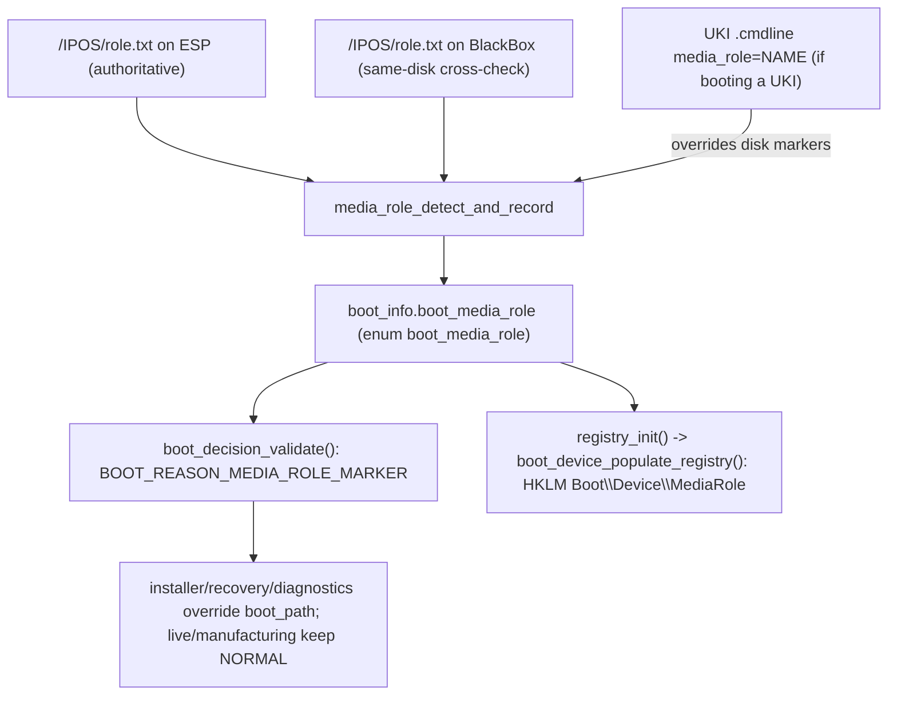

<!-- docs: covers=todo/01-boot-platform/TODO-06-boot-media-image-installer-handoff.md sources=src/boot/uefi/bootx64.c,include/kernel/boot_info.h,include/boot/uki_cmdline_media_role.h,src/kernel/main/boot_hw.c,src/kernel/main/boot_decision.c reviewed=2026-09-28 order=6 -->
# Boot Media, Image Pipeline and Installer Handoff

## What is it?

This is the boot-platform-native slice of Impossible OS's release-artifact story: how the bootloader recognizes what kind of medium it is running from (a normal installed disk, installer media, a live image, a recovery image, manufacturing media, or a diagnostics image) and hands that "media role" to the kernel. It answers one question the raw artifact-build pipeline cannot answer by itself: once an ISO, USB stick, or VHDX is actually booted, what should the running system believe about itself? Building the artifacts (raw/USB/VHD/VHDX/VDI/ISO images, their manifests, and their signing) is a separate, larger pipeline owned elsewhere; this page covers only the part that runs inside the bootloader and the kernel at every boot.

## How does it work?

A marker file, `/IPOS/role.txt`, is written onto the ESP by the artifact build (`scripts/release/build-image.sh --role NAME`) and mirrored onto the BlackBox service partition on the same physical disk. At boot, `media_role_detect_and_record()` reads both copies, cross-checks them, and falls back to `normal` with a warning on disagreement or an unset role (`src/boot/uefi/bootx64.c:14792`). The BlackBox copy is only trusted if it lives on the same physical disk as the boot device, resolved through `esp_find_parent_disk()` walking the parent `BlockIo` handle (`src/boot/uefi/bootx64.c:14010`), so a rogue same-labelled volume on a different disk cannot spoof the role.



The precedence when more than one source is present is fixed: a signed UKI's `.cmdline` `media_role=` value wins over the disk marker, because it is covered by the firmware's Secure Boot signature chain and the disk marker is not (`include/boot/uki_cmdline_media_role.h`). A planned DHCP option for network boot would sit between the two; the disk marker is the fallback, and `normal` is the default when nothing is present.

Once decoded, the role reaches the kernel two ways: through `struct boot_info.boot_media_role` (an `enum boot_media_role` with 6 roles plus `UNSET`, `include/kernel/boot_info.h:941`) and, for non-`normal` roles, through a boot-path override recorded in `boot_decision_validate()`'s policy table as `BOOT_REASON_MEDIA_ROLE_MARKER` (`src/kernel/main/boot_decision.c:78`). After `registry_init()` runs in Phase 2, `boot_device_populate_registry()` writes `HKLM\SYSTEM\Boot\Device\MediaRole` (string) plus `MediaRoleEnum`/`MediaRoleMismatch` (DWORD) alongside the rest of the boot device Registry surface.

The artifact-signing half of this picture, verifying that the manifest and the media itself have not been tampered with, is designed but only partially shippable today: the bootloader is freestanding UEFI code and cannot call the kernel's crypto (`cng_*`), so bootloader-side Ed25519+SHA-256 verification is blocked on a vendored crypto subset. What **is** shipped is the read side: `boot_info` v18 surfaces the firmware's own SBAT level and dbx (UEFI revocation list) status as a "trust landscape", exposed to the kernel and to `HKLM\SYSTEM\Boot\Trust\*`, independent of the blocked signature path.

## What are its interfaces?

| Interface | Purpose |
| --------- | ------- |
| `/IPOS/role.txt` (ESP + BlackBox) | On-disk media role marker, written by the artifact build |
| `media_role_detect_and_record()` | Bootloader hook that reads, cross-checks, and records the media role ([`bootx64.c`](../../src/boot/uefi/bootx64.c)) |
| `enum boot_media_role` / `boot_info.boot_media_role` | Kernel-visible role value (normal, installer, live, recovery, manufacturing, diagnostics) ([`boot_info.h`](../../include/kernel/boot_info.h)) |
| `include/boot/uki_cmdline_media_role.h` | Static-inline parser for the UKI `.cmdline` `media_role=` override |
| `BOOT_REASON_MEDIA_ROLE_MARKER` / `boot_decision_validate()` | Boot-path policy coupling for non-normal roles ([`boot_decision.c`](../../src/kernel/main/boot_decision.c)) |
| `boot_device_populate_registry()` | Writes `HKLM\SYSTEM\Boot\Device\MediaRole` and the trust-landscape Registry keys ([`boot_hw.c`](../../src/kernel/main/boot_hw.c)) |

## How do I use it?

Build a role-tagged artifact and boot it:

```bash
bash scripts/build.sh
bash scripts/release/build-image.sh --role installer
```

The bootloader logs the detected role before the kernel loads, and the kernel confirms it after Registry population:

```text
[BOOT] Media role: installer
Boot device Registry populated: ... media_role=installer
```

Run the boot-platform unit-test suite, which covers the role-detection policy table, the v17/v18 layout pins, and the UKI cmdline parser:

```bash
bash scripts/test.sh SUITE=boot
```

For the artifact side of the pipeline (building, converting, signing, and inspecting raw/USB/VHD/VHDX/VDI/ISO artifacts), see the deep-dive pages below rather than this one: [Boot Artifacts: Build, Verify, Write](../release/boot-artifacts.md), [Boot Artifact Manifest Schema](../release/boot-artifact-manifest.md), and [Windows Host Tooling](../release/windows-host-tooling.md).

## What is not implemented yet?

- Manifest signing with the release key and bootloader-side signature verification are blocked on a vendored Ed25519+SHA-256 implementation the freestanding bootloader can call: [Artifact Signing and Manifest Verification](../../todo/01-boot-platform/TODO-06-boot-media-image-installer-handoff.md#7-artifact-signing-and-manifest-verification).
- Rejecting modified installer/recovery media by default (`allow_unsigned_media=1` opt-out) is blocked on the same crypto work: same section as above.
- A non-normal media role is metadata only today: the kernel records it and logs which roadmap owns the matching shell, but it does not launch an installer, recovery or diagnostics environment, because those shells do not exist yet: [Bootloader Handoff of Media Role](../../todo/01-boot-platform/TODO-06-boot-media-image-installer-handoff.md#6-bootloader-handoff-of-media-role).
- Cryptographic signature checking (`Signature: OK`/`FAIL`) in the offline artifact inspector is blocked on the same crypto work; it currently reports `unverified`/`unsigned` only: [Offline Artifact Inspector](../../todo/01-boot-platform/TODO-06-boot-media-image-installer-handoff.md#8-offline-artifact-inspector).
- Hardening `media_role_locate_blackbox_fs()` to bind the BlackBox partition by GPT name/GUID instead of FAT label plus same-disk check is an open item, tracked in the [BlackBox service partition roadmap](../../todo/01-boot-platform/TODO-24-blackbox-service-partition.md#11-fat32-volume-label----set-blackbox-at-format-time).
- The Hyper-V VHDX boot leg of the CI artifact matrix is blocked on a non-interactive Windows WHPX runner script: [CI Boot Matrix for Every Artifact](../../todo/01-boot-platform/TODO-06-boot-media-image-installer-handoff.md#9-ci-boot-matrix-for-every-artifact).
- The network-boot half of the cross-format media-role contract (publishing `boot_media_role=network` and verifying a DHCP-served manifest signature) is blocked on the network bootloader infrastructure: [Alternate Artifact Formats: UKI and Network Boot](../../todo/01-boot-platform/TODO-06-boot-media-image-installer-handoff.md#11-alternate-artifact-formats-uki-and-network-boot), reciprocal item in the [network PXE and HTTP boot roadmap](../../todo/01-boot-platform/TODO-25-network-pxe-http-boot.md).
- Building the artifacts themselves (raw/USB/VHD/VHDX/VDI/ISO generation, manifest production, code signing pipeline) is not owned by this section at all; see [Disk Image, USB & Release Artifacts](../../todo/15-installer-release/TODO-01-release-artifacts.md) and [Installer ISO](../../todo/10-platform-services/TODO-11-installer-iso.md).

## How does it compare with Windows 11 and Linux?

On the fundamentals, once the boot-platform-native sections finish, Impossible OS matches Windows 11 (Media Creation Tool, Hyper-V VHDX, WinPE/Windows RE installer detection) and Linux (per-distro hybrid ISOs, cloud VHD/VDI images, live-ISO and `dracut` rescue detection). Impossible OS pushes further in the areas neither competitor covers: a release-key-signed artifact manifest the bootloader is designed to verify before the kernel loads (deeper than the SBAT/dbx-only trust checks both Windows and Linux rely on, though the signature path itself is currently blocked pending vendored crypto), a firmware trust landscape (SBAT level, dbx status) exposed to both the kernel and `HKLM\SYSTEM\Boot\Trust\*` in one place rather than scattered across `MSFT_SecureBootSettings`/`mokutil`/`dmesg`, and a single offline inspector tool covering raw, VHD, VHDX, VDI, and ISO formats where both ecosystems split that work across `qemu-img`, `wimlib-imagex`, `xorriso`, `7z`, and `VBoxManage`.

## See also

- [Boot Media, Image Pipeline & Installer Handoff roadmap](../../todo/01-boot-platform/TODO-06-boot-media-image-installer-handoff.md)
- [Boot Artifacts: Build, Verify, Write](../release/boot-artifacts.md)
- [Boot Artifact Manifest Schema](../release/boot-artifact-manifest.md)
- [Windows Host Tooling](../release/windows-host-tooling.md)
- [Boot Device Discovery and Fallback Chain](boot-device-discovery.md)
- [struct boot_info Field Ownership Matrix](boot-info-fields.md)
