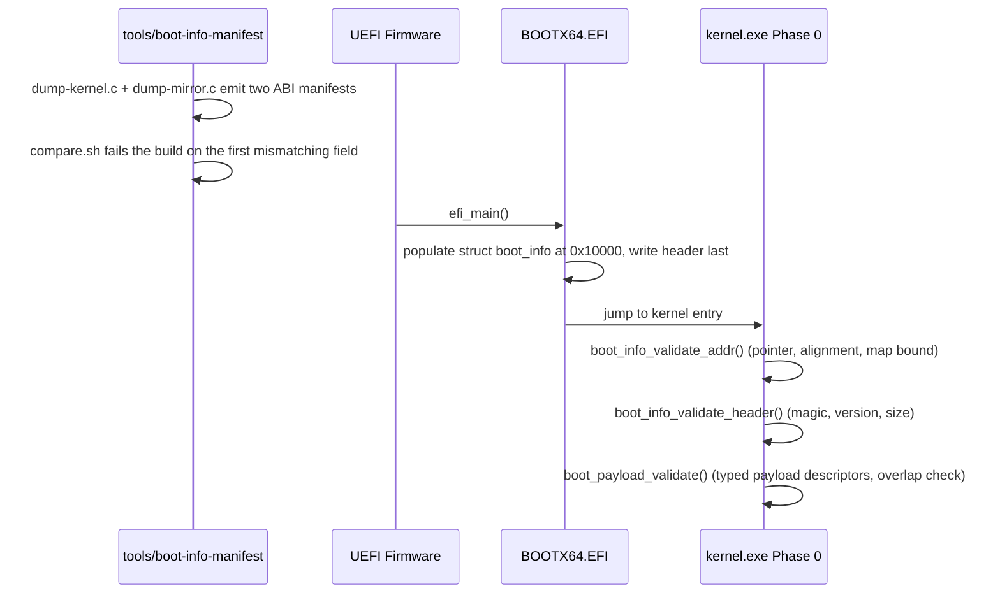

<!-- docs: covers=todo/01-boot-platform/TODO-01-boot-protocol-abi-handoff.md sources=include/kernel/boot_info.h,src/boot/uefi/bootx64.c,src/boot/uefi/boot_info_mirror.h,tools/boot-info-manifest,src/kernel/main/boot_hw.c,src/kernel/main/boot_version.c reviewed=2026-09-28 order=1 -->
# Boot Protocol ABI Handoff

## What is it?

`struct boot_info` is the versioned contract the UEFI bootloader (`BOOTX64.EFI`) uses to hand the kernel everything it learned before `ExitBootServices()`: the memory map, framebuffer, config tables, runtime services, TPM log, USB controller state, boot device identity, and a typed array of optional payloads (modules, initrd, recovery image, entropy seed). It lives at a fixed physical address, carries its own magic/version/size header, and is validated in two stages before the kernel trusts a single field. A generated ABI manifest and a bootloader/kernel mirror-drift checker run on every build so the two halves of this contract can never silently diverge. The remaining work in the roadmap is not "can the kernel trust the blob" (that shipped) but closing narrower gaps: deploy-time base binding, payload-body integrity, and enum-value drift detection.

## How does it work?

The bootloader writes the struct once, as the last step before jumping to the kernel; the kernel validates the pointer, then the header, then the payload array, before any consumer reads a field. A build-time tool pair dumps the struct layout from both the kernel header and the bootloader's byte-identical mirror and diffs them, so a reordered or resized field fails the build instead of failing at boot.



Field ownership (who produces each field, who consumes it, and its validation rule) is tracked in a separate matrix rather than duplicated here; see [struct boot_info Field Ownership Matrix](boot-info-fields.md). Every `BOOT_INFO_VERSION` bump is recorded with its owning roadmap section in the [Boot Protocol Changelog](boot-protocol-changelog.md).

## What are its interfaces?

| Interface | Purpose |
| --------- | ------- |
| `struct boot_info` | The full handoff blob at physical `0x10000` ([`boot_info.h`](../../include/kernel/boot_info.h)) |
| `struct boot_info_header` | 8-byte magic/version/size prefix validated before any other field is read ([`boot_info.h`](../../include/kernel/boot_info.h)) |
| `boot_info_validate_addr()` / `boot_info_validate_header()` | Two-stage pre-dereference validation ([`boot_info.h`](../../include/kernel/boot_info.h)) |
| `struct boot_payload_desc[]`, `boot_payload_find()`, `boot_payload_validate()` | Typed optional payload array (module, initrd, recovery, TPM log, entropy seed, ...) and its type/overlap validator ([`boot_info.h`](../../include/kernel/boot_info.h)) |
| [`boot_info_mirror.h`](../../src/boot/uefi/boot_info_mirror.h) | Bootloader-side mirror of the struct, kept byte-identical with the kernel header |
| [`tools/boot-info-manifest/`](../../tools/boot-info-manifest/) | Build-time ABI manifest generator + drift diff (`compare.sh`), the first gate in `scripts/build.sh` |
| [`bootx64.c`](../../src/boot/uefi/bootx64.c) | Populates and reserves the handoff buffer as the bootloader's last step before the kernel jump |

## How do I use it?

```bash
bash scripts/build.sh              # runs the "boot_info ABI" stage first; fails the build on drift
make boot-info-abi                 # regenerate + diff the two manifests directly
make test-boot-info-abi            # 8/8 drift-detection mutation fixtures
bash scripts/test.sh SUITE=boot    # kernel-side validator + payload unit tests
```

The build's `boot_info ABI` step prints a line of the form `PASS boot_info ABI manifest: N fields, size=..., version=..., kernel-sha256=..., mirror-sha256=...`; a reordered or resized field fails the build with the first mismatching field named.

## What is not implemented yet?

- **Deploy-time base binding.** Moving `BOOT_INFO_PHYS_ADDR` only stays consistent within one build; a bootloader and kernel built at different times with different bases still pass every existing check. All items are parked, operator-gated because they edit the receipt-surface ABI generator and root `Makefile`: [Handoff Base in the Deploy-Time ABI Fingerprint](../../todo/01-boot-platform/TODO-01-boot-protocol-abi-handoff.md#22-handoff-base-in-the-deploy-time-abi-fingerprint).
- **Payload-body integrity.** Today's validation covers the header envelope only; nothing checksums the several hundred bytes of scalar fields behind it, so a corrupted field (device base, framebuffer pitch, a memory-map count) is trusted on the strength of a correct 8-byte header alone. Parked on an ABI-version-bump decision: [Integrity Coverage for the Handoff Payload Body](../../todo/01-boot-platform/TODO-01-boot-protocol-abi-handoff.md#23-integrity-coverage-for-the-handoff-payload-body).
- **Enum-value drift detection.** The manifest diffs struct field offsets and sizes but not enum member values, so `enum boot_payload_type` staying numerically in sync between the kernel and the bootloader's `#define` mirror is currently a comment promise, not a checked one: [Enum-VALUE Drift Detection for the Bootloader Mirror](../../todo/01-boot-platform/TODO-01-boot-protocol-abi-handoff.md#26-enum-value-drift-detection-for-the-bootloader-mirror).
- **Handoff memory addressability.** The reservation pass checks that a warm-kernel-update payload lies inside tracked RAM before pinning it; every other payload type does not get that check yet. The three code items are written and measured but reverted (`+10.8 KiB` against a 4 KiB image-layout headroom budget), pending a separate kernel-image-size fix: [Handoff Memory Claims Must Match What PMM Actually Tracks](../../todo/01-boot-platform/TODO-01-boot-protocol-abi-handoff.md#30-handoff-memory-claims-must-match-what-pmm-actually-tracks).

- **The ABI manifest is not measured into the TPM.** A capability bit is reserved for a build whose bootloader extends a PCR with the manifest hash before the jump, but no build sets it yet: [Capability Negotiation and Degraded-Feature Flags](../../todo/01-boot-platform/TODO-01-boot-protocol-abi-handoff.md#11-capability-negotiation-and-degraded-feature-flags).
- **The anti-rollback refusal itself is not exercised by the fixture harness.** The four shipped fixtures prove the security floor is raised correctly, but no fixture boots a kernel below the floor to assert the pre-jump refusal halt, and no captured store from a released image pins compatibility with older writers (both parked, operator-gated or waiting on the first release): [Scripted Anti-Rollback NVRAM Fixture Harness](../../todo/01-boot-platform/TODO-01-boot-protocol-abi-handoff.md#24-scripted-anti-rollback-nvram-fixture-harness).

The remaining sections (validation, the payload array, module and initrd handoff, PMM reservation, version and capability negotiation, the anti-rollback floor, the warm-update ABI and their CI harnesses) have shipped.

## How does it compare with Windows 11 and Linux?

Both Windows (Loader Parameter Block) and Linux (`boot_params` / `kernel_info`) have a versioned loader-to-kernel ABI, and Impossible OS matches that baseline while going further on tooling: a generated, build-gated ABI manifest with a SHA-256 fingerprint (internal-only in Windows, docs-and-CI in Linux), an explicit field-level ownership matrix, and structured capability negotiation instead of relying on struct-size drift alone. Anti-rollback security-version binding parallels Windows' `OsLoaderSecurityVersion`, and the warm-kernel-update handoff ABI targets the same territory as Linux 6.16's Kexec Handover, ahead of Windows' closed Hot Patch mechanism at the ABI layer (the runtime side is separate, ongoing work). Neither comparison OS ships an automated, CI-wired stale-ABI boot-fail gate; this contract does.

## See also

- [Boot Protocol ABI & Handoff Contract roadmap](../../todo/01-boot-platform/TODO-01-boot-protocol-abi-handoff.md)
- [Boot Protocol Reference](boot-protocol.md)
- [struct boot_info Field Ownership Matrix](boot-info-fields.md)
- [Boot Protocol Changelog](boot-protocol-changelog.md)
- [Manual Test: Anti-Rollback Compositor-Steady Gate](../testing/rollback-steady-gate-manual-test.md)
