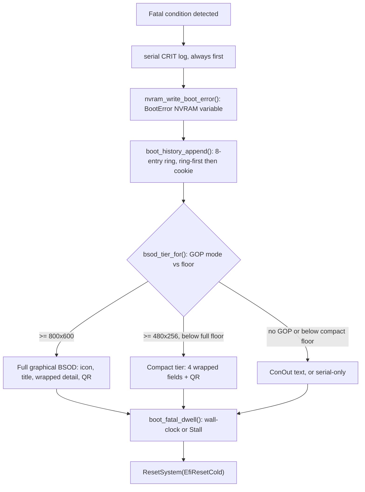

<!-- docs: covers=todo/01-boot-platform/TODO-03-bootloader-error-recovery.md sources=src/boot/uefi/bootx64.c,src/boot/uefi/boot_history.c,src/boot/uefi/boot_entries_parser.c,src/kernel/main/boot_history.c,include/kernel/boot_info.h reviewed=2026-09-28 order=3 -->
# Bootloader Error Recovery

## What is it?

Bootloader error recovery is the set of `src/boot/uefi/bootx64.c` failure paths that replaced the original 15+ silent-hang points (`for (;;) hlt;`) with visible, actionable output. Almost every fatal condition now logs to serial first, persists a structured error code in UEFI NVRAM, appends to an 8-entry cross-boot history ring, renders a screen sized to whatever GOP mode the firmware actually reports, and only then resets the machine. It covers the bootloader's own hardening (ELF bounds checks, bounded `ExitBootServices` retries, kernel fallback search, serial and watchdog handling, memory map validation) as well as the pre-kernel diagnostic UX (BSOD-style screens, QR codes, NVRAM history) that ships ahead of both Windows and Linux at this boot stage. One section (24) is still open: a rejected boot-entry store notice does not yet persist across reboots or say where in the file the problem is.

## How does it work?

`boot_fatal(err_code, title, detail)` is the terminal entry point the hardening checks in `bootx64.c` funnel into. Two pre-jump refusals owned by the [boot protocol ABI roadmap](../../todo/01-boot-platform/TODO-01-boot-protocol-abi-handoff.md) use their own paths instead: an ABI mismatch between the bootloader and the kernel renders its own screen, records `ImpossibleBootProtoFault` in NVRAM and resets (`bpp_render_and_reset()`), and an anti-rollback refusal (a kernel below the persisted security floor) renders its screen and then halts with no reset, because rebooting into the same refusal would erase the only diagnostic; the operator must power-cycle and install a kernel at or above the floor (`bpp_render_rollback_and_halt()`). It logs a `[CRIT]` line to serial before anything else, so a wedged NVRAM write or GOP negotiation can never suppress the one diagnostic that always gets out.



Before that terminal path, several independent hardening layers run earlier in `bootx64.c`: an ELF parser validates every `PT_LOAD` segment's file offsets, address wraparound and destination against the live UEFI memory map (`pt_load_destination_allowed()`) before any byte is copied; `ExitBootServices()` is retried a bounded number of times with a map refresh between attempts; a missing kernel triggers a 3-path fallback search instead of an immediate halt; serial port selection prefers the ACPI SPCR table over I/O probing; and the UEFI watchdog is re-armed for 60 seconds around any operation that can take longer than that. A rejected boot-entry store (corrupt JSON, bad CRC, oversize) is deliberately non-fatal: `boot_store_reject_notice()` paints an advisory banner, dwells 8 seconds, and lets the machine boot its fallback entry, because the fallback already works and making a hand-edited config error fatal would be worse than the bug it reports.

## What are its interfaces?

| Interface | Purpose |
| --------- | ------- |
| `boot_fatal(err_code, title, detail)` | Terminal fatal path: serial, NVRAM, history ring, tiered screen, reset ([`bootx64.c`](../../src/boot/uefi/bootx64.c)) |
| `nvram_write_boot_error()` / `nvram_read_boot_error()` | Single-slot `BootError` NVRAM variable, self-repairing on malformed attrs/size ([`bootx64.c`](../../src/boot/uefi/bootx64.c)) |
| `boot_history_append()` (bootloader) / `boot_history_kernel_mark_phase3()` (kernel) | Writers for the 8-entry cross-boot history ring ([`boot_history.c`](../../src/boot/uefi/boot_history.c), [`src/kernel/main/boot_history.c`](../../src/kernel/main/boot_history.c)) |
| `boot_history_read()` / `boot_history_render()` | Kernel-side ring reader and the "Recent boot history" klog block ([`src/kernel/main/boot_history.c`](../../src/kernel/main/boot_history.c)) |
| `bsod_tier_for()`, `bsod_render_graphical()`, `bsod_render_compact()` | GOP-mode-aware error screen tier selection and renderers ([`bootx64.c`](../../src/boot/uefi/bootx64.c)) |
| `boot_store_reject_notice()`, `boot_entries_reject_cause()` | Advisory, non-fatal rejected boot-entry store banner ([`bootx64.c`](../../src/boot/uefi/bootx64.c), [`boot_entries_parser.c`](../../src/boot/uefi/boot_entries_parser.c)) |
| `pt_load_destination_allowed()` | Rejects PT_LOAD writes into firmware/loader-owned memory before copy ([`bootx64.c`](../../src/boot/uefi/bootx64.c)) |
| `BOOT_ERR_*` registry, `BOOT_ERR_REGISTRY_MAX` | Structured error code namespace in `efi.h`, currently up to `BOOT_ERR_HHDM_FAIL` |
| `boot_info.h` header (`magic`/`version`/`size`) | Handoff struct this file's hardening protects; canonical owner is now the [boot protocol ABI roadmap](../../todo/01-boot-platform/TODO-01-boot-protocol-abi-handoff.md) |
| `error_screen_test=1`, `firmware_quirk_disable=` in `boot.conf` | Trigger a fatal screen for visual testing without a real failure |

## How do I use it?

```bash
bash scripts/build.sh                          # rebuild bootloader + kernel together
bash scripts/test-smoke.sh                     # normal boot; asserts required/absent serial patterns
SMOKE_CORRUPT_STORE=1 bash scripts/test-smoke.sh   # asserts the store-reject notice renders on a copied image
SMOKE_LOWRES=1 SMOKE_ERROR_SCREEN=1 bash scripts/test-smoke.sh  # forces a sub-floor GOP mode, asserts compact tier
SMOKE_ES_SELFTEST=1 bash scripts/test-smoke.sh # error-screen oracle self-test against synthetic transcripts, boots nothing
bash scripts/test-smoke-history.sh             # cascade: 3 corrupted boots + 1 clean boot, asserts the rendered ring
bash scripts/test.sh SUITE=boot                # boot_info, history-ring, error-screen-tier unit tests
```

A normal boot's serial log shows no `[FAIL]` or `BOOT HALT` lines; a deliberately broken one (`error_screen_test=1` in `boot.conf`, or a deleted `\boot\kernel.exe`) shows a `[CRIT] BOOT FATAL (0xNNNNNNNN)` line, then on QEMU with a display, a rendered BSOD with an error code, a QR code linking `https://impossibleos.co/err/<4-hex>`, and recovery steps.

## What is not implemented yet?

- The rejected-store advisory notice (section 22) is visible on screen for 8 seconds and then gone: it bypasses `nvram_write_boot_error()` and the history ring, so a headless or absent user never learns their configured boot entry was rejected, and the failure has no position (byte offset or line) to make repair mechanical: [A Rejected Store Leaves No Trace the User Can Act On Afterwards](../../todo/01-boot-platform/TODO-03-bootloader-error-recovery.md#24-a-rejected-store-leaves-no-trace-the-user-can-act-on-afterwards).
- The error-screen smoke assertions read the bootloader's own reports of what it drew (tier, QR fit, truncation), not the rendered pixels; three degraded paths (post-EBS fatal, the compact anti-rollback refusal, the pool-exhaustion notice) have no fixture at all. A pixel-content oracle over captured `.ppm` frames is parked and owned by [Error-Screen Pixel Oracle in the boot validation certification matrix](../../todo/01-boot-platform/TODO-28-boot-validation-certification-matrix.md#12-error-screen-pixel-oracle----assert-what-was-drawn-not-what-the-loader-says-it-drew), not this file.
- Full offline recovery (a WinRE-style repair environment reachable after an unrecoverable boot failure) is out of scope here by design; it is tracked in [recovery partition roadmap](../../todo/01-boot-platform/TODO-22-recovery-partition.md).

Every other section of the roadmap file has shipped and been quality-reviewed.

## How does it compare with Windows 11 and Linux?

The parity rows (ELF bounds checking, bounded `ExitBootServices` retries, kernel fallback search, SPCR-first serial detection, watchdog re-arm, memory map validation) track what `bootmgfw.efi` and GRUB2's `efi-stub` already do, closing gaps this bootloader used to have relative to both. The exclusive rows go further than either: a graphical, QR-coded, pre-kernel BSOD (Windows only draws its stop screen once the OS is running; GRUB's rescue menu is text-only), a structured `BOOT_ERR_*` code persisted in UEFI NVRAM across reboots (neither competitor persists a bootloader-level error code), and an 8-entry cross-boot history ring for cascade failures (Windows keeps only the last 4 `BootStatusData` entries; Linux keeps none at this stage).

## See also

- [Bootloader Error Recovery & ELF Hardening roadmap](../../todo/01-boot-platform/TODO-03-bootloader-error-recovery.md)
- [Boot Error History Ring: Schema and Operator Guide](boot-error-history.md)
- [struct boot_info: Canonical Field Ownership Matrix](boot-info-fields.md)
