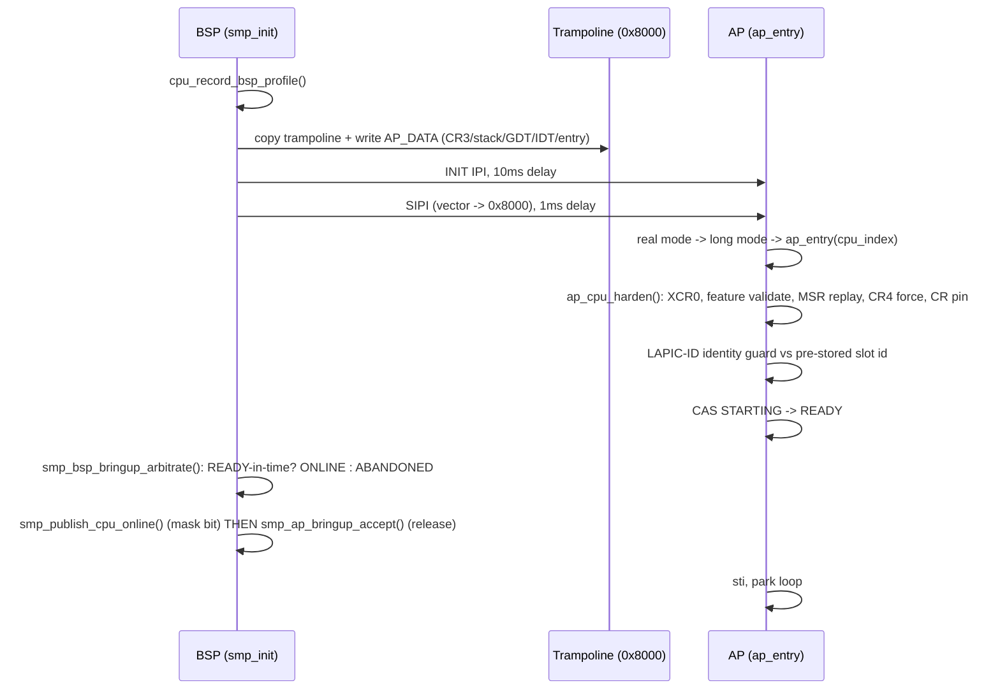

<!-- docs: covers=todo/01-boot-platform/TODO-09-cpu-boot-sequencing.md sources=src/kernel/smp/smp.c,include/kernel/smp.h,src/kernel/smp/ap_trampoline.asm,src/kernel/cpu_security.c,include/kernel/cpu_security.h,src/kernel/main/boot_hw.c,src/kernel/main/boot_storage.c reviewed=2026-09-28 order=9 -->
# CPU Boot Sequencing and AP Bringup

## What is it?

This is the contract that brings every CPU core online and makes each one match the boot processor (BSP) before it does any real work. It owns three things: the order security-relevant CPU state activates in during Phase 0/1, the INIT/SIPI handshake that starts each Application Processor (AP), and the online-mask lifecycle that publishes (and later retracts) a CPU's membership in the live system. It does not implement the security features themselves (NX, SMEP/SMAP, CET) or the x86-64 feature layer (XSAVE, MSR addresses, topology), which live in the [kernel security hardening](../../todo/02-kernel-core/TODO-10-kernel-security-hardening.md) and [x86-64 architecture](../../todo/02-kernel-core/TODO-09-x86-64-architecture.md) roadmaps respectively. This file is the sequencing contract between them: what runs in which phase, how an AP is proven to match the BSP, and what happens when it doesn't.

## How does it work?

The BSP hardens itself first (`cpu_harden()`, NX/UMIP/PKU/PAT, then `cpu_harden_post_pagetable()` for the still-gated SMEP/SMAP) during `boot_phase0()`. `smp_init()` then freezes that state into a per-CPU MSR profile (`cpu_record_bsp_profile()`) before starting any AP, so every AP replicates the BSP's final post-Phase-1 state rather than recomputing it from CPUID. `smp_init()` itself runs from `boot_phase2()`, after ACPI and the IDT are available, because the per-CPU register audit needs `msr_try_read()`, which requires the IDT to be loaded.

For each AP the BSP copies a real-mode trampoline to physical `0x8000`, writes a shared data block at `0x8000+0xE00` (CR3, stack, GDT/IDT pointers, entry point, a logical CPU index, and a canary), then sends INIT, waits, sends SIPI, and waits again for the AP to announce readiness. The AP wakes in 16-bit real mode, switches to long mode, and calls `ap_entry()` in C, which runs `ap_cpu_harden()`: match the BSP's XCR0, validate this AP's CPUID against the BSP's required/optional feature masks, replay the BSP's MSR profile (PAT, TSC_AUX, and friends), force the AP-supported subset of the BSP's required CR4 bits, and pin CR0.WP/CR4 safety bits on this CPU. Only after all of that does the AP check its live LAPIC ID against the identity the BSP pre-stored for this slot. A mismatch means a slow AP raced a trampoline-data rewrite and it parks dark rather than claiming the wrong slot.

Bringup itself is a small state machine per AP slot (`ap_bringup_state`: STARTING -> READY -> ONLINE or ABANDONED). The AP CASes itself to READY once its local hardening is complete; only the BSP, after the bringup timeout, decides ONLINE or ABANDONED, and it publishes the online-mask bit *before* releasing the AP to run interrupts. This ordering is what prevents a "live but uncounted" CPU: an AP can never `sti` before its membership bit exists.



After every discovered slot reaches a terminal verdict, the BSP publishes the global CPU-feature intersection (`cpu_features_finalize_global()`), runs the per-CPU register consistency check, arms the periodic CR-pin verify IPI, and arms the stop-the-world rendezvous IPI, all only once the online set is fixed.

## What are its interfaces?

| Interface | Purpose |
| --------- | ------- |
| `smp_init()` | BSP entry point: trampoline copy, per-AP INIT/SIPI, bringup arbitration ([`smp.c:345`](../../src/kernel/smp/smp.c)) |
| `smp_early_bsp_init()` | Sets BSP GS_BASE before any interrupt can fire, called at the top of `boot_phase0()` ([`smp.c:114`](../../src/kernel/smp/smp.c)) |
| `ap_entry(cpu_index)` | AP's C entry point from the trampoline: GS setup, hardening, identity guard, publish ([`smp.c:189`](../../src/kernel/smp/smp.c)) |
| `ap_cpu_harden(cpu_id)` / `cpu_record_bsp_profile()` | Per-CPU MSR-profile replay and the BSP baseline it replays from ([`cpu_security.h`](../../include/kernel/cpu_security.h)) |
| `cpu_validate_ap_features(cpu_id)` | AP-side CPUID check against the required/optional masks; bug-checks `MULTIPROCESSOR_CONFIGURATION_NOT_SUPPORTED` (0x3E) on a required-feature or vendor/Long-Mode mismatch ([`cpu_security.h`](../../include/kernel/cpu_security.h)) |
| `cpu_pin_control_regs()` | Per-CPU CR0.WP/CR4 safety-bit pinning; panics `CRITICAL_STRUCTURE_CORRUPTION` (0x109) if a pinned bit is later cleared ([`cpu_security.h`](../../include/kernel/cpu_security.h)) |
| `smp_publish_cpu_online()` / `smp_retract_cpu_online()` | The sole publication point for the online mask; publish sets `is_online` then the mask bit, retract clears the bit first ([`smp.h`](../../include/kernel/smp.h)) |
| `smp_cpu_count()` / `smp_cpu_present_count()` / `smp_online_mask()` / `smp_cpu_is_online()` | Live count, discovered-slot count, and membership queries; see `smp.h` for why the two counts are never interchangeable |
| `ap_trampoline.asm` | The 16-bit-to-64-bit transition code copied to physical `0x8000` ([`ap_trampoline.asm`](../../src/kernel/smp/ap_trampoline.asm)) |

## How do I use it?

```bash
bash scripts/test.sh SUITE=x86        # CPU sequencing, feature validation, CR pinning
make test-x86                         # same, as a make target
bash scripts/test-smoke-matrix.sh     # boots TCG+KVM x 1+2 CPUs; the 2-CPU legs exercise this file
```

On a live boot, serial shows the sequence in order: `[BSP] hardening baseline ...`, then per AP `AP %u online (LAPIC ID=...)` followed by `[AP%u] CPU hardening applied EFER=... CR4=... PAT=... XCR0=...`, then `[CPU%u AUDIT] EFER=... CR4=... ...` for each CPU, and finally `[SMP] All N CPUs register-consistent`. A single-CPU boot still emits `[BSP] hardening baseline` and the audit lines with no AP messages.

## What is not implemented yet?

- No test proves that a set `feature_mismatch` on an AP actually narrows the global CPU-feature intersection; today only the "intersection retains the required mask" direction is covered: [AP Feature Consistency Validation](../../todo/01-boot-platform/TODO-09-cpu-boot-sequencing.md#6-ap-feature-consistency-validation).
- MTRR/PAT runtime re-broadcast and divergent-AP MTRR reprogramming are parked on a cross-CPU synchronous call (`smp_call_function()`) that does not exist yet; PAT/MTRR sync ships as a warn-only audit instead: [MTRR/PAT AP Synchronization](../../todo/01-boot-platform/TODO-09-cpu-boot-sequencing.md#8-mtrrpat-ap-synchronization).
- No coverage-gap flag distinguishes a failed MSR read from a successfully captured zero in the per-CPU register audit (`arch_caps`, `ucode_rev`): [CPU Register State Audit Trail](../../todo/01-boot-platform/TODO-09-cpu-boot-sequencing.md#9-cpu-register-state-audit-trail).
- A slow AP can still run `ap_cpu_harden()` on the *next* AP's stack before the LAPIC-identity guard parks it, because the trampoline data area is reused per AP with no consume-ack handshake: [AP Bringup Hardening & Robustness](../../todo/01-boot-platform/TODO-09-cpu-boot-sequencing.md#10-ap-bringup-hardening--robustness).
- Every AP still shares the BSP's single TSS/IST region (no per-CPU `ltr`), so IST delivery for #DF/NMI/MCE on an AP is not SMP-isolated: [AP Bringup Hardening & Robustness](../../todo/01-boot-platform/TODO-09-cpu-boot-sequencing.md#10-ap-bringup-hardening--robustness).
- The phase-split INIT-settle-once-then-per-AP-SIPI optimization is parked behind the consume-ack handshake above: [AP Bringup Hardening & Robustness](../../todo/01-boot-platform/TODO-09-cpu-boot-sequencing.md#10-ap-bringup-hardening--robustness).
- `HKLM\HARDWARE\VM\*` hypervisor Registry mirror, Hyper-V SynIC/TLFS TSC reference page, and the `boot_info.cc_kind` field are still not populated: [Hypervisor Detection Before Timer Selection](../../todo/01-boot-platform/TODO-09-cpu-boot-sequencing.md#3-hypervisor-detection-before-timer-selection).

## How does it compare with Windows 11 and Linux?

The per-phase activation order (EFER.NXE before NX-bit pages, XSAVE/PCID after page tables exist), AP hardening replication, feature-consistency bug-check, and CR0/CR4 pinning all match what Windows' HAL and Linux's `cpu_init`/`verify_cpu.S` do. This is table-stakes SMP correctness, not a differentiator. Two things go further than either: the consolidated single-line `[CPU%u AUDIT]` register dump (Windows scatters this across ETW, Linux across dmesg fragments) and hypervisor detection running before timer-backend selection so Hyper-V TSC/TLB enlightenments are correct from the first tick. SMEP/SMAP activation is deliberately behind both: it is wired here but gated off system-wide until the KPTI clean kernel page table (owned by the [kernel security hardening roadmap](../../todo/02-kernel-core/TODO-10-kernel-security-hardening.md)) removes the User bit from kernel pages, so Impossible OS reports `SMEP/SMAP skipped` honestly rather than claiming enforcement it cannot back.

## See also

- [CPU Boot Sequencing & AP Hardening roadmap](../../todo/01-boot-platform/TODO-09-cpu-boot-sequencing.md)
- [Bare Metal Boot Hardening roadmap](../../todo/01-boot-platform/TODO-10-bare-metal-hardening.md)
- [Bare Metal Gotchas](../infrastructure/bare-metal-gotchas.md)
- [Bare Metal Boot Hardening](bare-metal-hardening.md)
