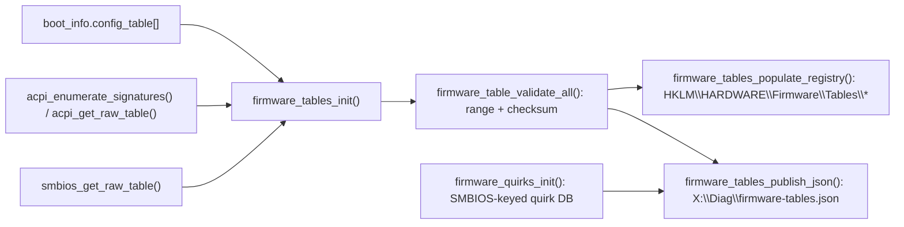

<!-- docs: covers=todo/01-boot-platform/TODO-04-firmware-table-platform-inventory.md sources=include/kernel/firmware_tables.h,src/kernel/firmware_tables.c,src/kernel/firmware_tables_json.c,src/kernel/firmware_tables_registry.c,src/kernel/firmware_quirks.c,tools/firmware-tables-decode.c reviewed=2026-09-28 order=4 -->
# Firmware Table Inventory

## What is it?

The firmware table inventory is a single catalog of every firmware-provided platform table the kernel has seen: ACPI SDTs, the SMBIOS structure table, UEFI configuration-table entries (ESRT, FPDT, the Memory Attributes Table, Runtime Properties), and devicetree blobs on EBBR-class systems. It exists so range validation, checksum validation, and diagnostic publication happen once, in one place, instead of being re-implemented by every consumer that wants to know what firmware exposed. Per-provider parsing (how to read an SMBIOS entry point, how to walk the ACPI XSDT) stays owned by `acpi.c`, `smbios.c` and `uefi_config.c`; this layer only records what those parsers found, validates it against the live UEFI memory map, and republishes it as a Registry mirror and a JSON diagnostic file. Every Implementation Order item has shipped; what remains open is hardware-only verification (VirtualBox EFI and bare metal), not missing functionality.

## How does it work?

`firmware_tables_init()` runs once, BSP-only, at Phase 1, after `uefi_conformance_init()`. It walks `boot_info.config_table[]` plus the ACPI and SMBIOS provider accessors into a fixed 64-entry catalog (`firmware_table_entry_t`), then calls `firmware_table_validate_all()` to re-check every entry's physical range against the UEFI memory map and recompute its checksum. An entry that fails downgrades one-way to `FW_STATUS_DEGRADED` with a reason code; it stays in the catalog rather than being dropped, so consumers can still see that firmware published something bad.



A separate SMBIOS-keyed quirk database (`firmware_quirks.c`) runs in the same window and flags known-bad firmware combinations (a broken FPDT, a bad MADT checksum, GOP pitch lies) so downstream code can gate a workaround on `firmware_quirks_is_active()` rather than re-detecting the same vendor string. Everything the catalog and the quirk database found is republished twice: as a Registry mirror at `HKLM\HARDWARE\Firmware\Tables\<name>` (and a separate `HKLM\HARDWARE\Firmware\ESRT\*` subtree), and as `X:\Diag\firmware-tables.json`, a schema-versioned JSON file a host tool can decode offline.

## What are its interfaces?

| Interface | Purpose |
| --------- | ------- |
| `firmware_tables_init()` | Builds the catalog from `boot_info.config_table[]` plus ACPI/SMBIOS accessors ([`firmware_tables.h`](../../include/kernel/firmware_tables.h)) |
| `firmware_table_lookup_guid()` / `_name()` / `_owner()` | Query the catalog without re-walking firmware ([`firmware_tables.h`](../../include/kernel/firmware_tables.h)) |
| `firmware_table_validate_all()` | Range + checksum re-validation pass; one-way downgrade to `FW_STATUS_DEGRADED` ([`firmware_tables.c`](../../src/kernel/firmware_tables.c)) |
| `firmware_tables_populate_registry()` | Writes `HKLM\HARDWARE\Firmware\Tables\*` and the ESRT subtree ([`firmware_tables_registry.c`](../../src/kernel/firmware_tables_registry.c)) |
| `firmware_tables_publish_json()` | Writes `X:\Diag\firmware-tables.json` (schema_version 1) ([`firmware_tables_json.c`](../../src/kernel/firmware_tables_json.c)) |
| `firmware_quirks_is_active(bit)`, `boot.conf firmware_quirk_disable=name1,name2` | Query / override a known firmware quirk ([`firmware_quirks.c`](../../src/kernel/firmware_quirks.c)) |
| `tools/firmware-tables-decode.c` | Host-side decoder: pretty-prints or round-trips a captured `firmware-tables.json` ([`firmware-tables-decode.c`](../../tools/firmware-tables-decode.c)) |
| `SystemFirmwareTableInformation` (NtQuerySystemInformation class 76) | Win32 `GetSystemFirmwareTable` / `EnumSystemFirmwareTables` surface consuming the same provider accessors |

## How do I use it?

```bash
bash scripts/build.sh                       # build; boot log shows the catalog summary
bash scripts/test-smoke.sh                  # QEMU OVMF boot; serial shows firmware-tables line
bash scripts/test.sh SUITE=boot             # firmware-table catalog, validator, quirk, DTB unit tests
make build/tools/firmware-tables-decode     # build the host decoder (no external deps)
bash scripts/test-firmware-decode.sh        # pretty-print + round-trip + schema-version-reject regression
```

A QEMU OVMF smoke boot on 2026-09-28 logged these two lines:

```text
[WARN] BOOT: firmware tables: 16 cataloged, 9 validated, 6 degraded, 2 PC-class table(s) absent (FPDT/MAT/RtProps required by profile)
[ OK ] FW: JSON: wrote X:\Diag\firmware-tables.json (4318 bytes)
```

The roadmap attributes the 6 degraded entries on OVMF to `EfiBootServicesCode/Data` config-table pointers that the PMM reclaims before `firmware_tables_init()` runs, which is expected on that platform. The warning names PC-class tables (FPDT, the Memory Attributes Table, Runtime Properties) that the platform profile requires but OVMF does not publish; a profile that allows their absence logs the same line at info level instead. The decoder reads a captured `firmware-tables.json` and re-emits it in canonical or round-trip form for diffing against the schema doc.

## What is not implemented yet?

Every Implementation Order deliverable (sections 1 through 12) is shipped and quality-reviewed. What remains open is hardware-only verification: the roadmap's own [Verification checklist](../../todo/01-boot-platform/TODO-04-firmware-table-platform-inventory.md#verification) still has unchecked items for a VirtualBox EFI boot (no FPDT/ESRT, should report them absent rather than degraded) and a bare-metal laptop/desktop boot (confirming every active quirk is logged with no silent validation failure), both deferred for lack of test hardware rather than for missing code.

## How does it compare with Windows 11 and Linux?

The parity rows track existing Win11 and Linux firmware-inspection paths: catalog and validation are comparable to the HAL and `acpi_tb_verify_checksum`/`sysfs`, ACPI-versus-DTB arbitration mirrors how Linux already picks between the two per architecture, and the FPDT, Memory Attributes Table, Runtime Properties and ESRT inventories line up with `fwupd`/Windows Update's own consumers. The exclusive rows go further: a firmware quirk database keyed on SMBIOS strings and published in the JSON report (Windows keeps this HAL-internal and opaque; Linux's DMI quirks are scattered per-driver), a standalone host decoder for the JSON schema (neither competitor exposes one), and one documented schema (`docs/boot/firmware-tables-schema.md`) covering APEI, DBG2 and WSMT visibility in a single file rather than several undocumented tools.

## See also

- [Firmware Table and Platform Inventory roadmap](../../todo/01-boot-platform/TODO-04-firmware-table-platform-inventory.md)
- [`firmware-tables.json` Wire Format](firmware-tables-schema.md)
- [struct boot_info: Canonical Field Ownership Matrix](boot-info-fields.md)
