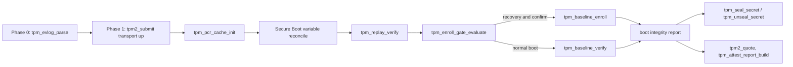

<!-- docs: covers=todo/01-boot-platform/TODO-13-tpm-measured-boot-attestation.md sources=include/kernel/tpm.h,src/kernel/tpm.c,include/kernel/tpm_transport.h,src/kernel/tpm_transport.c,include/kernel/tpm_replay.h,src/kernel/tpm_replay.c,include/kernel/tpm_baseline.h,src/kernel/tpm_baseline.c,include/kernel/tpm_nv.h,src/kernel/tpm_nv.c,include/kernel/tpm_seal.h,src/kernel/tpm_seal.c,include/kernel/tpm_attest.h,src/kernel/tpm_attest.c,include/kernel/tpm_attest_report.h,src/kernel/tpm_attest_report.c,include/kernel/tpm_enroll_gate.h,src/kernel/tpm_enroll_gate.c,src/kernel/main/boot_interrupts.c,scripts/test-swtpm.sh reviewed=2026-09-28 order=13 -->
# TPM Measured Boot and Attestation

## What is it?

This is the kernel's measured-boot trust chain. It reads the TCG event log the firmware and bootloader built, replays it against the TPM's own PCR values, enrolls and verifies a golden baseline, seals secrets to a PCR policy, and produces a TPM-signed attestation quote a remote verifier can check.

It runs almost entirely in Phase 1, after the TPM2 transport and the IDT exist, and it never gates boot: every degraded or missing-TPM case is a reported status, not a halt. Which boot event extends which PCR, and which PCRs the seal, quote and baseline policies use, is documented separately in [PCR Allocation and Policy Masks](pcr-allocation.md); this page is about the pipeline.

## How does it work?

Phase 0 parses the TCG event log the bootloader copied into `boot_info` (`tpm_evlog_parse()`, unaligned-safe, TPM 1.2 and TPM 2.0 crypto-agile logs) and later exports it as `X:\Diag\tpm-events.json`.

Phase 1 brings up the TPM2 command transport (`tpm2_submit()` over TIS or CRB, discovered from the ACPI TPM2 table or a TIS fixed base), reads the measured-boot PCR bank into a lock-free cache (`tpm_pcr_cache_init()`), reconciles the Secure Boot `EV_EFI_VARIABLE_*` measurements against the live UEFI variables, then replays every event in the log into a fresh in-memory PCR state (`tpm_replay_verify()`) and compares it with the cached hardware reads. A mismatch is `TPM_REPLAY_TAMPER`, distinct from `UNVERIFIABLE` (a degraded or incomplete log), and it outranks every later verdict.

Baseline enrollment and verification run next, gated on `tpm_enroll_gate_evaluate()`. The gate takes the bootloader's recovery-path signals (`boot_path`, `boot_reason`, `sticky_recovery_trigger`), whole-chain UKI verification, the replay verdict and an operator confirmation. Confirmation normally comes from the console. Only when no console is present at all (the confirmation result is UNAVAILABLE) is a signed headless authorization token, already verified and consumed by the caller, accepted instead, and only at that last step after every other check has passed. A console that is present but unanswered is a TIMEOUT, which refuses enrollment without consulting the token, so a headless machine that still has a PS/2 controller cannot enroll remotely yet ([Headless Authority Lifecycle](../../todo/01-boot-platform/TODO-13-tpm-measured-boot-attestation.md#34-headless-authority-lifecycle-revocation-durable-verdict-and-aggregate-budget)) ([Headless Enrollment Authorization Escape Hatch](../../todo/01-boot-platform/TODO-13-tpm-measured-boot-attestation.md#23-headless-enrollment-authorization-escape-hatch)). Only a genuine recovery boot that passes the gate can write a new golden `struct tpm_baseline` (PCR digests, Secure Boot state, a firmware-version hash, the kernel ABI manifest digest and a monotonic generation counter) to an owner-auth TPM NV index. Every other boot reads that blob back and reports verified, baseline mismatch or no baseline.

A single aggregate deadline (`tpm_boot_budget_arm()`, `TPM_BOOT_BUDGET_MS`) bounds every verified NV read the boot performs, so a stuck or slow TPM degrades the verdict to unverified instead of hanging Phase 1.

Two consumers sit downstream of the same PCR state. `tpm_seal_secret()` and `tpm_unseal_secret()` bind a secret to the PCR 7 seal policy (PCR 11 is deliberately excluded, so a kernel rebuild cannot brick unseal). `tpm2_quote()` has the TPM sign the SHA-256 PCR digest plus a caller nonce under a per-boot Attestation Key, and `tpm_attest_report_build()` assembles that into `X:\Diag\attestation.json` alongside the Endorsement Key certificate and the integrity verdict.



## What are its interfaces?

| Interface | Purpose |
| --------- | ------- |
| `tpm_evlog_parse()` | Parses a TPM 1.2 or TPM 2.0 event log into `struct tpm_event` entries ([`tpm.h`](../../include/kernel/tpm.h)) |
| `tpm2_submit()` | Sends one raw TPM2 command over TIS or CRB and returns the response ([`tpm_transport.h`](../../include/kernel/tpm_transport.h)) |
| `tpm2_pcr_read()` / `tpm_pcr_get()` | Uncached hardware PCR read and the Phase 1 cached lock-free read ([`tpm.h`](../../include/kernel/tpm.h)) |
| `tpm_pcr_extend()` / `tpm_replay_verify()` | Software PCR-extend primitive and the replay-versus-hardware comparison ([`tpm_replay.h`](../../include/kernel/tpm_replay.h)) |
| `tpm_baseline_enroll()` / `tpm_baseline_verify()` | Writes or checks the golden baseline blob in TPM NV ([`tpm_baseline.h`](../../include/kernel/tpm_baseline.h)) |
| `tpm_nv_define_data()` / `tpm_nv_write()` / `tpm_nv_read()` | Owner-auth and PCR-policy NV index operations ([`tpm_nv.h`](../../include/kernel/tpm_nv.h)) |
| `tpm_seal_secret()` / `tpm_unseal_secret()` | Seal and unseal a secret to the PCR 7 policy ([`tpm_seal.h`](../../include/kernel/tpm_seal.h)) |
| `tpm2_quote()` / `tpm_ak_public_get()` / `tpm_ek_cert_read()` | TPM-signed PCR quote and the AK/EK material a verifier needs ([`tpm_attest.h`](../../include/kernel/tpm_attest.h)) |
| `tpm_attest_report_build()` / `tpm_attest_report_export()` | Assembles and writes the signed attestation report ([`tpm_attest_report.h`](../../include/kernel/tpm_attest_report.h)) |
| `tpm_enroll_gate_evaluate()` | The enrollment-authority predicate ([`tpm_enroll_gate.h`](../../include/kernel/tpm_enroll_gate.h)) |
| `tpm_integrity_status_label()` | One-word status for VPD and klog from the boot integrity report ([`tpm.h`](../../include/kernel/tpm.h)) |
| `tpm_enroll` in `boot.conf` | Opt-in that lets the kernel enroll or rotate the baseline this boot, honoured only under the enrollment gate ([boot_info Field Ownership](boot-info-fields.md)) |

## How do I use it?

```bash
bash scripts/test.sh SUITE=security   # all TPM and measured-boot unit suites
make test-security                    # same, as a make target
bash scripts/test-swtpm.sh            # boots QEMU against swtpm; skips cleanly when swtpm is not installed
```

On a live boot with a TPM, serial shows `TPM2 transport up (TIS, vendor ...)` (or `CRB`), then `PCR cache populated (measured-boot PCRs, active banks)`, then `PCR replay: event-log TAMPER at PCR N` only on a mismatch, and finally `Boot integrity status: <label> (<scope>)`. Without a TPM the transport reports `no TPM2 table and no firmware TPM; transport not started` and the rest of the pipeline reports its no-TPM status without halting.

`X:\Diag\tpm-events.json` (the event log) and `X:\Diag\attestation.json` are written after the BlackBox volume mounts, for offline inspection. `attestation.json` is a diagnostic report that carries a signed PCR quote only when one was produced: when the CSPRNG is not yet crypto-ready it is an unsigned self-test report, and a failed quote is omitted. A consumer must check the quote's presence and verify its signature, never trust the file's existence.

## What is not implemented yet?

- There is no native user-mode query API for attestation evidence, and the remote-attestation protocol (what a verifier calls, over what transport) is not chosen; the report is file-only today: [Attestation Report Export](../../todo/01-boot-platform/TODO-13-tpm-measured-boot-attestation.md#9-attestation-report-export).
- The bootloader does not yet extend the kernel ABI manifest digest into PCR 11 before jumping to the kernel, so replay cannot catch a manifest swap between bootloader and kernel: [Attestation Report Export](../../todo/01-boot-platform/TODO-13-tpm-measured-boot-attestation.md#9-attestation-report-export).
- A quote's `qualifiedSigner` is not bound to the Attestation Key's qualified name, and `TPM2_MakeCredential`/`TPM2_ActivateCredential` (proving the AK is bound to a trusted EK) is not implemented: [Attestation Key Provisioning and TPM2 Quote](../../todo/01-boot-platform/TODO-13-tpm-measured-boot-attestation.md#13-attestation-key-provisioning-and-tpm2-quote).
- Recovery mode does not name which layer changed on a mismatch, there is no UI to reset a trusted baseline, and an unexpected kernel measurement does not trigger A/B rollback: [Recovery and Mismatch UX](../../todo/01-boot-platform/TODO-13-tpm-measured-boot-attestation.md#10-recovery-and-mismatch-ux).
- Salted HMAC sessions and parameter encryption on the TPM transport are not built, so authenticity against a physical bus interposer is structural only, and there is no live console recovery prompt on unseal failure: [Sealed-Secret Boot Policy Hooks](../../todo/01-boot-platform/TODO-13-tpm-measured-boot-attestation.md#8-sealed-secret-boot-policy-hooks).
- A baseline blob that outgrows one NV transaction has no versioned growth or index migration path: [Versioned Baseline Growth and NV Index Migration](../../todo/01-boot-platform/TODO-13-tpm-measured-boot-attestation.md#19-versioned-baseline-growth-and-nv-index-migration).
- The bootloader-side NV floor read for the A/B anti-rollback slot is parked on index authorization design: [Bootloader-Side NV Floor Read (EFI_TCG2 Adapter)](../../todo/01-boot-platform/TODO-13-tpm-measured-boot-attestation.md#22-bootloader-side-nv-floor-read-efi_tcg2-adapter).

## How does it compare with Windows 11 and Linux?

The transport, PCR replay, PolicyPCR-sealed NV storage, PolicyAuthorize anti-rollback writes and sealing are at parity with the Windows Measured Boot, BitLocker and TBS stack and the Linux `tpm_tis`, `tpm2-tools`, IMA and systemd-pcrlock stack. The aggregate boot-time deadline for verified NV reads has no equivalent in either, since both use per-call timeouts, and the directional crash-consistent pairing of anchor records goes further than Windows' internal handling and Linux, which has none. Two things are behind: the attestation report is file-exported only, with no live query API or chosen remote-attestation protocol (Windows Device Health Attestation and Keylime both have one), and the loader-to-kernel PCR 11 manifest binding is not wired, so today's "verified" baseline label covers PCR and Secure Boot state rather than the executed kernel image.

## See also

- [TPM Measured Boot, PCR Replay and Attestation roadmap](../../todo/01-boot-platform/TODO-13-tpm-measured-boot-attestation.md)
- [PCR Allocation and Policy Masks](pcr-allocation.md)
- [boot_info Field Ownership](boot-info-fields.md)
- [Early Entropy and Random Seed Handoff](early-entropy-random-seed.md)
- [Secure Boot Key Management](../guides/secure-boot-keys.md)
