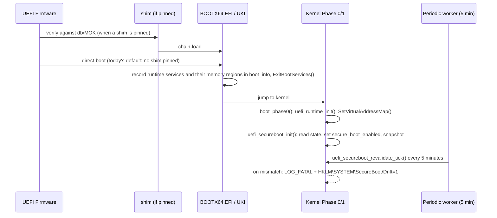

<!-- docs: covers=todo/01-boot-platform/TODO-02-uefi-hardening-secureboot.md sources=src/boot/uefi/bootx64.c,src/kernel/uefi_runtime.c,include/kernel/uefi_runtime.h,src/boot/uefi/sbat.csv,include/boot/uki_cmdline_check.h,scripts/sign-efi.sh,scripts/test-secureboot-smoke.sh reviewed=2026-09-28 order=2 -->
# UEFI Bootloader Hardening and Secure Boot

## What is it?

This is the core UEFI boot path: preserving runtime services after `ExitBootServices()`, reading and writing UEFI variables, negotiating the best GOP framebuffer mode, parsing SMBIOS into the registry, and the Secure Boot chain built on the rhboot/shim MOK model. It also owns boot UX polish, atomic serial logging, and the Unified Kernel Image (UKI) that bundles kernel, cmdline, and now signed initrd/recovery/module payloads into one Authenticode-signed PE. The runtime foundation (services, variables, GOP, SMBIOS, boot UX, serial log) is fully shipped and covered by the `TEST_CAT_BOOT` unit suites. The Secure Boot chain itself is designed and testable but currently unpinned: no shim ships in the tree today, so a stock build direct-boots without a hardware chain of trust.

## How does it work?

The bootloader records the firmware's runtime-services table and runtime memory regions in `boot_info` and calls `ExitBootServices()`. The kernel then owns runtime services: `boot_phase0()` calls `uefi_runtime_init()`, which calls `SetVirtualAddressMap()` so runtime-service pointers stay valid under the kernel's mappings, and `uefi_secureboot_init()` reads the firmware's SecureBoot/SetupMode/PK/KEK state sets `boot_info.secure_boot_enabled`, and freezes a baseline snapshot for later drift detection. The bootloader can chain-load through a shim (MOK-dev, self-signed for local hardware, or a Microsoft-signed shim for stock firmware) before handing off to the signed `BOOTX64.EFI`; the Unified Kernel Image path instead embeds the kernel and its payloads as PE sections inside one Authenticode-signed artifact, so nothing load-bearing is read from disk outside the signature.



Post-boot drift detection (firmware tampering while the OS sleeps or runs) shares one `uefi_secureboot_do_revalidate()` helper between the periodic worker path (shipped) and the still-unwired S3-resume path.

## What are its interfaces?

| Interface | Purpose |
| --------- | ------- |
| `uefi_runtime_init()` | Preserves UEFI runtime services across `ExitBootServices()` ([`uefi_runtime.h`](../../include/kernel/uefi_runtime.h)) |
| `uefi_var_get()` / `uefi_var_set()` | UEFI variable read/write after boot ([`uefi_runtime.c`](../../src/kernel/uefi_runtime.c)) |
| `uefi_secureboot_init()` | Reads SecureBoot/SetupMode/PK/KEK and populates `boot_info.secure_boot_enabled` ([`uefi_runtime.h`](../../include/kernel/uefi_runtime.h)) |
| `uefi_secureboot_snapshot()` / `_refresh()` / `_revalidate_tick()` / `_drift_detected()` | Post-boot tamper drift-detection API ([`uefi_runtime.h`](../../include/kernel/uefi_runtime.h)) |
| [`scripts/sign-efi.sh`](../../scripts/sign-efi.sh) | Signs the bootloader, logs the shim's Microsoft UEFI CA generation, enforces the graduated 2011-CA deprecation policy |
| [`scripts/test-secureboot-smoke.sh`](../../scripts/test-secureboot-smoke.sh) | Reports shim-chain coverage in every state; `REQUIRE_SHIM=1` fails an uncovered chain |
| [`sbat.csv`](../../src/boot/uefi/sbat.csv) | SBAT revocation metadata embedded as a `.sbat` PE section in `BOOTX64.EFI` and the UKI |
| [`uki_cmdline_check.h`](../../include/boot/uki_cmdline_check.h) | Rejects any disk-side `initrd=`/`module=`/`recovery_image=` override when booted via a signed UKI |

## How do I use it?

```bash
bash scripts/build.sh                          # builds + signs BOOTX64.EFI, packs the UKI, embeds .sbat
bash scripts/test-secureboot-smoke.sh          # reports shim-chain coverage state (NOT COVERED today)
SHIM_TRUST_MODE=mok-dev bash scripts/test-secureboot-smoke.sh   # self-built shim, MOK-signed locally
bash scripts/secure-boot/build-shim.sh         # build a local MOK-dev shim from rhboot/shim
bash scripts/test.sh SUITE=boot                # boot suites: runtime services, variables, GOP, SMBIOS, Secure Boot state
```

A clean build with no shim pinned prints the coverage state explicitly rather than passing silently; see [Secure Boot Key Management](../guides/secure-boot-keys.md) for the two ways to get a shim back.

## What is not implemented yet?

- **No Secure Boot shim is pinned today.** The only Microsoft-signed shim available was signed by the Microsoft UEFI CA 2011, which expired 2026-06-30, so `shim/` is empty and every clean build direct-boots without a hardware chain of trust; a Microsoft-signed 2023-CA shim needs the external shim-review process to complete first: [Post-Ship Follow-Up Backfill](../../todo/01-boot-platform/TODO-02-uefi-hardening-secureboot.md#20-post-ship-follow-up-backfill-orphan-cohort-2026-07-31).
- **Cryptographic shim verification.** The smoke test's `ms-ca` mode checks `sbverify --list` metadata plus a hash allowlist, not a pinned Microsoft CA certificate, so a tampered image with plausible metadata is not yet caught by signature verification alone: same section as above.
- **`make disk` does not refuse an unsigned Secure-Boot-requested build.** It still prints a direct-boot notice and proceeds; fixing this touches the root `Makefile`, a receipt-surface file reserved for an attended session: same section as above.
- **S3-resume drift revalidation.** `uefi_secureboot_refresh()` is wired into the periodic worker (every 5 minutes) but not yet called from the S3 resume path, so tampering during sleep is caught only on the next periodic tick rather than immediately on wake: [Post-boot SecureBoot Revalidation](../../todo/01-boot-platform/TODO-02-uefi-hardening-secureboot.md#15-post-boot-secureboot-revalidation).
- **UKI signed-payload smoke coverage.** The signed `.initrd`/`.recovery`/`.modules` PE sections and the disk-override rejection are implemented and unit-tested, but the two headless boot-and-capture smoke cases need a QEMU serial-capture harness that does not exist yet: [Signed .initrd / Recovery / Module PE Sections in UKI](../../todo/01-boot-platform/TODO-02-uefi-hardening-secureboot.md#16-signed-initrd--recovery--module-pe-sections-in-uki).
- **Bare-metal Secure Boot chain acceptance.** Build idempotency for the signed UKI is fixed and verified on QEMU; a real Secure-Boot-enrolled machine or VM can only be checked by a human, since WSL TCG/KVM cannot enroll Secure Boot keys: [Build Idempotency: UKI SBAT Survives Incremental Rebuild](../../todo/01-boot-platform/TODO-02-uefi-hardening-secureboot.md#18-build-idempotency-uki-sbat-survives-incremental-rebuild).
- **Signed-artifact selection is not unified.** `build-image.sh` and `verify-esp.sh` pick the signed loader when its file exists, while `build-manifest.sh` picks it by signing-stamp freshness, so after an incremental or stale build the image and its manifest can name different loader bytes; unifying the predicate and adding signing-state regression tests is parked on an attended build-input change: [Build Idempotency: UKI SBAT Survives Incremental Rebuild](../../todo/01-boot-platform/TODO-02-uefi-hardening-secureboot.md#18-build-idempotency-uki-sbat-survives-incremental-rebuild).

## How does it compare with Windows 11 and Linux?

Most of this subsystem matches the Win11/Linux baseline directly: runtime-service preservation, UEFI variable access, GOP/SMBIOS enumeration, and the shim-plus-MOK Secure Boot model mirror `hal.dll`/NtQuerySystemEnvironmentValue and the `efi_call` wrapper plus rhboot/shim on Linux. The Unified Kernel Image goes further than Windows (which has no single-artifact equivalent, since `bootmgr` and `winload.efi` are separate signed pieces) and matches systemd-boot's UKI approach on Linux, while extending it with a whole-chain signature covering initrd, recovery, and module payloads. The gap against both baselines is not design but deployment: Windows' CA rotation flows through Windows Update and Linux distros re-sign shim on their own cadence, while Impossible OS currently ships with no shim pinned at all pending the external Microsoft shim-review process.

## See also

- [UEFI Bootloader Hardening & Secure Boot roadmap](../../todo/01-boot-platform/TODO-02-uefi-hardening-secureboot.md)
- [Secure Boot Key Management](../guides/secure-boot-keys.md)
- [Boot Protocol Reference](boot-protocol.md)
- [struct boot_info Field Ownership Matrix](boot-info-fields.md)
