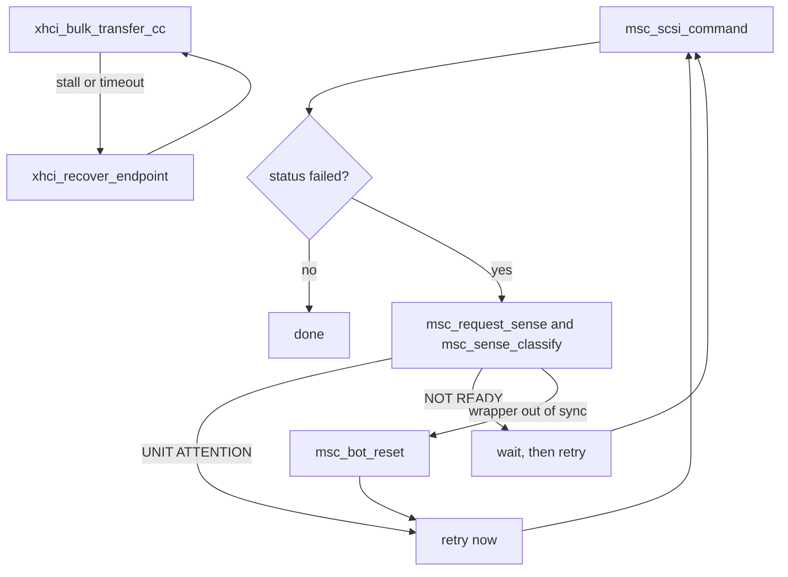

<!-- docs: covers=todo/01-boot-platform/TODO-19-usb-boot-hardening.md sources=src/kernel/drivers/usb_msc.c,include/kernel/drivers/usb_msc.h,include/kernel/drivers/scsi.h,src/kernel/drivers/xhci_dev.c,src/kernel/drivers/xhci.c,include/kernel/drivers/xhci_dev.h,src/kernel/drivers/usb_legacy.c,src/kernel/drivers/usb_boot_report.c,src/kernel/klog_disk.c,include/kernel/klog.h,src/kernel/main/boot_media.c,src/kernel/main/boot_storage.c,src/kernel/test/test_usb_boot.c reviewed=2026-09-28 order=19 -->
# USB Boot Hardening

## What is it?

This is the fail-safe layer that stops USB boot from hanging, stalling or losing data on real hardware. USB storage fails in ways SATA rarely does: a drive reports UNIT ATTENTION right after enumeration, a bulk endpoint stalls mid-transfer, a pulled cable leaves the controller waiting, and writing the boot log to a USB 2.0 stick can take minutes. This roadmap covers SCSI error decoding and retry, endpoint stall recovery, bounded transfer timeouts, a bounded log flush with a deferred mode for slow media, boot-media speed detection, and a single diagnostic report. Enumeration itself belongs to [USB Boot Storage (xHCI)](xhci-usb-boot.md).

## How does it work?

Every mass-storage command passes three layers, each handling a different failure.

The transport layer (`xhci_dev.c`) recovers a stalled or halted bulk endpoint. `xhci_endpoint_is_halted()` reads the endpoint state, and `xhci_recover_endpoint()` runs the recovery the state needs: a halted endpoint gets `CLEAR_FEATURE(ENDPOINT_HALT)`, an xHCI Reset Endpoint command and a Set TR Dequeue Pointer; a stopped one gets the clear and the dequeue; a running one only the clear.

The bulk-only transport layer (`usb_msc.c`) checks every Command Status Wrapper's signature, tag and residue before trusting its status byte, and `msc_bot_reset()` issues a mass-storage class reset when the wrapper is out of sync.

The SCSI layer decides why a command failed. `msc_request_sense()` issues REQUEST SENSE and `msc_sense_classify()` maps the sense key to retry now (UNIT ATTENTION), wait and retry (NOT READY) or unrecoverable. `msc_scsi_command()` wraps every INQUIRY, READ CAPACITY, READ and WRITE with up to three attempts (`MSC_SCSI_RETRIES`), decided by the pure function `msc_scsi_retry_decide()`.

Readiness after enumeration used to be a blind two-second sleep. `msc_poll_unit_ready()` now sends TEST UNIT READY, decodes a failure through REQUEST SENSE, and stops as soon as the drive is ready, so a drive that is ready at once costs nothing. `MSC_TUR_READY_BUDGET_MS` (2000 ms) bounds when a new attempt may start, not the whole wait: a command already in flight runs to its own transfer timeout, so a stalled drive can take longer than two seconds. Bulk transfers are bounded too: `xhci_wait_transfer()` takes a nominal polling budget (`USB_BULK_TIMEOUT_MS`, 5000 ms, counted in port I/O delays and applied per 64 KiB fragment), and a timeout attempts to stop the endpoint and move its dequeue pointer past the stale transfer, so an unplugged device cannot hang the kernel. If that abort itself fails, the endpoint is logged as tainted (`Bulk timeout abort FAILED ... -- endpoint tainted`) and the stale transfer stays queued.

On the logging side, `klog_disk_flush()` writes only the entries since the last flush, capped to the ring size, and reports progress on serial once a flush passes 64 entries. A flush slower than 5000 ms logs a warning and switches to deferred mode (`klog_set_deferred()`), after which flushes are skipped until `klog_disk_flush_all()` drains everything at the end of boot. Earlier still, `boot_media_probe()` times one 4 KiB read from the boot volume, classifies the media as fast, medium or slow with `boot_media_classify()`, and switches to deferred logging up front when the media is slow.



## What are its interfaces?

| Interface | Purpose |
| --------- | ------- |
| `msc_request_sense()` / `msc_sense_classify()` | REQUEST SENSE decode and error classification ([`usb_msc.c`](../../src/kernel/drivers/usb_msc.c)) |
| `msc_poll_unit_ready()` | Event-driven TEST UNIT READY poll that replaced the fixed sleep ([`usb_msc.c`](../../src/kernel/drivers/usb_msc.c)) |
| `msc_scsi_command()` / `msc_scsi_retry_decide()` | Whole-command SCSI retry wrapper and its pure decision function ([`usb_msc.c`](../../src/kernel/drivers/usb_msc.c)) |
| `msc_bot_reset()` | Mass-storage class reset on an out-of-sync status wrapper ([`usb_msc.c`](../../src/kernel/drivers/usb_msc.c)) |
| `xhci_endpoint_is_halted()` / `xhci_recover_endpoint()` | State-aware stall and halt recovery ([`xhci_dev.c`](../../src/kernel/drivers/xhci_dev.c)) |
| `xhci_bulk_transfer_cc()` / `xhci_wait_transfer()` / `xhci_stop_endpoint()` | Bulk transfer with a bounded timeout and Stop Endpoint abort ([`xhci_dev.c`](../../src/kernel/drivers/xhci_dev.c), [`xhci_dev.h`](../../include/kernel/drivers/xhci_dev.h)) |
| `xhci_route_intel_usb2_ports()` | Intel EHCI-to-xHCI USB 2.0 port routing with a bounded settle wait ([`xhci.c`](../../src/kernel/drivers/xhci.c)) |
| `klog_disk_flush()` / `klog_disk_flush_all()` / `klog_set_deferred()` | Bounded flush, end-of-boot drain, and deferred mode ([`klog_disk.c`](../../src/kernel/klog_disk.c), [`klog.h`](../../include/kernel/klog.h)) |
| `boot_media_probe()` / `boot_media_classify()` | Timed read and fast, medium or slow classification ([`boot_media.c`](../../src/kernel/main/boot_media.c)) |
| `usb_legacy_scan()` / `usb_legacy_announce()` | Detects EHCI, UHCI and OHCI controllers and logs the graceful skip when there is no xHCI ([`usb_legacy.c`](../../src/kernel/drivers/usb_legacy.c)) |
| `usb_boot_report()` | The consolidated `=== USB Boot Report ===` block ([`usb_boot_report.c`](../../src/kernel/drivers/usb_boot_report.c)) |
| `scsi.h` | Shared SCSI sense-key constants used by the USB and AHCI drivers ([`scsi.h`](../../include/kernel/drivers/scsi.h)) |

## How do I use it?

```bash
bash scripts/test.sh SUITE=storage    # sense, retry, residue and stall tests; legacy controller classification
bash scripts/test.sh SUITE=boot       # bounded log flush, lost-entry count, media-speed thresholds
```

There is nothing to invoke by hand: all of this runs on every boot that touches USB storage, from `boot_phase2()` in [`boot_storage.c`](../../src/kernel/main/boot_storage.c). On serial, a check condition shows a `Sense: key=N ASC=0x.. ASCQ=0x.. (NAME)` line, a large flush shows its entry count and duration, the media classification appears once the boot volume is mounted (`Boot media speed: fast (N us/4KiB)`), and the end of storage init prints a `=== USB Boot Report ===` block listing devices, controllers, port routing and SCSI retry counts.

## What is not implemented yet?

- The EHCI/UHCI host controller driver has not landed, so USB boot on pre-2012 hardware without xHCI is detected and skipped rather than served: [EHCI/UHCI Companion Controller Fallback](../../todo/01-boot-platform/TODO-19-usb-boot-hardening.md#11-ehciuhci-companion-controller-fallback).
- The xHCI command ring and the mass-storage transport are not serialized for SMP; one boot CPU is safe, concurrent hot-plug against SMP block I/O is not: [xHCI Command Ring + BOT Transport SMP Serialization](../../todo/01-boot-platform/TODO-19-usb-boot-hardening.md#16-xhci-command-ring--bot-transport-smp-serialization).
- A failed timeout abort leaves a stale transfer on the ring, and a later retry can queue behind it; forcing a re-abort or slot reset first is open: [xHCI Command Ring + BOT Transport SMP Serialization](../../todo/01-boot-platform/TODO-19-usb-boot-hardening.md#16-xhci-command-ring--bot-transport-smp-serialization).
- A control-transfer timeout returns after its bound but cannot be aborted and re-armed the way a bulk transfer can: [Bulk Transfer Timeouts](../../todo/01-boot-platform/TODO-19-usb-boot-hardening.md#5-bulk-transfer-timeouts).
- The Intel port-routing wait is a fixed bound rather than an early exit once routed ports are ready: [XUSB2PR Port-Ready Polling](../../todo/01-boot-platform/TODO-19-usb-boot-hardening.md#7-xusb2pr-port-ready-polling-intel-ehcixhci).
- Flush progress is reported through a callback, but nothing shows it on screen, because the end-of-boot drain runs after the splash has gone: [Flush Progress on Splash Diagnostic Line](../../todo/01-boot-platform/TODO-19-usb-boot-hardening.md#15-flush-progress-on-splash-diagnostic-line).
- A failed `kernel.log` flush retry appends over a partial write instead of truncating first: [klog_disk_flush Bounded Loop](../../todo/01-boot-platform/TODO-19-usb-boot-hardening.md#8-klog_disk_flush-bounded-loop).
- Composite media such as multi-slot card readers are addressed at LUN 0 only: [SCSI REQUEST SENSE and Error Classification](../../todo/01-boot-platform/TODO-19-usb-boot-hardening.md#1-scsi-request-sense-and-error-classification).

## How does it compare with Windows 11 and Linux?

On xHCI hardware this is at parity with Windows `usbstor.sys` and Linux `usb-storage`: SCSI sense retry, event-driven readiness, stall and halt recovery, and bounded transfer timeouts. It goes further with a single `=== USB Boot Report ===` block (Windows spreads the same facts across Event Log entries, Linux across dmesg lines). It falls short on pre-xHCI hardware, where Windows and Linux have full EHCI/UHCI stacks and Impossible OS only detects the controller and skips it.

## See also

- [USB Boot Hardening and Fail-Safe Pipeline roadmap](../../todo/01-boot-platform/TODO-19-usb-boot-hardening.md)
- [USB Boot Storage (xHCI)](xhci-usb-boot.md)
- [USB Zero-Delay Handover](usb-zero-delay-handover.md)
- [Boot Device Discovery](boot-device-discovery.md)
- [Bare Metal Gotchas](../infrastructure/bare-metal-gotchas.md)
