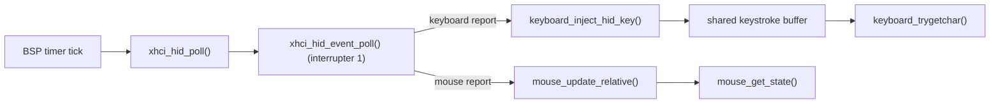

<!-- docs: covers=todo/01-boot-platform/TODO-18-usb-hid-keyboard-mouse.md sources=src/kernel/drivers/xhci_dev.c,src/kernel/drivers/xhci_ring.c,include/kernel/drivers/xhci_dev.h,src/kernel/drivers/keyboard.c,src/kernel/drivers/mouse.c,include/kernel/drivers/mouse.h,src/kernel/drivers/usb_input_diag.c,src/kernel/timer.c,src/kernel/test/test_usb_hid.c reviewed=2026-09-28 order=18 -->
# USB HID Boot-Protocol Keyboard and Mouse

## What is it?

This is the driver that makes a USB keyboard type and a USB mouse move the cursor, whether or not the machine has PS/2 hardware. Most laptops and desktops built since 2015 expose only USB input, so without it the OS is unusable on that hardware. It reads boot-protocol HID reports (the fixed 8-byte keyboard layout and 3-byte mouse layout that firmware setup screens rely on) over an xHCI interrupt endpoint, and feeds them into the same keystroke buffer and cursor state the PS/2 drivers use, so nothing above the driver needs to know which bus a device is on.

## How does it work?

Endpoint setup happens once per device in `xhci_hid_identify()`. It walks the configuration descriptor for a HID boot interface (class 0x03, boot subclass, keyboard or mouse protocol), validates the interrupt-IN endpoint before trusting it (rejecting endpoint 0, high-bandwidth packet sizes and sizes outside 1 to 64 bytes), converts the polling interval to the xHCI endpoint-context encoding with `xhci_hid_interval_encode()` (the encoding depends on device speed), and issues a Configure Endpoint command. It then forces boot protocol with `SET_PROTOCOL(0)` and turns off repeated held-key reports with `SET_IDLE(0)`, logging a warning rather than failing the device if either is refused.

Reports do not share the controller's main event ring. On controllers with at least two interrupters, a second, dedicated event ring on interrupter 1 receives HID transfer events, so the HID poller can never consume a command, storage or hot-plug event meant for the main ring. `xhci_hid_poll()` runs on the BSP timer tick (about 100 Hz) through `timer_add_tick_subscriber()`, drains up to 32 events per tick with `xhci_hid_event_poll()`, checks each event's completion code and length, and only then parses the report.

A keyboard report is compared with the previous one to find newly pressed keys, dropped whole on key rollover (usages 0x01 to 0x03), and each new key goes to `keyboard_inject_hid_key()`. That uses the report's own modifier byte against HID usage tables, not the PS/2 shift state, and pushes into the same buffer the PS/2 interrupt handler fills, so `keyboard_trygetchar()` does not care where a key came from. A mouse report becomes signed dx and dy plus a 3-bit button mask, applied by `mouse_update_relative()` under the irqsave lock shared with PS/2 and the compositor. Each input source (USB, PS/2, and absolute sources such as the VirtIO tablet) keeps its own button slot, and the slots are combined into the visible state, so one device cannot release a button held on another.



## What are its interfaces?

| Interface | Purpose |
| --------- | ------- |
| `xhci_hid_identify()` | Finds the HID boot interface and configures its interrupt-IN endpoint ([`xhci_dev.c`](../../src/kernel/drivers/xhci_dev.c)) |
| `xhci_hid_interval_encode()` | Speed-dependent interval conversion, exposed for tests ([`xhci_dev.c`](../../src/kernel/drivers/xhci_dev.c)) |
| `xhci_hid_poll()` | Timer-tick callback: drain the HID ring, parse reports, re-queue transfers ([`xhci_dev.c`](../../src/kernel/drivers/xhci_dev.c)) |
| `xhci_hid_decode_mouse()` | Pure boot-mouse report decoder, exposed for tests ([`xhci_dev.c`](../../src/kernel/drivers/xhci_dev.c)) |
| `xhci_hid_event_poll()` | Drains interrupter 1's dedicated event ring ([`xhci_ring.c`](../../src/kernel/drivers/xhci_ring.c)) |
| `keyboard_inject_hid_key()` / `keyboard_trygetchar()` | HID usage to character into the shared buffer, and the non-blocking read ([`keyboard.c`](../../src/kernel/drivers/keyboard.c)) |
| `mouse_update_relative()` / `mouse_get_state()` | Apply a relative USB movement, and read the merged cursor state ([`mouse.c`](../../src/kernel/drivers/mouse.c), [`mouse.h`](../../include/kernel/drivers/mouse.h)) |
| `usb_input_diag_report()` | Boot-time input-source summary and per-device HID identity ([`usb_input_diag.c`](../../src/kernel/drivers/usb_input_diag.c)) |

## How do I use it?

```bash
bash scripts/test.sh SUITE=storage    # interval encoding, report decoding, source merging, diagnostic format
make test-storage                     # same, as a make target
```

To try the live path in QEMU, boot with `-device usb-kbd` and `-device usb-mouse`, then type at the shell prompt or move the cursor. Serial shows one identify line per device, `HID keyboard found on port N (EPn, interval field=N, MaxPkt=N)`, and after input init a summary such as `[INPUT] Sources: PS/2=yes USB_KBD=no USB_MOUSE=no VIRTIO=no` with a line of HID poll counters (`HID poll: reports=N ep_errors=N requeue_fails=N`).

## What is not implemented yet?

- Safe hot-plug: with MSI enabled, a keyboard or mouse attached after boot is already enumerated and polled, but from the interrupt handler, on the event ring the foreground command and transfer loops also consume. Moving enumeration to a serialized worker is open: [Hot-Plug Keyboard/Mouse Detection](../../todo/01-boot-platform/TODO-18-usb-hid-keyboard-mouse.md#6-hot-plug-keyboardmouse-detection).
- Removal: an error completion after unplug stops polling that device, but nothing tears down its slot or frees its endpoint ring: [Hot-Plug Keyboard/Mouse Detection](../../todo/01-boot-platform/TODO-18-usb-hid-keyboard-mouse.md#6-hot-plug-keyboardmouse-detection).
- All USB mice share one button slot, so with two USB mice attached one can release a button still held on the other: [Hot-Plug Keyboard/Mouse Detection](../../todo/01-boot-platform/TODO-18-usb-hid-keyboard-mouse.md#6-hot-plug-keyboardmouse-detection).

## How does it compare with Windows 11 and Linux?

Interrupt endpoint setup, USB keyboard and mouse during boot, and PS/2 plus USB coexistence are at parity with the Windows `usbxhci.sys` and HID class stack and Linux `xhci-hcd` plus `usbhid`. The single `[INPUT] Sources:` summary line goes further than either: Windows shows input sources only in Device Manager and Linux in scattered dmesg lines. Hot-plug is where Impossible OS still trails both.

## See also

- [USB HID Boot-Protocol Keyboard and Mouse roadmap](../../todo/01-boot-platform/TODO-18-usb-hid-keyboard-mouse.md)
- [USB Boot Storage (xHCI)](xhci-usb-boot.md)
- [USB Boot Hardening](usb-boot-hardening.md)
- [Interrupt Architecture and the Unified Timer Subsystem](interrupt-timer-architecture.md)
