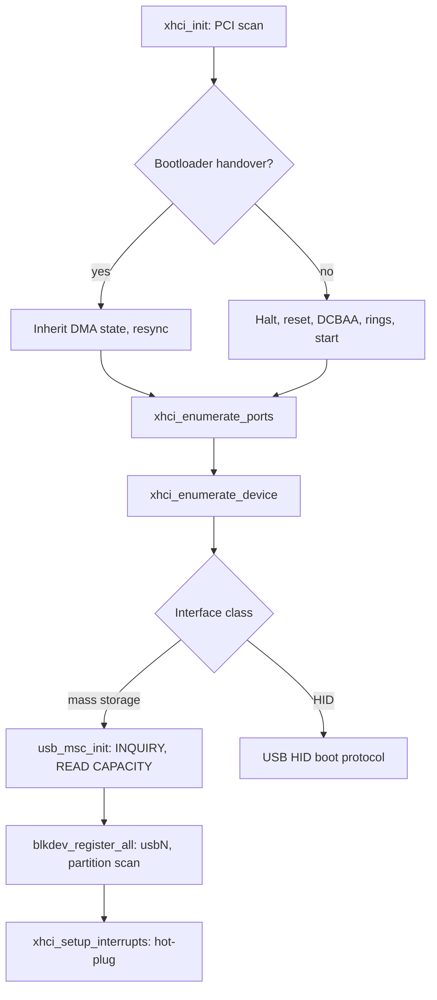

<!-- docs: covers=todo/01-boot-platform/TODO-17-xhci-usb-boot.md sources=src/kernel/drivers/xhci.c,src/kernel/drivers/xhci_dev.c,src/kernel/drivers/xhci_ring.c,src/kernel/drivers/usb_msc.c,include/kernel/drivers/usb_msc.h,include/kernel/drivers/xhci_dev.h,src/kernel/main/blkdev_adapters.c,src/kernel/main/boot_storage.c,src/kernel/test/test_usb_boot.c reviewed=2026-09-28 order=17 -->
# USB Boot Storage (xHCI)

## What is it?

This is the boot-critical path that lets Impossible OS boot from a USB flash drive and read files from it, and it is the base every other USB boot roadmap builds on. It owns three things: the xHCI host controller driver that brings a USB controller online after UEFI hands over, the device enumeration sequence for whatever is plugged into a port, and the USB Mass Storage Class (MSC) Bulk-Only Transport driver that turns a USB drive into a block device the VFS can mount.

It does not own USB keyboard and mouse input ([USB HID Boot-Protocol Keyboard and Mouse](usb-hid-boot-protocol.md)), the bootloader-to-kernel controller handover ([USB Zero-Delay Handover](usb-zero-delay-handover.md)), or the wider USB stack of hubs, EHCI and UHCI, Bluetooth and USB networking (the [USB stack roadmap](../../todo/04-drivers-hardware/TODO-10-usb-stack.md)).

## How does it work?

`xhci_init()` walks PCI for xHCI controllers (class 0x0C, subclass 0x03, prog-if 0x30) and calls `xhci_init_controller()` for each. That maps BAR0 uncacheable, reads the capability registers, and performs the USBLEGSUP handoff that takes the controller from firmware before touching it. It then either inherits the controller the bootloader already started (when the handover capability and flags are set, see [USB Zero-Delay Handover](usb-zero-delay-handover.md)) or performs the full halt, reset, DCBAA and scratchpad allocation and TRB ring setup before starting the controller.

On Intel chipsets that still have an EHCI companion controller, `xhci_route_intel_usb2_ports()` moves the USB 2.0 ports from EHCI to xHCI through the XUSB2PR and USB3_PSSEN PCI registers and waits a bounded settle time. Newer Intel chipsets with no EHCI skip the wait.

`xhci_enumerate_ports()` walks each connected port and `xhci_enumerate_device()` runs the enumeration: port reset, Enable Slot, Address Device, the device and configuration descriptors (capped at 4096 bytes), SET_CONFIGURATION, and Configure Endpoint for the class interface it finds. A mass-storage interface (class 0x08) goes to `usb_msc_init()`, which issues INQUIRY and READ CAPACITY(10) and validates the sector size; any other device is probed for a HID boot interface instead.

Data moves through `usb_msc_read_sectors()` and `usb_msc_write_sectors()`, which frame READ(10) and WRITE(10) commands in the Bulk-Only Transport wrappers and hand the data phase to `xhci_bulk_transfer()`. That splits any transfer that would cross a 64 KiB physical boundary, because one transfer descriptor cannot cross one. Waits are bounded rather than open-ended, but the bounds are nominal polling budgets counted in port I/O delay iterations, not a calibrated clock: 500 ms for commands and control transfers, and 5000 ms (`USB_BULK_TIMEOUT_MS`) for each bulk fragment, so a transfer split at a 64 KiB boundary gets one budget per fragment. Recovery and SCSI retries add to that; there is no overall deadline.

`blkdev_register_all()` registers every active mass-storage device as `usb0`, `usb1` and so on, routes its I/O to the owning controller, and rejects any LBA above `0xFFFFFFFF` before it would be truncated into a 32-bit READ(10) or WRITE(10). Partition scanning then mounts whatever filesystem it finds. After boot enumeration, `xhci_setup_interrupts()` registers an MSI vector for hot-plug, and a port status change re-runs enumeration on connect; a disconnect is only logged. A controller without MSI still enumerates everything present at boot, but has no working hot-plug: the foreground polling loops discard port-change events.



## What are its interfaces?

| Interface | Purpose |
| --------- | ------- |
| `xhci_init()` | PCI discovery and per-controller bringup, called from `boot_phase2()` ([`xhci.c`](../../src/kernel/drivers/xhci.c)) |
| `xhci_init_controller()` | BAR mapping, USBLEGSUP handoff, and either full init or bootloader-state inherit for one controller ([`xhci.c`](../../src/kernel/drivers/xhci.c)) |
| `xhci_enumerate_ports()` / `xhci_enumerate_device()` | Port scan and device enumeration ([`xhci_dev.c`](../../src/kernel/drivers/xhci_dev.c)) |
| `usb_msc_init()` / `usb_msc_read_sectors()` / `usb_msc_write_sectors()` | Mass-storage setup and chunked READ(10)/WRITE(10) ([`usb_msc.c`](../../src/kernel/drivers/usb_msc.c), [`usb_msc.h`](../../include/kernel/drivers/usb_msc.h)) |
| `xhci_get_device()` / `xhci_msc_device_count()` | Device accessors the block-device registration walks ([`xhci_dev.c`](../../src/kernel/drivers/xhci_dev.c)) |
| `blkdev_register_all()` | Registers each USB mass-storage device as `usbN` ([`blkdev_adapters.c`](../../src/kernel/main/blkdev_adapters.c)) |
| `xhci_setup_interrupts()` | MSI registration for hot-plug; without MSI there is no hot-plug ([`xhci.c`](../../src/kernel/drivers/xhci.c)) |
| `xhci_controller_count()` | Controller count, the surface the unit tests assert against ([`xhci.c`](../../src/kernel/drivers/xhci.c)) |

## How do I use it?

```bash
bash scripts/test.sh SUITE=storage    # xHCI and mass-storage unit tests (test_usb_boot.c)
make test-storage                     # same, as a make target
make run-usb                          # QEMU with an xHCI controller and a USB mass-storage device
make run-usb-ci                       # headless variant with serial to a file
```

With a USB drive attached, serial shows `Found xHCI at PCI ...` with the vendor and device IDs, then `xHCI vX.Y ready, N slots, N ports, N intrs, N scratchpads`, then a `Device VVVV:PPPP enumerated on port N (slot N)` line for the drive, then its `INQUIRY:` identity and `READ CAPACITY: N sectors x N bytes = N MiB`. A machine with no xHCI controller logs `No xHCI controller -- continuing boot without USB (PS/2 + disk still work)` and boots on PS/2 input and SATA or NVMe storage.

## What is not implemented yet?

- Hot-plug is interim: the port-change handler shares the event ring the foreground command and transfer loops use, enumerates a new device from interrupt context, and a disconnect is logged but never removed from the block layer: [Hot-Plug Interrupt Handling](../../todo/04-drivers-hardware/TODO-10-usb-stack.md#8-hot-plug-interrupt-handling-opus).
- Devices behind a USB hub do not enumerate, because there is no hub class driver yet: [USB Hub Class Driver](../../todo/04-drivers-hardware/TODO-10-usb-stack.md#9-usb-hub-class-driver-opus).
- A machine without xHCI has no USB at all: EHCI, UHCI and OHCI controllers are detected and named for the boot report but not driven: [EHCI Fallback (USB 2.0)](../../todo/04-drivers-hardware/TODO-10-usb-stack.md#10-ehci-fallback-usb-20-opus).
- Non-Intel xHCI controllers (AMD, ASMedia, Renesas, VIA) have run only through the generic path in emulation; the physical hardware matrix waits on operator access: [Hardware Compatibility, Non-Intel xHCI Vendors](../../todo/01-boot-platform/TODO-17-xhci-usb-boot.md#6-hardware-compatibility----non-intel-xhci-vendors).
- Bare-metal USB boot (`C:\` on the USB drive with the kernel log written to it) is a manual verification step not yet checked off: [Verification](../../todo/01-boot-platform/TODO-17-xhci-usb-boot.md#verification).

## How does it compare with Windows 11 and Linux?

The controller driver, enumeration and mass-storage transport are table stakes: Windows `usbxhci.sys` with `USBSTOR.SYS` and Linux `xhci-hcd` with `usb-storage` do the same job, and a USB boot drive mounts automatically on all three. The USBLEGSUP ownership handoff is automatic here as in both. Windows and Linux both also have an EHCI driver for USB 2.0-only hardware and a recursive hub driver, which this roadmap does not ship yet. Hot-plug is automatic and robust on both; here it works but is interim, with the gaps listed above.

## See also

- [xHCI, USB Storage and USB HID roadmap](../../todo/01-boot-platform/TODO-17-xhci-usb-boot.md)
- [USB HID Boot-Protocol Keyboard and Mouse](usb-hid-boot-protocol.md)
- [USB Boot Hardening](usb-boot-hardening.md)
- [USB Zero-Delay Handover](usb-zero-delay-handover.md)
- [NVMe Storage Driver](nvme-boot-storage.md)
- [Boot Device Discovery](boot-device-discovery.md)
