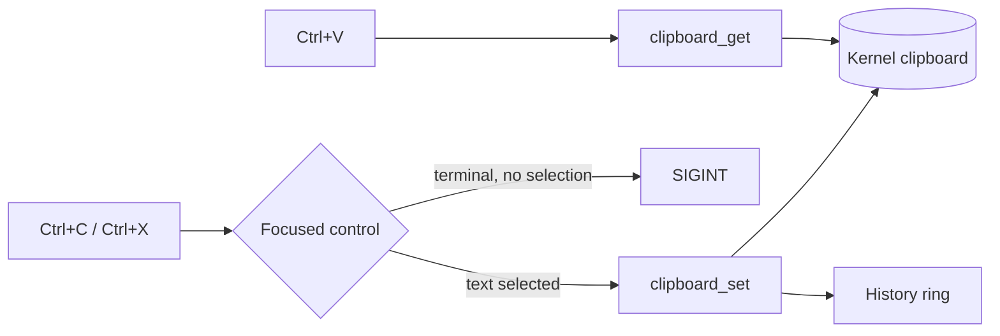

<!-- docs: covers=todo/09-desktop-shell/TODO-01-clipboard.md sources=src/kernel/drivers/keyboard.c,src/kernel/ipc/signal.c,include/desktop/controls.h,include/desktop/theme_tokens.h,include/icon_store.h reviewed=2026-09-29 order=7 -->
# Clipboard

## What is it?

The clipboard is the system-wide buffer behind Copy, Cut and Paste, plus the Win+V history of recent copies. This roadmap plans a kernel clipboard with typed formats, Ctrl+C, Ctrl+X and Ctrl+V routed to the focused control, the Win32 clipboard functions, a 25-entry history popup and several formats held at once. Nothing is implemented yet: there is no clipboard buffer, no clipboard syscall and no clipboard API in the tree.

## How does it work?

**Today.** No clipboard exists, and the one shortcut the plan builds on behaves differently from what the plan assumes. The keyboard driver turns Ctrl plus a letter into a control code, and for code 3 (Ctrl+C) it calls `signal_ctrl_c()` and returns ([`keyboard.c`](../../src/kernel/drivers/keyboard.c)). `signal_ctrl_c()` sends SIGINT to the console's foreground process group, or does nothing when there is none ([`signal.c`](../../src/kernel/ipc/signal.c)). No foreground group is set today, because `cmd.exe` never claims the console, and pending signals are not delivered yet ([Process Model Extensions](../kernel/process-model-extensions.md)), so Ctrl+C currently does nothing at all: it neither interrupts a program nor reaches the terminal or a text box. The text box control stores up to 128 characters and a cursor position, with no selection fields ([`controls.h`](../../include/desktop/controls.h)). What does exist for the future feature is presentation only: the `ICON_CUT`, `ICON_COPY`, `ICON_PASTE` and `ICON_CLIPBOARD` icons ([`icon_store.h`](../../include/icon_store.h)) and the history popup size tokens `THEME_SIZE_CLIPBOARD_WIDTH` (360) and `THEME_SIZE_CLIPBOARD_MAX_HEIGHT` (480) ([`theme_tokens.h`](../../include/desktop/theme_tokens.h)).

**Planned design.**

1. **Kernel buffer.** One global clipboard guarded by a spinlock, holding a format tag (none, text, image, file list or HTML) and the data. Data up to 4 KB comes from `kmalloc()`, larger data from `pmm_alloc_contiguous()`. Two syscalls set and read it.
2. **Shortcuts.** Ctrl+C, Ctrl+X and Ctrl+V go to the focused control. In the terminal, Ctrl+C copies when text is selected and sends SIGINT otherwise. That needs the keyboard path above changed first, because the driver consumes Ctrl+C before any window sees it.
3. **Win32 API.** `OpenClipboard`, `SetClipboardData`, `GetClipboardData` and `EmptyClipboard`, mapping `CF_TEXT` (1), `CF_BITMAP` (2), `CF_UNICODETEXT` (13) and `CF_HDROP` (15) onto the kernel formats.
4. **History.** A 25-entry ring filled by every copy, shown by Win+V as an acrylic popup, with the source program's name taken from the copying task. It can be turned off in the Registry.
5. **Multiple formats.** Up to four formats per copy, so a paste target can pick the richest one it understands, with HTML reduced to plain text when needed.

## What are its interfaces?

| Interface | Status |
| --- | --- |
| `clipboard_set()`, `clipboard_get()`, `clipboard_has()`, `clipboard_clear()` | Planned |
| Clipboard set and get syscalls | Planned; no numbers are assigned yet |
| `OpenClipboard`, `SetClipboardData`, `GetClipboardData`, `EmptyClipboard` | Planned |
| `NtUserOpenClipboard` and the other shadow clipboard calls | Reserved in the [Win32k shadow master table](../graphics/win32k-shadow-master-table.md); none registered |
| `HKLM\SYSTEM\Clipboard` history settings | Planned |

## How do I use it?

It cannot be used yet. Ctrl+C is taken by the keyboard driver for SIGINT, and since the shell sets no foreground group it has no effect today.

## What is not implemented yet?

Everything:

- [Kernel Clipboard Buffer](../../todo/09-desktop-shell/TODO-01-clipboard.md#1-kernel-clipboard-buffer-sonnet)
- [Keyboard Shortcut Wiring](../../todo/09-desktop-shell/TODO-01-clipboard.md#2-keyboard-shortcut-wiring-opus), including the change to the keyboard driver's Ctrl+C path
- [Win32 Clipboard API Stubs](../../todo/09-desktop-shell/TODO-01-clipboard.md#3-win32-clipboard-api-stubs-sonnet)
- [Clipboard History](../../todo/09-desktop-shell/TODO-01-clipboard.md#4-clipboard-history-sonnet)
- [Multi-Format Clipboard](../../todo/09-desktop-shell/TODO-01-clipboard.md#5-multi-format-clipboard-sonnet)

Text selection in controls is a prerequisite owned by the widget work in [Extended Widget Library: Core Controls](../graphics/widget-library.md).

## How does it compare with Windows 11 and Linux?

Windows 11 has one global clipboard through `SetClipboardData`, several formats per copy and the Win+V history. On Linux, X11 has separate PRIMARY and CLIPBOARD selections negotiated between programs, Wayland has equivalents, and history comes from third-party tools such as CopyQ or Parcellite. Impossible OS has no clipboard yet. The plan follows the Windows model, keeps the history in the kernel instead of a separate daemon, and decides between copy and SIGINT in one place so that Ctrl+C in a terminal behaves predictably.

## See also

- [Clipboard System roadmap](../../todo/09-desktop-shell/TODO-01-clipboard.md)
- [Shell design: clipboard history](../design/shell.md#clipboard-history)
- [Keyboard and Mouse Input](input-system.md)
- [Control Library](control-library.md)
- [Win32 GDI and USER32](../graphics/win32-gdi-user32.md)
