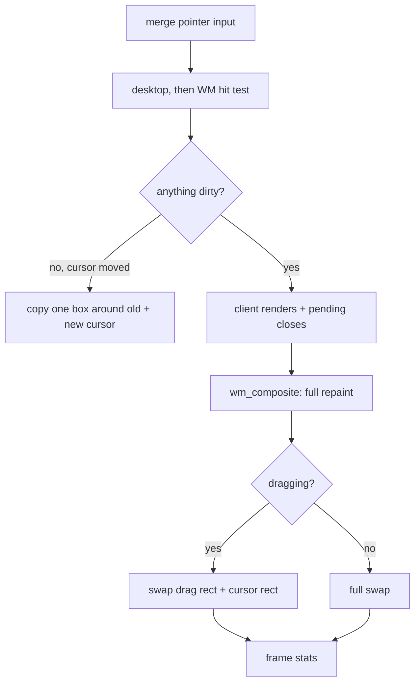

<!-- docs: covers=todo/06-desktop-foundation/TODO-02-compositor-optimization.md sources=src/kernel/main/compositor.c,src/desktop/wm.c,include/desktop/wm.h,src/desktop/desktop.c,src/kernel/drivers/framebuffer.c reviewed=2026-09-29 order=2 -->
# Desktop Compositor

## What is it?

The compositor is the kernel loop that turns the desktop into pixels: it reads the mouse, hands clicks to the desktop and the window manager, and when something changed it repaints the whole scene into a back buffer and copies it to the screen. This roadmap planned to make that cheaper with damage (dirty rectangle) tracking, partial wallpaper restores, per-window damage, frame timing and VSync. Its first four sections are superseded by [Compositor Performance](../../todo/08-graphics-ui/TODO-08-window-manager.md#8-compositor-performance-opus) in the window manager roadmap, and only their leftovers stay here. Frame timing is already measured; everything else is unstarted.

## How does it work?

`compositor_run()` in [`compositor.c`](../../src/kernel/main/compositor.c) runs forever as the kernel's first task (PID 0), which never leaves the loop. Each pass it:

1. Merges pointer input from the PS/2, USB, VirtIO tablet and VirtualBox sources. It waits for input interrupts up to 4 times (12 under TCG emulation), re-reading the shared pointer state after each, so a burst of motion collapses into one frame.
2. Dispatches a moved cursor or changed button to `desktop_handle_click()` first, then to `wm_handle_mouse()` if the desktop did not take it.
3. Decides whether a full frame is needed: the first frame, a button change, a drag, any window marking itself dirty, or the taskbar clock's minute changing.
4. If so, renders the Command Prompt and Control Gallery client buffers (skipped while a window is being dragged), drains queued Alt+F4 closes, and calls `wm_composite()`.
5. `wm_composite()` in [`wm.c`](../../src/desktop/wm.c) always repaints the full screen, back to front: wallpaper, desktop icons, each window's decorations and client pixels in stacking order, the taskbar, then the Start menu.
6. Draws the cursor and presents. During a drag it copies only the drag rectangle and the cursor rectangle to video memory; otherwise it copies the whole back buffer.
7. If nothing changed but the cursor moved, it skips the composite and copies one rectangle bounding the old and new cursor positions, with interrupts disabled during the copy. A small move copies a few pixels; a large jump of an absolute pointer can copy most of the screen.

Dirtiness is one atomic flag (`needs_redraw` in `wm.c`), not a list of rectangles, so any change repaints everything. The general-purpose dirty tracker `gfx_dirty_*` in [`gfx.h`](../../include/gfx.h) (32 rectangles) is not used by the compositor. A clipped wallpaper repaint, `desktop_draw_wallpaper_rect()` in [`desktop.c`](../../src/desktop/desktop.c), exists but has no callers.

**Frame timing.** Every full-composite frame, including drag frames, is timed from the start of frame work to the present and counted against a 16.67 ms budget. Input batching before that point and cursor-only copies are not timed or counted. `struct wm_frame_stats` in [`wm.h`](../../include/desktop/wm.h) counts frames presented, queued, late and dropped, guarded by a sequence lock so readers on other CPUs see a consistent snapshot. Each timed present also emits an ETW event.

**VSync.** None. [`framebuffer.c`](../../src/kernel/drivers/framebuffer.c) can page-flip on Bochs VGA hardware, but nothing waits for vertical blank.

## What are its interfaces?

| Interface | Purpose |
| --- | --- |
| `compositor_run()` | The desktop loop ([`compositor.c`](../../src/kernel/main/compositor.c)) |
| `compositor_step_frames()` | Headless presenter used by tests; refuses to run on a live display |
| `wm_mark_dirty()`, `wm_needs_redraw()` | Request and consume a repaint |
| `wm_composite()` | Full-screen repaint into the back buffer |
| `wm_get_drag_dirty_rect()` | The one partial-present rectangle |
| `wm_get_frame_stats()`, `\ObjectManager\FrameStats` | Frame counters, in code and as an Object Manager info file |

## How do I use it?

The compositor starts on its own when the desktop boots (`bash scripts/build.sh run`). The frame counters are covered by the desktop suite, `bash scripts/test.sh SUITE=desktop`, which also drives `compositor_step_frames()` headlessly.

## What is not implemented yet?

- **Damage tracking**: a rectangle list, per-window damage and a composite that repaints only damaged areas. Owned by [Compositor Performance](../../todo/08-graphics-ui/TODO-08-window-manager.md#8-compositor-performance-opus); leftovers in [section 1](../../todo/06-desktop-foundation/TODO-02-compositor-optimization.md#1-dirty-rect-tracking-infrastructure) and [section 3](../../todo/06-desktop-foundation/TODO-02-compositor-optimization.md#3-per-window-damage-and-compositor-loop).
- **Partial wallpaper restore**: the clipped repaint exists and needs wiring in, including the taskbar edge case. [Section 2](../../todo/06-desktop-foundation/TODO-02-compositor-optimization.md#2-partial-wallpaper-restore).
- **VSync and a late-frame warning**: frames are counted as late but nothing is logged. [Section 4](../../todo/06-desktop-foundation/TODO-02-compositor-optimization.md#4-frame-timing-and-vsync).
- **Terminal text at boot**: a report of Command Prompt text briefly appearing at the top left before the first frame. [Section 5](../../todo/06-desktop-foundation/TODO-02-compositor-optimization.md#5-terminal-render-clipping-boot-bleed-fix) owns it. Its stated cause is not confirmed by today's code, which writes terminal text only into the window's own buffer through a bounds-checked pixel call.
- **GPU acceleration**: none planned here; composition is CPU-only.

## How does it compare with Windows 11 and Linux?

Windows 11's Desktop Window Manager and Wayland compositors such as Mutter and KWin all track damage per surface, synchronise to vertical blank and compose on the GPU, so a blinking cursor repaints a few pixels. Impossible OS composes on the CPU, repaints the full screen whenever anything changes, and has no VSync; what it already has is per-frame lateness accounting exposed as a readable counter file.

## See also

- [Compositor Optimization roadmap](../../todo/06-desktop-foundation/TODO-02-compositor-optimization.md)
- [Window Manager Enhancements](../graphics/window-manager.md)
- [Window Management Basics](window-management.md)
- [Animation Engine](../graphics/animation-engine.md), which needs the compositor to keep ticking while animations run
- [Design principles: the 60 Hz CPU budget](../design/index.md#what-principles-guide-it)
