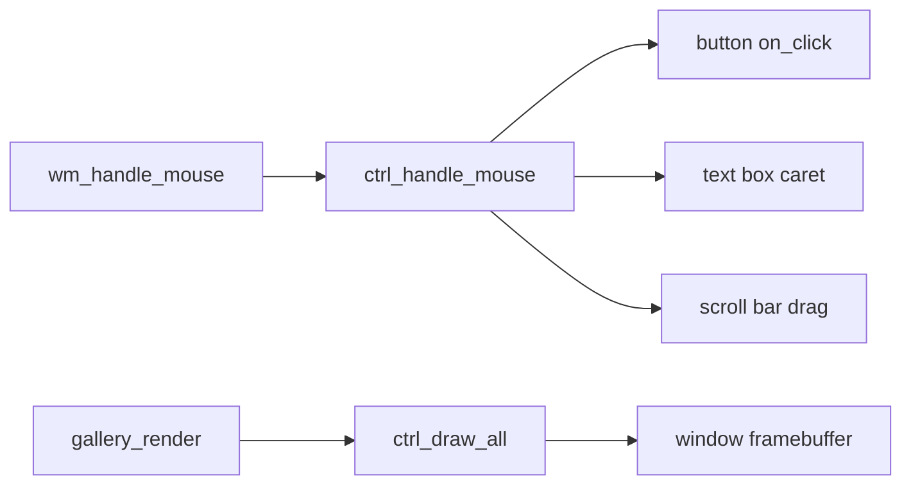

<!-- docs: covers=todo/06-desktop-foundation/TODO-04-control-library.md sources=src/desktop/controls.c,include/desktop/controls.h,src/desktop/gallery.c reviewed=2026-09-29 order=4 -->
# Control Library

## What is it?

The control library draws the buttons, labels, text boxes and scroll bars inside desktop windows and turns mouse clicks into control events. It lives in [`controls.c`](../../src/desktop/controls.c) and is shown off by the Control Gallery window in [`gallery.c`](../../src/desktop/gallery.c). This roadmap planned check boxes, radio buttons, progress bars, list boxes, combo boxes and context menus, but it is superseded: each control is now owned by the [core widget roadmap](../graphics/widget-library.md), the [complex controls roadmap](../graphics/complex-controls-dialogs.md) or the single context menu engine in the desktop shell features roadmap. What stays here is adding each new control to the gallery.

## How does it work?

Four control types exist: `CTRL_BUTTON`, `CTRL_LABEL`, `CTRL_TEXTBOX` and `CTRL_SCROLLBAR` ([`controls.h`](../../include/desktop/controls.h)). Controls belong to a window by its window manager handle. A pool of 32 per-window records, each holding up to 32 controls, is allocated from physical memory the first time `ctrl_init()` runs; an atomic state makes that call safe to repeat, and if the allocation fails every `ctrl_create_*()` call returns -1 instead of halting. `ctrl_ready()` tells a caller whether the pool exists.

Drawing uses the 14 pixel UI font and fixed colours from `CTRL_COLOR_*` in the header, not the design tokens. Buttons have a one-pixel border and a top highlight; text boxes show a caret positioned from measured glyph widths; scroll bars have a draggable thumb at least 16 pixels long.

Input arrives from the window manager: a click inside a window is passed to `ctrl_handle_mouse()`, which focuses the control under the pointer, fires a button's `on_click` callback, places a text box caret, or drags or jumps a scroll bar thumb. `ctrl_handle_key()` edits text boxes (Backspace, Delete and printable characters), but no production code path calls it, so the gallery's text box cannot be typed into yet.

The Control Gallery is a 420 by 360 dialog opened at boot. It has three cards (Buttons, Text Input and ScrollBars) holding three buttons, one of them disabled, a text box, a horizontal and a vertical scroll bar and status labels. Its "Accent" button is created the same way as "Normal"; there is no accent style yet.

## What are its interfaces?

| Interface | Purpose |
| --- | --- |
| `ctrl_init()`, `ctrl_ready()` | Allocate the pool once; report whether it exists |
| `ctrl_create_button()`, `_label()`, `_textbox()`, `_scrollbar()` | Create a control in a window |
| `ctrl_destroy()`, `ctrl_destroy_all()` | Remove one control or all of a window's controls |
| `ctrl_draw()`, `ctrl_draw_all()` | Paint into the window's framebuffer |
| `ctrl_handle_mouse()`, `ctrl_handle_key()` | Input entry points |
| `ctrl_set_text()`, `ctrl_get_text()`, `ctrl_set_scroll_pos()`, `ctrl_set_focus()`, `ctrl_set_enabled()` | State |
| `CTRL_MAX_PER_WINDOW` 32, `CTRL_TEXT_MAX` 128, `CTRL_MAX_WINDOWS` 32 | Limits |

## How do I use it?

Boot the desktop and use the Control Gallery window: click the buttons and drag the scroll bars. The pool's out-of-memory and restart behaviour is covered by the desktop suite, `bash scripts/test.sh SUITE=desktop`; drawing and input are not unit tested yet.

## What is not implemented yet?

- **New controls**: check box and radio button ([section 1](../../todo/06-desktop-foundation/TODO-04-control-library.md#1-checkbox-and-radio-button)), progress bar ([section 2](../../todo/06-desktop-foundation/TODO-04-control-library.md#2-progress-bar)), list box ([section 3](../../todo/06-desktop-foundation/TODO-04-control-library.md#3-listbox-with-scrollbar)), combo box ([section 4](../../todo/06-desktop-foundation/TODO-04-control-library.md#4-combobox-dropdown)) and context menu ([section 5](../../todo/06-desktop-foundation/TODO-04-control-library.md#5-context-menu-popup)). Each section names its owner.
- **Keyboard**: no Tab, Enter, Escape or arrow keys; see [Keyboard and Mouse Input](input-system.md).
- **Known defects**, filed under [Checkbox](../../todo/08-graphics-ui/TODO-05-widget-library-core.md#1-checkbox-sonnet) in the core widget roadmap: a destroyed control's slot is never reused, so a window can create only 32 controls in its lifetime; a button fires on press and its pressed look never shows; `ctrl_set_text()` does not accept a null string.
- **Theme colours**: controls use fixed colours until the [Theme System](../graphics/theme-system.md) lands.

## How does it compare with Windows 11 and Linux?

Windows 11 (Win32 common controls and WinUI 3) and GTK both ship check boxes, radio buttons, progress bars, list boxes, combo boxes and context menus as built-in controls, all keyboard-operable. Impossible OS has four basic controls operated by mouse; the rest are planned, drawn to the [controls design spec](../design/controls.md).

## See also

- [Control Library Completion roadmap](../../todo/06-desktop-foundation/TODO-04-control-library.md)
- [Core Widgets](../graphics/widget-library.md) and [Complex Controls and Dialogs](../graphics/complex-controls-dialogs.md)
- [Controls design: rules for every control](../design/controls.md#which-rules-apply-to-every-control)
- [Keyboard and Mouse Input](input-system.md)
