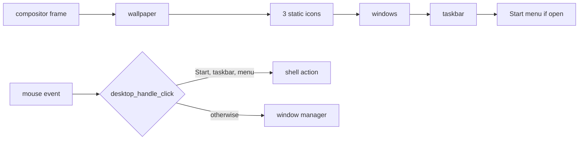

<!-- docs: covers=todo/06-desktop-foundation/TODO-05-desktop-shell.md sources=src/desktop/desktop.c,include/desktop/desktop.h,src/kernel/main/compositor.c reviewed=2026-09-29 order=5 -->
# Desktop Shell Today

## What is it?

The desktop shell is everything drawn behind and around the windows: the wallpaper, the desktop icons, the taskbar with its Start button, window buttons and clock, and the Start menu. Today it all lives in one file, [`desktop.c`](../../src/desktop/desktop.c). This roadmap planned to make it interactive (icon launching, a desktop right-click menu, taskbar window state, Start menu launching, power and settings buttons), but it is superseded: each behaviour is owned in the graphics roadmaps and built to the [shell design](../design/shell.md). This page describes what the shell does now.

## How does it work?

The [compositor](compositor.md) calls the shell's draw functions every frame, and gives it the first look at every mouse event through `desktop_handle_click()`; the window manager only sees a click the shell did not take.

- **Wallpaper.** Read at startup from the Registry values `Wallpaper` and `WallpaperMode` under `HKLM\SYSTEM\Theme`, defaulting to `C:\Impossible\Web\Wallpaper\default.jpg`. It is decoded, scaled to the screen with one of five fit modes (fill, fit, center, tile, stretch) and cached; a gradient is drawn if loading fails.
- **Desktop icons.** Three fixed icons, Computer, Recycle Bin and Control Panel, drawn at 48 pixels in a column on the right edge with a shadowed 14 pixel label. They are pictures only: clicking them does nothing. See [Desktop Icons](desktop-icons.md).
- **Taskbar.** 48 pixels tall (`TASKBAR_HEIGHT` in [`desktop.h`](../../include/desktop/desktop.h)) with a frosted acrylic background. From the left: the Start button with the logo, a 100 pixel button per open window with the focused one highlighted, and on the right a two-line clock (12-hour time over the date). Clicking a window button raises and focuses that window; it never minimizes it.
- **Start menu.** A fixed two-column menu, 450 pixels wide. The left column has a search box that does not search yet and three entries: About (opens a small information window), All Programs (does nothing) and Terminal (opens the Command Prompt). The right column lists Computer, Documents, Pictures, Music, Downloads, Control Panel and Help, which highlight on hover but do nothing when clicked. At the bottom, Settings closes the menu and Power shuts the machine down immediately through `acpi_shutdown()`, with no confirmation and no restart or sleep choice.
- **Right-click.** Ignored everywhere on the desktop.

## What are its interfaces?

| Interface | Purpose |
| --- | --- |
| `desktop_init()` | Load the wallpaper at startup ([`desktop.h`](../../include/desktop/desktop.h)) |
| `desktop_draw_wallpaper()`, `desktop_draw_icons()`, `desktop_draw_taskbar()`, `desktop_draw_start_menu()` | Called by `wm_composite()` |
| `desktop_handle_click()` | First refusal on every mouse event |
| `desktop_get_cursor_context()` | Hand cursor over clickable areas |
| `desktop_get_usable_height()` | Screen height minus the taskbar |
| `HKLM\SYSTEM\Theme\Wallpaper`, `WallpaperMode` | Wallpaper settings |

## How do I use it?

Boot the desktop (`bash scripts/build.sh run`), click Start, and choose Terminal to open the Command Prompt or About for version information. The wallpaper cannot be changed persistently yet: every boot re-seeds the Registry defaults and saved hives are never loaded.

## What is not implemented yet?

- **Icon actions**: [section 1](../../todo/06-desktop-foundation/TODO-05-desktop-shell.md#1-desktop-icon-click-actions), owned by [Desktop Icons](../../todo/08-graphics-ui/TODO-08-window-manager.md#4-desktop-icons-sonnet) in the window manager roadmap.
- **Desktop right-click menu**: [section 2](../../todo/06-desktop-foundation/TODO-05-desktop-shell.md#2-desktop-right-click-context-menu), owned by [Desktop Right-Click Menu](../../todo/08-graphics-ui/TODO-09-desktop-shell-features.md#2-desktop-right-click-menu-sonnet).
- **Taskbar minimize and restore**: [section 3](../../todo/06-desktop-foundation/TODO-05-desktop-shell.md#3-taskbar-window-state-sync), owned by [Taskbar Window List](../../todo/08-graphics-ui/TODO-10-taskbar.md#1-taskbar-window-list-sonnet). The hand-cursor and click areas of the window buttons also disagree today (120 versus 100 pixels), filed there.
- **Persistent settings**: wallpaper and other Registry changes are lost at reboot until hives load at boot, owned by [Registry Tree SMP Synchronization and Hive Durability](../../todo/02-kernel-core/TODO-35-unblocked-deferral-backfill.md#1-registry-tree-smp-synchronization-and-hive-durability).
- **Start menu**: [section 4](../../todo/06-desktop-foundation/TODO-05-desktop-shell.md#4-start-menu-program-launch) and [section 5](../../todo/06-desktop-foundation/TODO-05-desktop-shell.md#5-power-and-settings-buttons). The Windows 11 layout (pinned grid, recommended list, power menu) is owned by [Start Menu Data Loading](../../todo/08-graphics-ui/TODO-11-startmenu-tray-notifications.md#1-start-menu-data-loading-sonnet) and the two sections after it.

## How does it compare with Windows 11 and Linux?

Windows 11 launches desktop icons, has a desktop context menu, minimizes and restores from taskbar buttons, and offers Shut down, Restart and Sleep from Start. GNOME launches from Activities and its dash and has the same power choices. Impossible OS draws a working taskbar and a Windows 7 style Start menu that can launch two items and power off; the Windows 11 layout in the [Start menu design](../design/shell.md#start-menu) replaces it.

## See also

- [Desktop Shell Completion roadmap](../../todo/06-desktop-foundation/TODO-05-desktop-shell.md)
- [Desktop Icons](desktop-icons.md)
- [Shell design: desktop](../design/shell.md#desktop) and [taskbar](../design/shell.md#taskbar)
- [Desktop Compositor](compositor.md)
