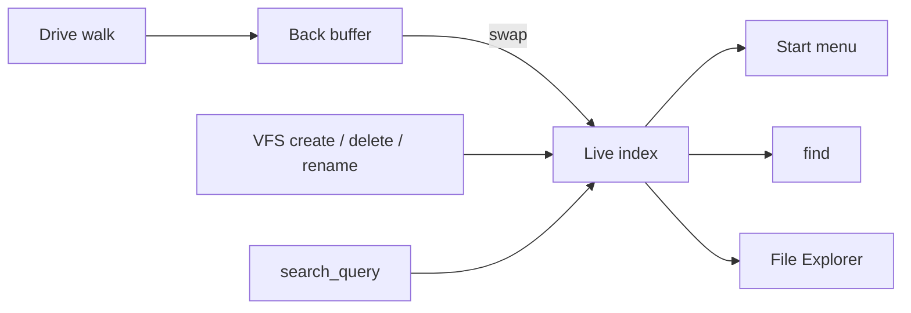

<!-- docs: covers=todo/09-desktop-shell/TODO-05-file-search.md sources=include/kernel/fs/vfs.h,src/kernel/nt/nt_syscall.c,src/kernel/nt/nt_file.c,src/desktop/desktop.c,user/cmd.c reviewed=2026-09-29 order=11 -->
# File Search and Indexing

## What is it?

File search finds files by name without walking the whole disk each time. This roadmap plans a kernel index of every file path, rebuilt in the background and kept current by file system change hooks, with a ranked query API, a `find` shell command, and search in the Start menu and File Explorer. Nothing is implemented yet: there is no index, no search call and no `find` command, and the Start menu search box is a drawing only.

## How does it work?

**Today.**

- **Directory listing.** Programs can list one directory at a time. `vfs_readdir()` returns entries by index ([`vfs.h`](../../include/kernel/fs/vfs.h)), and the native `NtQueryDirectoryFile` call returns directory information to user programs ([`nt_syscall.c`](../../src/kernel/nt/nt_syscall.c)). It takes no file name pattern, so there is no wildcard filtering in the kernel.
- **Change notification.** `NtNotifyChangeDirectoryFile` is registered but returns `STATUS_INVALID_DEVICE_REQUEST` ([`nt_file.c`](../../src/kernel/nt/nt_file.c)), so nothing can watch a folder for changes.
- **Shell.** The shell's `dir` lists the root of `C:` only, and there is no `find` ([`cmd.c`](../../user/cmd.c)).
- **Start menu.** The menu draws a "Search programs and files" box, but typing into it does nothing ([`desktop.c`](../../src/desktop/desktop.c)).

**Planned design.**

1. **Index core.** A flat array of up to 65,536 entries (name, full path, type, size, modified time), filled by a walk of every mounted drive. Two buffers are swapped under a lock, so queries keep working during a rebuild. The index is cached on disk at `C:\Impossible\System\Cache\search.idx` and rebuilt by a background thread and by a 30-minute scheduled job.
2. **Query API.** Case-insensitive substring match, scored 3 for an exact name, 2 for a prefix and 1 for a substring, with programs listed first. A search syscall exposes it to user programs.
3. **`find` command.** `find <text>` with `--type` and `--path` filters.
4. **Start menu.** Results appear in the Start search after a 150 ms pause in typing.
5. **File Explorer.** A search box scoped to the current folder.
6. **Change hooks.** Create, delete and rename mark the index dirty and update it in place, with a full rebuild at most once a minute.

## What are its interfaces?

| Interface | Status |
| --- | --- |
| `vfs_readdir()`, `vfs_finddir()`, `vfs_stat()` | Shipped VFS calls the index walk will use |
| `NtQueryDirectoryFile` | Shipped: one directory, no pattern filter ([Win32 File I/O](../storage/win32-file-io.md)) |
| `NtNotifyChangeDirectoryFile` | Registered stub |
| `search_query()`, `search_query_scoped()`, search syscall | Planned |
| `find` command, index cache file | Planned |

## How do I use it?

It cannot be used yet. To find a file today, list directories one by one.

## What is not implemented yet?

- [Search Index Core](../../todo/09-desktop-shell/TODO-05-file-search.md#1-search-index-core-opus)
- [Search Query API](../../todo/09-desktop-shell/TODO-05-file-search.md#2-search-query-api-sonnet)
- [`find` Shell Command](../../todo/09-desktop-shell/TODO-05-file-search.md#3-find-shell-command-sonnet)
- [Start Menu Integration](../../todo/09-desktop-shell/TODO-05-file-search.md#4-start-menu-integration-sonnet), whose search box is owned by [Start Menu Search](../../todo/08-graphics-ui/TODO-11-startmenu-tray-notifications.md#3-start-menu-search-sonnet)
- [File Manager Integration](../../todo/09-desktop-shell/TODO-05-file-search.md#5-file-manager-integration-sonnet), consumed by the [File Manager](file-manager.md)
- [Index Change Notifications](../../todo/09-desktop-shell/TODO-05-file-search.md#6-index-change-notifications-sonnet)

The scheduled rebuild depends on the task scheduler in [Recycle Bin, ZIP and Task Scheduler](recycle-bin-zip-scheduler.md), which has not shipped either.

## How does it compare with Windows 11 and Linux?

Windows 11 runs Windows Search, an indexing service fed by the NTFS change journal, and shows results in Start and File Explorer; `dir /s /b` and `Get-ChildItem` search without an index. Linux has `locate` with `updatedb`, inotify and fanotify for change events, `find` and `fd`, and desktop indexers such as Tracker and Baloo. Impossible OS has no search yet. The plan puts the index in the kernel with no separate daemon, updates it directly from the file system instead of through a change-event round trip, and keeps Start search local only.

## See also

- [File Search and Indexing roadmap](../../todo/09-desktop-shell/TODO-05-file-search.md)
- [FAT32 and the VFS](../storage/fat32-vfs.md)
- [Win32 File I/O](../storage/win32-file-io.md)
- [Start Menu, System Tray and Notifications](../graphics/start-menu-tray-notifications.md)
- [Shell design: Start menu](../design/shell.md#start-menu)
