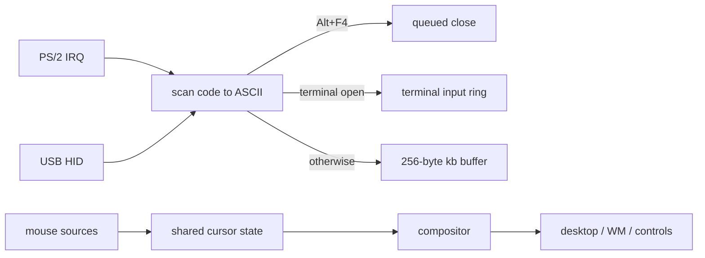

<!-- docs: covers=todo/06-desktop-foundation/TODO-03-input-system.md sources=src/kernel/drivers/keyboard.c,src/kernel/drivers/mouse.c,src/desktop/terminal.c,src/desktop/controls.c,src/desktop/wm.c reviewed=2026-09-29 order=3 -->
# Keyboard and Mouse Input

## What is it?

Input routing decides which program receives a key press or a mouse click. This roadmap replaces today's direct wiring with a proper pipeline: tracked modifier keys (Shift, Ctrl, Alt and the Windows key), a key event structure dispatched to the focused window, Tab navigation between controls, a global hotkey table, and fixes for two input bugs seen on a bare-metal laptop. None of its five sections has started. Mouse input already flows through the window manager; keyboard input does not.

## How does it work?

**Keyboard.** The PS/2 interrupt handler in [`keyboard.c`](../../src/kernel/drivers/keyboard.c) reads a scan code and turns it into an ASCII character on the spot. It keeps four private flags for Shift, Ctrl, Alt and Caps Lock. Left and right Shift share one flag, and the right-hand Ctrl and Alt keys and the Windows keys are not tracked at all: after the `E0` prefix byte only the four arrow keys are handled. A few combinations are acted on inside the handler: Alt+F4 queues a close of the focused window, Ctrl+C raises the console interrupt signal, and Ctrl+Scroll Lock is the crash-dump hook.

Every other character goes straight to the Command Prompt if its window exists (`terminal_key_input()` in [`terminal.c`](../../src/desktop/terminal.c)), otherwise into a 256-byte ring buffer read by the console. The window manager's focus is never consulted, so keys reach the terminal even when another window is focused, and no control ever receives a key press. USB keyboards enter the same path through `keyboard_inject_hid_key()`, which decodes only the Ctrl and Shift bits of the HID modifier byte.

**Mouse.** [`mouse.c`](../../src/kernel/drivers/mouse.c) keeps one shared cursor position and button mask under a spinlock, fed by PS/2 packets, USB relative reports, and absolute positions from the VirtIO tablet and VirtualBox. Positions are clamped to the screen. The [compositor](compositor.md) reads the merged state and passes it to the desktop, then to the window manager, which forwards clicks to controls inside the window with `ctrl_handle_mouse()`.

**Focus in controls.** A control gains focus only by being clicked or through `ctrl_set_focus()` in [`controls.c`](../../src/desktop/controls.c). `ctrl_handle_key()` handles Backspace, Delete and printable characters for text boxes, but its only caller, `gallery_handle_key()`, is itself never called.

## What are its interfaces?

| Interface | Status |
| --- | --- |
| `keyboard_inject_scancode()`, `keyboard_inject_hid_key()` | Shipped: test and USB entry points |
| `terminal_key_input()`, `terminal_is_open()` | Shipped: the terminal's input path |
| `mouse_update_relative()`, `mouse_merge_absolute()` | Shipped: pointer sources |
| `input_get_modifiers()`, `struct key_event`, `input_dispatch()` | Planned, section 1 and 2 |
| `wm_register_hotkey()` | Planned, section 4 |

## How do I use it?

Type in the Command Prompt after boot. Arrow keys recall shell history and Alt+F4 closes the focused window. Ctrl+C does not interrupt a program yet: `cmd.exe` sets no console foreground group, and a pending signal is never delivered because nothing calls `signal_check()` ([Process Model Extensions](../kernel/process-model-extensions.md)). Input tests run with `bash scripts/test.sh SUITE=desktop`.

## What is not implemented yet?

- **Modifier state**: [Modifier Key Tracking](../../todo/06-desktop-foundation/TODO-03-input-system.md#1-modifier-key-tracking), with left and right keys and the Windows key.
- **Event pipeline**: [Key Event Struct + Dispatch Pipeline](../../todo/06-desktop-foundation/TODO-03-input-system.md#2-key-event-struct--dispatch-pipeline), routing keys to the focused window.
- **Tab navigation**: [Focus Model and Tab Navigation](../../todo/06-desktop-foundation/TODO-03-input-system.md#3-focus-model-and-tab-navigation), with Enter and Escape for dialogs.
- **Hotkey table**: [Global Hotkey Dispatch Table](../../todo/06-desktop-foundation/TODO-03-input-system.md#4-global-hotkey-dispatch-table). [Keyboard Shortcuts](../../todo/08-graphics-ui/TODO-08-window-manager.md#5-keyboard-shortcuts--task-switching-sonnet) in the window manager roadmap plans a second table; reconciling them into one is filed in section 4.
- **Bare-metal bugs**: [Bare-Metal Input Bugs](../../todo/06-desktop-foundation/TODO-03-input-system.md#5-bare-metal-input-bugs-focus--mouse). One candidate for the keyboard bug is confirmed in code: closing the Command Prompt with its close button or Alt+F4 leaves the terminal's handle set, so keys keep flowing to a window that no longer exists and the Start menu cannot reopen it.
- **Input methods**: composition for East Asian languages builds on this pipeline in [UI Accessibility, Automation and IME](../graphics/accessibility-ime.md).

## How does it compare with Windows 11 and Linux?

Windows 11 tracks left and right modifiers per thread, delivers `WM_KEYDOWN` to the focused window, moves focus with Tab through dialog controls and registers global shortcuts with `RegisterHotKey`. Wayland compositors deliver keys to the focused surface with full modifier state, and X11 programs grab global keys with `XGrabKey`. Impossible OS has all three still to build; today a key goes to the terminal or a buffer, not to the focused window.

## See also

- [Input System roadmap](../../todo/06-desktop-foundation/TODO-03-input-system.md)
- [Window Management Basics](window-management.md)
- [Control Library](control-library.md)
- [Input Drivers](../hardware/input-system.md), the keyboard and mouse drivers underneath
