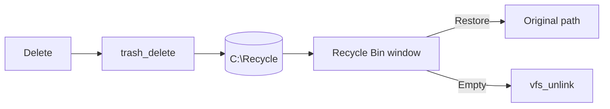

<!-- docs: covers=todo/09-desktop-shell/TODO-04-recycle-zip-scheduler.md sources=src/libs/miniz/miniz.h,src/libs/PROVENANCE.md,Makefile,include/kernel/fs/vfs.h,include/kernel/sched/workqueue.h,src/desktop/desktop.c,include/icon_store.h reviewed=2026-09-29 order=10 -->
# Recycle Bin, ZIP and Task Scheduler

## What is it?

This roadmap groups three shell services. The Recycle Bin keeps deleted files so they can be restored. ZIP support creates and extracts `.zip` archives from the kernel and the shell. The task scheduler runs jobs on a timer, such as clock sync and log rotation, and the `at` command schedules one-off jobs. None of its eight sections has shipped. The miniz compression library is already in the tree but is not compiled yet.

## How does it work?

**Today.**

- **Recycle Bin.** Deleting a file removes it at once: `vfs_unlink()` is the only delete ([`vfs.h`](../../include/kernel/fs/vfs.h)). The Recycle Bin exists only as a desktop picture that always shows its empty state ([`desktop.c`](../../src/desktop/desktop.c)); the full-bin icon exists but nothing selects it ([`icon_store.h`](../../include/icon_store.h)).
- **ZIP.** miniz 11.0.2 is vendored at [`src/libs/miniz/`](../../src/libs/miniz/miniz.h) and recorded in [`PROVENANCE.md`](../../src/libs/PROVENANCE.md), but the [`Makefile`](../../Makefile) excludes it from the build until its freestanding port lands. The port is owned by [miniz Deflate / Inflate + ZIP](../../todo/02-kernel-core/TODO-03-kernel-libraries.md#4-miniz-deflate--inflate--zip) in the kernel libraries roadmap, and is blocked on a caller-owned work area because miniz's compressor state is larger than the 4 KB `kmalloc()` limit. There is no `zip` or `unzip` command.
- **Scheduler.** There is no wall-clock job scheduler. Periodic work runs from fixed places instead: the compositor loop flushes the Registry on every pass, and the kernel log rotates its own LZ4-compressed buffer ([System Logging](../kernel/system-logging.md)). Kernel work queues ([`workqueue.h`](../../include/kernel/sched/workqueue.h)) and the 100 Hz timer are the building blocks a scheduler would use.

**Planned design.**

1. **Recycle Bin core.** Deleted files move into `C:\Recycle\trash_NNNNNNNN\`, with a plain-text `.meta` file beside them recording the original path, name, deletion time and size. Restore, restore all, empty and an automatic size limit.
2. **Recycle Bin window.** A File Explorer location listing name, original location, date deleted and size, with Restore and Empty.
3. **miniz integration.** The freestanding build of miniz with its allocations routed to the kernel allocator.
4. **ZIP kernel API.** `zip_create()`, `zip_add_file()`, `zip_open()`, `zip_extract()`, `zip_list()`; encrypted archives are refused with `ZIP_ERR_ENCRYPTED`.
5. **Shell commands.** `zip` and `unzip`.
6. **Scheduler core.** 16 job slots, each a function called every N seconds, checked once a second.
7. **Built-in jobs.** Clock sync hourly, Registry flush every 2 seconds, search index rebuild every 30 minutes and log rotation daily.
8. **`at` command.** `at HH:MM <command>`, `at list` and `at cancel`.

## What are its interfaces?

| Interface | Status |
| --- | --- |
| miniz sources in `src/libs/miniz/` | Vendored, not built |
| `vfs_rename()`, `vfs_unlink()`, `vfs_stat()` | Shipped VFS calls the Recycle Bin will use |
| `workqueue_create()`, `workqueue_enqueue()` | Shipped kernel work queues |
| `trash_*`, `zip_*`, `sched_task_add()` | Planned |
| `zip`, `unzip`, `at` commands | Planned |

## How do I use it?

It cannot be used yet. A deleted file cannot be recovered, and archives cannot be opened.

## What is not implemented yet?

- [Recycle Bin Core](../../todo/09-desktop-shell/TODO-04-recycle-zip-scheduler.md#1-recycle-bin-core-sonnet) and [Recycle Bin Window App](../../todo/09-desktop-shell/TODO-04-recycle-zip-scheduler.md#2-recycle-bin-window-app-sonnet), which is hosted by the [File Manager](file-manager.md)
- [miniz ZIP Library Integration](../../todo/09-desktop-shell/TODO-04-recycle-zip-scheduler.md#3-miniz-zip-library-integration-sonnet), which depends on the kernel libraries port above
- [ZIP Kernel API](../../todo/09-desktop-shell/TODO-04-recycle-zip-scheduler.md#4-zip-kernel-api-sonnet) and [ZIP Shell Commands](../../todo/09-desktop-shell/TODO-04-recycle-zip-scheduler.md#5-zip-shell-commands-sonnet)
- [Task Scheduler Core](../../todo/09-desktop-shell/TODO-04-recycle-zip-scheduler.md#6-task-scheduler-core-sonnet), [Built-In Scheduled Tasks](../../todo/09-desktop-shell/TODO-04-recycle-zip-scheduler.md#7-built-in-scheduled-tasks-sonnet) and the [`at` Shell Command](../../todo/09-desktop-shell/TODO-04-recycle-zip-scheduler.md#8-at-shell-command-sonnet)

Two built-in jobs overlap work that already runs elsewhere: the Registry is already flushed from the compositor loop, and the kernel log already rotates. Moving them onto the scheduler replaces those callers rather than adding a second one.

## How does it compare with Windows 11 and Linux?

Windows 11 keeps deleted files in `$Recycle.Bin` as `$I` and `$R` file pairs, opens ZIP files in File Explorer, and has Task Scheduler with `schtasks` and XML task definitions. Linux desktops use `~/.local/share/Trash` with `.trashinfo` files, the `zip` and `unzip` tools, and cron, systemd timers and `at`. Impossible OS has none of the three yet. The plan uses readable metadata files like the freedesktop trash, and a small in-kernel function scheduler with no daemon or task XML.

## See also

- [Recycle Bin, ZIP and Task Scheduler roadmap](../../todo/09-desktop-shell/TODO-04-recycle-zip-scheduler.md)
- [Kernel Libraries](../kernel/kernel-libraries.md)
- [System Logging](../kernel/system-logging.md)
- [Service Manager and Core Daemons](service-manager.md)
- [Desktop Icons](desktop-icons.md)
