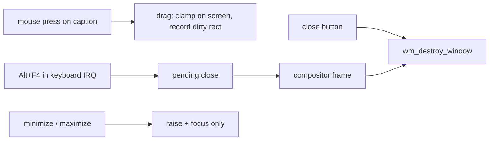

<!-- docs: covers=todo/06-desktop-foundation/TODO-01-wm-completion.md sources=src/desktop/wm.c,include/desktop/wm.h,src/kernel/drivers/keyboard.c reviewed=2026-09-29 order=1 -->
# Window Management Basics

## What is it?

The window manager in [`wm.c`](../../src/desktop/wm.c) owns every desktop window: it creates and destroys them, keeps their stacking order, draws their title bars and moves them when you drag the caption. This roadmap was the first plan to finish it with minimize, maximize and restore, edge resizing, snapping and global hotkeys. That plan is superseded: every one of its sections now points at [Window Manager Enhancements](../graphics/window-manager.md), which owns the work and builds it to the [shell design](../design/shell.md#window-chrome). This page describes what the window manager does today.

## How does it work?

A window is one slot in a fixed table of 32 (`WM_MAX_WINDOWS` in [`wm.h`](../../include/desktop/wm.h)). Each slot holds the window's position, size, title, flags, stacking order and a client framebuffer that the owning program draws into. `wm_create_window()` takes the first free slot, allocates the framebuffer from physical memory, places the window on top of the stack and focuses it.

What works today:

- **Moving.** Pressing on the title bar starts a drag. While you drag, the window is clamped so it stays fully on screen, and the manager records one rectangle covering the old and new positions so the compositor can copy just that region to the screen.
- **Caption buttons.** Close, maximize and minimize are drawn 46 by 32 pixels and hover-highlight. Close destroys the window. Maximize and minimize raise and focus the window and do nothing else; both handlers are marked as unfinished in the code. Dialogs (`WM_FLAG_DIALOG`) get a close button only.
- **Resize cursor.** Hovering within 5 pixels (`WM_RESIZE_MARGIN`) of a window edge shows the matching resize cursor, but pressing there does not resize. The only resize path is the programmatic `wm_resize_window()`, which nothing calls yet.
- **Alt+F4.** The keyboard interrupt handler in [`keyboard.c`](../../src/kernel/drivers/keyboard.c) recognises Alt+F4 and calls `wm_close_focused_window()`. The close is queued, not done in the interrupt, and the compositor drains the queue on its next frame. It is the only global shortcut that exists.

## What are its interfaces?

| Interface | Purpose |
| --- | --- |
| `wm_create_window()`, `wm_destroy_window()` | Window lifetime ([`wm.h`](../../include/desktop/wm.h)) |
| `wm_move_window()`, `wm_resize_window()`, `wm_raise_window()`, `wm_focus_window()` | Programmatic placement and stacking |
| `wm_close_focused_window()`, `wm_process_pending_closes()` | Interrupt-safe Alt+F4 close |
| `WM_FLAG_VISIBLE`, `DECORATED`, `MOVABLE`, `RESIZABLE`, `FOCUSED`, `DIALOG` | Window flags |
| `WM_TITLEBAR_HEIGHT` 32, `WM_BTN_WIDTH` 46, `WM_CORNER_RADIUS` 6 | Chrome geometry |

## How do I use it?

Boot the desktop (`bash scripts/build.sh run`) and drag the Command Prompt or Control Gallery window by its title bar; press Alt+F4 to close the focused window. The Alt+F4 path is covered by a kernel unit test in the desktop suite: `bash scripts/test.sh SUITE=desktop`.

## What is not implemented yet?

- **Minimize, maximize, restore**: there are no minimized or maximized flags and no saved restore rectangle. Owned by [Minimize / Maximize / Restore](../../todo/08-graphics-ui/TODO-08-window-manager.md#1-minimize--maximize--restore-sonnet); the pointer is [section 1](../../todo/06-desktop-foundation/TODO-01-wm-completion.md#1-minimize-maximize-restore).
- **Edge resizing**: only the cursor shape exists. Pointer: [section 2](../../todo/06-desktop-foundation/TODO-01-wm-completion.md#2-resize-by-dragging-window-edges); owner [Window Decorations](../../todo/08-graphics-ui/TODO-08-window-manager.md#2-window-decorations-sonnet).
- **Snapping**: none. Pointer: [section 3](../../todo/06-desktop-foundation/TODO-01-wm-completion.md#3-snap-to-leftright-half); owner [Snap Layouts](../../todo/08-graphics-ui/TODO-08-window-manager.md#3-snap-layouts-sonnet).
- **Hotkeys beyond Alt+F4**: no Alt+Tab, Win+D or hotkey table. Pointer: [section 4](../../todo/06-desktop-foundation/TODO-01-wm-completion.md#4-global-hotkeys); owners [Keyboard Shortcuts](../../todo/08-graphics-ui/TODO-08-window-manager.md#5-keyboard-shortcuts--task-switching-sonnet) and [Alt+Tab](../../todo/08-graphics-ui/TODO-08-window-manager.md#6-alttab-task-switcher-opus).
- **Teardown gaps**: destroying a window does not clear an in-progress drag or the controls attached to its slot, filed under [Minimize / Maximize / Restore](../../todo/08-graphics-ui/TODO-08-window-manager.md#1-minimize--maximize--restore-sonnet).

## How does it compare with Windows 11 and Linux?

Windows 11 and GNOME both minimize, maximize, restore and edge-resize every window, and both switch windows with Alt+Tab. Windows 11 adds a six-zone Snap Layouts flyout; GNOME offers half-screen tiling by dragging to an edge. Impossible OS today moves, raises, focuses and closes windows, and nothing more. The planned design follows Windows 11, including snap layouts.

## See also

- [Window Manager Completion roadmap](../../todo/06-desktop-foundation/TODO-01-wm-completion.md)
- [Window Manager Enhancements](../graphics/window-manager.md), the owning plan
- [Desktop Compositor](compositor.md)
- [Keyboard and Mouse Input](input-system.md)
- [Shell design: window chrome](../design/shell.md#window-chrome)
