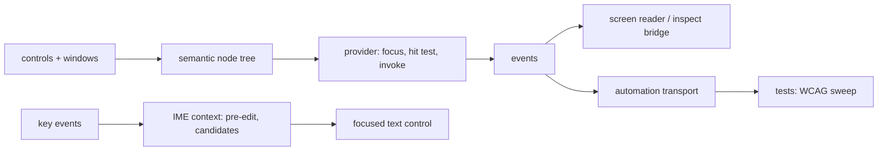

<!-- docs: covers=todo/08-graphics-ui/TODO-07-ui-accessibility-automation-ime.md sources=include/kernel/test/wcag.h,src/kernel/test/wcag.c,include/kernel/test/input_record.h,include/desktop/wm.h,include/desktop/controls.h reviewed=2026-09-29 order=7 -->
# UI Accessibility, Automation and IME

## What is it?

This roadmap builds the layer that lets software other than the app itself understand and drive the user interface. A semantic tree describes every window and control by role, name, state and value; a provider API answers "what has focus" and "what is under this point" and raises events when things change; an inspect bridge feeds screen readers and automation clients; an input method (IME) framework lets people type languages that need composition, such as Chinese and Japanese; and a deterministic automation transport lets tests and assistive tools drive the desktop. None of its six sections has started.

## How does it work?

**Today.** There is no accessibility tree and no IME. Controls have no name or role beyond their type ([`controls.h`](../../include/desktop/controls.h)); the name and role helpers are planned in the [core widget](widget-library.md) roadmap. The window manager exposes the primitives a provider will need: `wm_get_focused_window()`, `wm_window_at()` for hit testing, `wm_get_window_rect()` and `wm_get_window_count()` in [`wm.h`](../../include/desktop/wm.h). Keyboard focus does not reach controls yet (see [Keyboard and Mouse Input](../desktop/input-system.md)).

Two test-side pieces already anticipate this roadmap, both compiled only into test builds:

- **The WCAG sweep.** [`wcag.h`](../../include/kernel/test/wcag.h) defines five WCAG rules (text and non-text contrast, keyboard reachability, focus order, and name and role) and `wcag_sweep_run()`. It is scaffolding: until a provider exists [`wcag.c`](../../src/kernel/test/wcag.c) reports `WCAG_SWEEP_PROVIDER_MISSING`, the rule checks themselves are not written, and the desktop suite records the sweep as pending rather than passing. Its comments name the provider calls it expects as `automation_root()` and `automation_walk()`, while this roadmap calls them `ui_access_*`; one naming has to win when section 2 lands.
- **Input recording.** [`input_record.h`](../../include/kernel/test/input_record.h) captures key, mouse and IME compose and commit events to a JSON Lines log for replayable tests. It records events; it is not an input method.

**Planned design.**

1. **Semantic node tree**: roles, states, values and actions for every window and control.
2. **Provider and events**: focus lookup, hit testing, children, invoke, plus focus, value and structure change events.
3. **Inspect bridge**: a screen reader hook and an automation subscription model.
4. **IME**: an IME context, pre-edit text with composition underlines, candidate lists, commit and cancel, attached to the focus and key event pipeline.
5. **Win32 wiring**: the USER keyboard, IME, accessibility and system-parameter calls of the Win32k shadow table use this model instead of their own metadata.
6. **Automation transport**: a deterministic channel for test harnesses and assistive tools.

## What are its interfaces?

| Interface | Status |
| --- | --- |
| `wcag_sweep_run()`, `wcag_provider_ready()` | Test builds only; provider missing |
| `input_record_ime_compose()`, `input_record_ime_commit()` | Test builds only; event capture |
| `wm_get_focused_window()`, `wm_window_at()` | Shipped window primitives |
| `ui_access_get_focused()`, `ui_access_hit_test()`, `ui_access_get_children()`, `ui_access_invoke()` | Planned, section 2 |
| `ime_context_t`, `ime_preedit_t` in a new `ime.h` | Planned, section 4 |

## How do I use it?

It cannot be used yet. `bash scripts/test.sh SUITE=desktop` shows the WCAG sweep as pending until the provider exists.

## What is not implemented yet?

- [Semantic Node Tree](../../todo/08-graphics-ui/TODO-07-ui-accessibility-automation-ime.md#1-semantic-node-tree-roles-states-values-and-action-descriptors) and [Provider/Query API and Events](../../todo/08-graphics-ui/TODO-07-ui-accessibility-automation-ime.md#2-providerquery-api-focushit-test-lookup-and-accessibility-events).
- [Inspect Bridge and Screen-Reader Hooks](../../todo/08-graphics-ui/TODO-07-ui-accessibility-automation-ime.md#3-inspect-bridge-screen-reader-hooks-and-automation-subscription-model).
- [IME and Text-Composition Framework](../../todo/08-graphics-ui/TODO-07-ui-accessibility-automation-ime.md#4-ime-and-text-composition-framework), which needs the key event pipeline from [Keyboard and Mouse Input](../desktop/input-system.md) and the text services from [Text and Fonts](text-fonts.md).
- [Win32 and Platform-Service Wiring](../../todo/08-graphics-ui/TODO-07-ui-accessibility-automation-ime.md#5-win32-and-platform-service-wiring), consumed by [USER Keyboard, IME, and Hook](../../todo/08-graphics-ui/TODO-15-win32k-shadow-ssdt.md#21-user-keyboard-ime-and-hook) and [USER DPI, Accessibility, and System Parameters](../../todo/08-graphics-ui/TODO-15-win32k-shadow-ssdt.md#22-user-dpi-accessibility-and-system-parameters).
- **WCAG rule checks**: the tree walk and the five rule loops, owned by [WCAG Sweep Over Automation Tree](../../todo/00-infrastructure/TODO-05-desktop-ui-test-framework.md#14-wcag-sweep-over-automation-tree).
- [Deterministic Automation Transport](../../todo/08-graphics-ui/TODO-07-ui-accessibility-automation-ime.md#6-deterministic-automation-transport-for-testing-and-assistive-tooling).

## How does it compare with Windows 11 and Linux?

Windows 11 exposes UI Automation providers and events (with MSAA underneath), ships Narrator and the Inspect tool, and handles composition through IMM32 and the Text Services Framework. Linux desktops use AT-SPI for roles, states and events, Orca as the screen reader, and IBus or Fcitx for input methods. Impossible OS plans one shared provider model for both the native desktop and Win32 programs, and already has the skeleton of a WCAG sweep in its test suite; once the tree exists and the rule checks are written, accessibility regressions will fail the build.

## See also

- [UI Accessibility, Automation, and IME roadmap](../../todo/08-graphics-ui/TODO-07-ui-accessibility-automation-ime.md)
- [Shell design: accessibility](../design/shell.md#accessibility)
- [Controls design: rules for every control](../design/controls.md#which-rules-apply-to-every-control)
- [Core Widgets](widget-library.md)
- [Text and Fonts](text-fonts.md)
