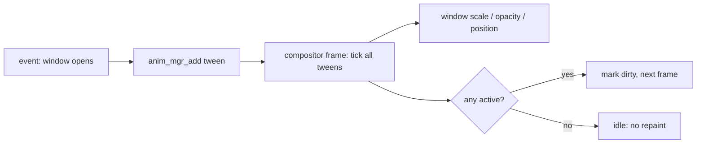

<!-- docs: covers=todo/08-graphics-ui/TODO-04-animation-engine.md sources=src/kernel/main/compositor.c,src/desktop/wm.c,include/desktop/theme_tokens.h,src/kernel/gfx/ease_lut.h,src/kernel/registry.c reviewed=2026-09-29 order=4 -->
# Animation Engine

## What is it?

The animation engine will make the desktop move: windows that fade and scale when they open, slide into the taskbar when minimized, and settle with a spring when snapped, and menus that rise into place. This roadmap plans a time-based tween engine in 16.16 fixed-point arithmetic (no floating point in the kernel), nine easing functions plus the three design curves, a 64-slot animation manager ticked by the compositor, Registry controls for animation speed and reduced motion, window transitions and integer spring physics. None of its seven sections has started, and nothing on the desktop animates today.

## How does it work?

**Today.** Windows appear, disappear and move instantly. The [compositor](../desktop/compositor.md) only repaints when something marks the screen dirty, so an animation has to keep marking it dirty each frame until it finishes. The motion timings it will use are already generated into [`theme_tokens.h`](../../include/desktop/theme_tokens.h) from the design tokens: `THEME_MOTION_FAST_MS` 83, `THEME_MOTION_NORMAL_MS` 167, `THEME_MOTION_SLOW_MS` 250, Start open 250 and close 167, flyout open 167, plus distances such as a 48 pixel Start slide and a 96 percent window-open scale. The three easing curves (standard, decelerate, accelerate) are in the JSON but not yet emitted to C. A 64-entry quarter-sine lookup table, [`ease_lut.h`](../../src/kernel/gfx/ease_lut.h), was generated for an earlier design and is not included anywhere. The only Registry setting is `HKLM\SYSTEM\Theme\EnableAnimations`, seeded to 1 and not read by any code.

**Planned design.**

1. **Tween.** A `gfx_tween_t` holds from, to and current values, a duration, elapsed time, an easing function and a completion callback. Progress `t` runs from 0 to 65536 (1.0 in 16.16), and values are interpolated with a 64-bit multiply.
2. **Easing.** Linear, quadratic and cubic in, out and in-out, bounce and back, all integer, plus the three design curves.
3. **Manager.** A fixed table of 64 tweens advanced once per frame; while any is active the compositor keeps repainting, and an idle desktop costs nothing.
4. **Controls.** `EnableAnimations` set to 0 makes every animation jump to its end (the reduced-motion setting), and `AnimationSpeed` (50 to 200 percent) scales every duration. The roadmap places both under `HKCU\Software\Impossible\Theme`, while today's seeded value is under `HKLM\SYSTEM\Theme`.
5. **Window transitions.** Open, close, minimize, restore, maximize, snap and menu animations driven by per-window animation state.
6. **Springs.** An integer spring for snap and restore that can be retargeted mid-flight.
7. **Compositor integration.** The checklist that ties the manager tick and dirty marking into the frame loop.

## What are its interfaces?

All planned:

| Interface | Purpose |
| --- | --- |
| `gfx_tween_start()`, `gfx_tween_update()`, `gfx_tween_value()` | One tween |
| `gfx_ease_*()` | Easing functions |
| `anim_mgr_add()`, `anim_mgr_cancel()`, `anim_mgr_tick()`, `anim_mgr_any_active()` | The global table |
| `wm_anim_open()`, `wm_anim_close()`, `wm_anim_minimize()`, `wm_anim_restore()` | Window transitions |
| `EnableAnimations`, `AnimationSpeed` Registry values | User controls |

## How do I use it?

It cannot be used yet.

## What is not implemented yet?

- [Core Tween Engine](../../todo/08-graphics-ui/TODO-04-animation-engine.md#1-core-tween-engine-sonnet) and [Easing Functions](../../todo/08-graphics-ui/TODO-04-animation-engine.md#2-easing-functions-sonnet).
- [Global Animation Manager](../../todo/08-graphics-ui/TODO-04-animation-engine.md#3-global-animation-manager-sonnet), which also has to take frame time from a clock that does not assume the 100 Hz PIT rate.
- [Registry Controls](../../todo/08-graphics-ui/TODO-04-animation-engine.md#4-registry-controls-sonnet) and [Window Transition Animations](../../todo/08-graphics-ui/TODO-04-animation-engine.md#5-window-transition-animations-opus).
- [Spring Physics](../../todo/08-graphics-ui/TODO-04-animation-engine.md#6-spring-physics-opus). Its constants and overflow bounds need rechecking before implementation; the item is filed in that section.
- [Compositor Integration](../../todo/08-graphics-ui/TODO-04-animation-engine.md#7-compositor-integration-sonnet).
- Window animations also need the minimize and maximize states that [Window Manager Enhancements](window-manager.md) adds.

## How does it compare with Windows 11 and Linux?

Windows 11's Desktop Window Manager animates every window state change, WinUI offers easing functions and natural-motion springs, and Settings has an Animation effects switch. GNOME's Mutter and KDE's KWin animate windows through plugins, with an `enable-animations` setting in GNOME. The planned Impossible OS engine matches that feature set and adds an integer spring usable anywhere in the kernel's desktop, where the others offer springs only in high-level toolkits.

## See also

- [Animation Engine roadmap](../../todo/08-graphics-ui/TODO-04-animation-engine.md)
- [Shell design: window chrome](../design/shell.md#window-chrome) and [accessibility](../design/shell.md#accessibility), which requires honouring reduced motion
- [Theme System](theme-system.md)
- [Desktop Compositor](../desktop/compositor.md)
