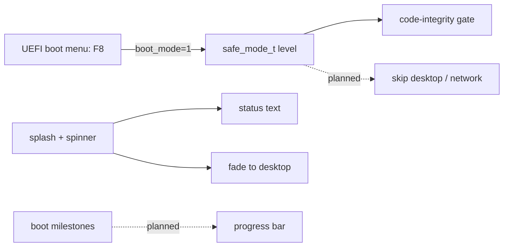

<!-- docs: covers=todo/08-graphics-ui/TODO-13-boot-splash-recovery.md sources=src/kernel/boot_splash.c,include/kernel/boot_splash.h,include/kernel/spinner.h,src/boot/uefi/bootx64.c,include/kernel/config.h reviewed=2026-09-29 order=13 -->
# Boot Splash and F8 Recovery

## What is it?

This roadmap finishes the graphical boot path: a progress bar under the boot logo, a smoother fade to the desktop, named boot milestones that drive the bar, and an early-boot F8 menu offering Normal, Safe Mode, a Recovery Shell and Last Known Good. Crash-loop protection and the crash screen restart moved to the [crash experience roadmap](../../todo/02-kernel-core/TODO-28-bsod-ux-enhancements.md). None of its five open sections has shipped, but the splash, spinner, logo pipeline and a bootloader F8 hotkey already work.

## How does it work?

**Today.** More exists than the roadmap's older text says:

- **Splash (section 1 is mostly built).** [`boot_splash.c`](../../src/kernel/boot_splash.c) draws the logo from [`os_logo.h`](../../include/kernel/os_logo.h), sized for the screen, with its centre at 38 percent of the height, fades in over five frames with a `Starting...` caption, shows status text from 38 call sites across the boot phases, and fades out over five frames of 67 milliseconds before the desktop takes the screen. `postbars=diag` in `boot.conf` suppresses it so the [boot progress display](../boot/visual-post-display.md) stays authoritative. There is no progress bar and no percentage.
- **Spinner (section 2 is built).** [`spinner.h`](../../include/kernel/spinner.h) animates an arc ring below the logo from the timer's tick callback, and fades with the logo.
- **Logo pipeline (section 3 is built).** `tools/convert_icon.py` turns the brand art into the embedded logo sizes; what remains is moving the layout to the design's values.
- **F8 (section 5, different mechanism).** The UEFI [boot menu](../boot/boot-menu.md) already treats F8 as a safe-mode request while the menu is on screen, and sets `boot_mode = 1` in the handoff; `boot_mode=safe` in `boot.conf` does the same. The kernel resolves this to a `safe_mode_t` level in [`config.h`](../../include/kernel/config.h). Today only the code-integrity relaxation gate reads that level, so safe mode does not yet skip the desktop or the network. There is no kernel-side F8 menu, no Recovery Shell and no Last Known Good.

**Planned design.**

1. **Splash renderer**: a 240 by 3 pixel progress bar, `boot_splash_progress(pct)`, and an eight-step fade matching the design.
2. **Spinner**: the design's 40 pixel size and position.
3. **Build pipeline**: layout values from the design tokens.
4. **Milestones**: eight `BOOT_MILESTONE_*` points in the boot phases that move the bar.
5. **F8 menu**: a text menu before the desktop starts, with Normal, Safe Mode, Recovery Shell and Last Known Good, later System Restore, Factory Reset and Startup Repair.

## What are its interfaces?

| Interface | Status |
| --- | --- |
| `boot_splash_init()`, `boot_splash_status()`, `boot_splash_finish()`, `boot_splash_abort()`, `boot_splash_active()` | Shipped ([`boot_splash.h`](../../include/kernel/boot_splash.h)) |
| `spinner_start()`, `spinner_draw_faded()`, `spinner_stop()` | Shipped |
| `OS_LOGO_FOR_HEIGHT()`, `OS_LOGO_SIZE_FOR_HEIGHT()` | Shipped |
| F8 in the UEFI boot menu, `boot_mode=normal\|safe\|recovery`, `safe_mode_t` | Shipped |
| `boot_splash_progress()`, `BOOT_MILESTONE_*` | Planned, sections 1 and 4 |
| Kernel F8 menu, Recovery Shell, Last Known Good | Planned, section 5 |

## How do I use it?

Boot normally to see the splash (`bash scripts/build.sh run`), or hold F8 in the boot menu to request safe mode. The splash cannot be unit-tested because tests must not call boot infrastructure; `bash scripts/test-smoke.sh` exercises it on every boot, and `bash scripts/test.sh SUITE=boot` covers the boot policy and safe-mode rules.

## What is not implemented yet?

- [Boot Splash Renderer](../../todo/08-graphics-ui/TODO-13-boot-splash-recovery.md#1-boot-splash-renderer-sonnet) (the progress bar) and [Loading Spinner](../../todo/08-graphics-ui/TODO-13-boot-splash-recovery.md#2-loading-spinner-sonnet) (the design size).
- [Build Pipeline](../../todo/08-graphics-ui/TODO-13-boot-splash-recovery.md#3-build-pipeline-sonnet) (the design layout) and [Boot Progress Milestones](../../todo/08-graphics-ui/TODO-13-boot-splash-recovery.md#4-boot-progress-milestones-sonnet).
- [F8 Boot Menu](../../todo/08-graphics-ui/TODO-13-boot-splash-recovery.md#5-f8-boot-menu-opus), which now also owns making safe mode actually skip the desktop and the network.
- Crash-loop protection and the crash-screen restart: [Crash Statistics and Loop Protection](../../todo/02-kernel-core/TODO-28-bsod-ux-enhancements.md#7-crash-statistics--loop-protection).

## How does it compare with Windows 11 and Linux?

Windows 11 shows the boot logo with a spinning dots animation and reaches Safe Mode and recovery through the Advanced Startup options (F8 is off by default on modern hardware). Linux distributions draw the splash with Plymouth and offer recovery entries in GRUB or `systemd`'s `rescue.target`, with no built-in Last Known Good. Impossible OS draws its splash in the kernel with an embedded logo and takes F8 from the UEFI boot menu; the roadmap adds a progress bar and a recovery menu.

## See also

- [Boot Splash and F8 Recovery roadmap](../../todo/08-graphics-ui/TODO-13-boot-splash-recovery.md)
- [Shell design: boot splash](../design/shell.md#boot-splash)
- [Boot Menu](../boot/boot-menu.md) and [Boot Diagnostics](../boot/boot-diagnostics.md)
- [Kernel Configuration and Policy Plane](../kernel/kernel-configuration-policy.md)
