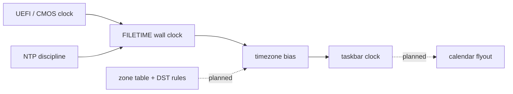

<!-- docs: covers=todo/08-graphics-ui/TODO-12-clock-time.md sources=src/desktop/desktop.c,include/kernel/time/wall_clock.h,include/kernel/time/timezone.h,src/kernel/time/timezone.c,user/cmd.c reviewed=2026-09-29 order=12 -->
# Kernel Time and Taskbar Clock

## What is it?

This roadmap plans the user-facing side of time: formatted dates and times, a named time-zone table with daylight saving rules, a millisecond uptime, a taskbar clock that opens a calendar flyout, and a Date and time settings page. It was written as if the kernel had no wall clock, but one already ships (see [Time and FILETIME](../kernel/time-filetime.md)), and a basic taskbar clock is already drawn. None of its six sections has shipped; section 1 now has to build on the existing clock rather than add a second one.

## How does it work?

**Today.** Two pieces already exist:

- **The kernel clock.** The [FILETIME wall clock](../kernel/time-filetime.md) is seeded from UEFI or the CMOS clock at boot and read with `KeQuerySystemTime()`; user programs reach it through `NtQuerySystemTime()`. Time zones are a single bias in [`timezone.h`](../../include/kernel/time/timezone.h): `timezone_set()` and `filetime_to_local()` apply it, but the zone always starts at UTC, there is no daylight saving rule engine, no zone names and no Registry persistence.
- **The taskbar clock (partial, section 3).** [`desktop.c`](../../src/desktop/desktop.c) draws two lines at the right end of the taskbar: a 12-hour time (`3:07 PM`) over a `YYYY/MM/DD` date, in 15 pixel bold, from `KeQuerySystemTime()` and `filetime_to_local()`, falling back to the CMOS clock when the wall clock is not ready. The compositor repaints it when the minute changes. It has no click, no flyout, no calendar and no 24-hour option, and the `Use24Hour` and `DateFormat` values the Registry already seeds are read by nothing.
- **Uptime.** `uptime()` and `uptime_ns()` exist in [`timer.h`](../../include/kernel/timer.h), and the `uptime` command in [`cmd.c`](../../user/cmd.c) prints hours, minutes and seconds from the legacy `SYS_UPTIME` call.

**Planned design.**

1. **Kernel time API**: `time_now()`, `time_now_local()`, `time_to_datetime()` and `time_set()`, which now have to wrap the FILETIME clock rather than keep their own boot anchor.
2. **Formatting**: `strftime`-style patterns and the short and long date formats.
3. **Taskbar clock**: the design's caption-sized clock, updated every second, with the calendar in the shared 360 pixel flyout.
4. **Date and time page**: a Settings page to set the time, the zone and the format.
5. **Time-zone database**: about 30 named zones with daylight saving rules.
6. **Monotonic uptime**: a millisecond uptime and a days field for the shell command.

## What are its interfaces?

| Interface | Status |
| --- | --- |
| `KeQuerySystemTime()`, `KeSetSystemTime()`, `NtQuerySystemTime()`, `NtSetSystemTime()` | Shipped ([`wall_clock.h`](../../include/kernel/time/wall_clock.h)) |
| `timezone_set()`, `timezone_get()`, `filetime_to_local()`, `filetime_from_local()` | Shipped ([`timezone.h`](../../include/kernel/time/timezone.h)) |
| `uptime()`, `uptime_ns()`, `SYS_UPTIME` | Shipped |
| `time_now()`, `time_to_datetime()`, `time_format()`, `struct datetime` | Planned, sections 1 and 2 |
| Clock flyout, Date and time page, `tz_find()`, `uptime_ms()` | Planned, sections 3 to 6 |

## How do I use it?

The clock shows in the taskbar after boot (`bash scripts/build.sh run`), and `uptime` in the shell prints the time since boot. The kernel clock and time-zone conversion are covered by `bash scripts/test.sh SUITE=sched`; the taskbar clock has no test.

## What is not implemented yet?

- [Kernel Time API](../../todo/08-graphics-ui/TODO-12-clock-time.md#1-kernel-time-api-sonnet) and [Time Formatting](../../todo/08-graphics-ui/TODO-12-clock-time.md#2-time-formatting-sonnet).
- [Taskbar Clock](../../todo/08-graphics-ui/TODO-12-clock-time.md#3-taskbar-clock-sonnet), which also owns a small defect: without a CMOS clock the fallback path formats a zero-filled date.
- [Date/Time Control Panel](../../todo/08-graphics-ui/TODO-12-clock-time.md#4-datetime-control-panel-sonnet) and [Timezone Database](../../todo/08-graphics-ui/TODO-12-clock-time.md#5-timezone-database-sonnet).
- [Monotonic Uptime Extension](../../todo/08-graphics-ui/TODO-12-clock-time.md#6-monotonic-uptime-extension-sonnet).
- Network time sync is planned in [NTP, Network Status and Winsock](../networking/ntp-status-winsock.md).

## How does it compare with Windows 11 and Linux?

Windows 11 reads time with `GetSystemTime`, converts it with `SystemTimeToTzSpecificLocalTime`, ships its own zone data with daylight saving rules, and shows a calendar flyout from the taskbar clock. Linux uses `clock_gettime(CLOCK_REALTIME)` and `localtime_r` over the IANA zoneinfo files, set with `timedatectl`. Impossible OS already matches the Windows FILETIME model in the kernel; what this roadmap adds is the zone table, formatting and the clock user interface.

## See also

- [Kernel Time and Taskbar Clock roadmap](../../todo/08-graphics-ui/TODO-12-clock-time.md)
- [Time and FILETIME](../kernel/time-filetime.md)
- [Shell design: taskbar](../design/shell.md#taskbar) and [notifications and calendar](../design/shell.md#notifications-and-calendar)
- [Taskbar](taskbar.md)
