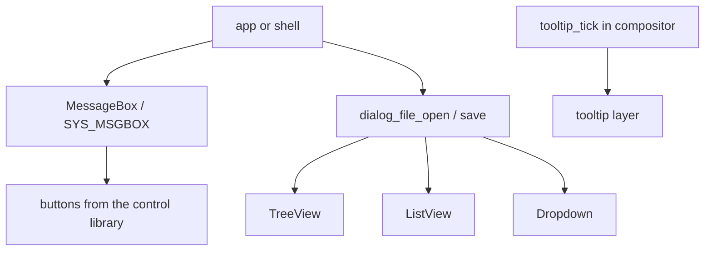

<!-- docs: covers=todo/08-graphics-ui/TODO-06-widget-dialogs.md sources=src/desktop/controls.c,include/desktop/controls.h,include/icon_store.h,include/kernel/sched/syscall.h reviewed=2026-09-29 order=6 -->
# Complex Controls and Dialogs

## What is it?

This roadmap adds the heavier controls that real applications are built from, and the standard dialogs. The controls are a list view, a tree view, a toolbar, a menu bar, a status bar, group boxes and separators, tooltips and an info bar. The dialogs are a Win32-compatible `MessageBox()`, file Open and Save, a text input prompt and a colour picker, plus a system call so any program can raise a message box. File Explorer, Notepad, the Registry Editor and Control Panel all depend on them. None of its nine sections has started; the list controls it owns were also listed in the older [control library](../desktop/control-library.md) plan.

## How does it work?

**Today.** None of these controls or dialogs exists. What they will build on:

- The [control library](../desktop/control-library.md) in [`controls.c`](../../src/desktop/controls.c): per-window control tables, mouse dispatch, and `ctrl_destroy()`, which today marks a control empty but does not free anything the control owns.
- The icon store ([`icon_store.h`](../../include/icon_store.h)), which already has monochrome information, warning, error and question glyphs, check marks, chevrons and list and grid glyphs. The message box uses those status glyphs in the matching status colours, as the [dialog design](../design/controls.md#dialog) requires; it needs no new colour icons.
- Size tokens already generated into `theme_tokens.h`: 32 pixel list rows, a 48 pixel command bar, dialogs between 320 and 548 pixels wide with an 80 pixel footer, a 32 pixel message icon, and a tooltip up to 320 pixels wide shown after 400 ms.
- System calls in [`syscall.h`](../../include/kernel/sched/syscall.h); `SYS_MSGBOX` will take the next free number rather than a fixed one.

**Planned design.**

1. **List view**: details and icon modes, column headers with sorting and resizing, Ctrl and Shift multi-select, and only the visible rows drawn.
2. **Tree view**: a 512-node slab with expand and collapse and a flattened visible list.
3. **Toolbar**: icon buttons with an overflow pop-up.
4. **Menu bar**: a 32 pixel bar of top-level menus opening pop-ups, with Alt navigation and accelerators.
5. **Status bar**: up to 8 panes, where a zero width pane stretches.
6. **Group box and separator**: a card with a heading, per the design's cards and settings rows.
7. **Tooltips**: one global tooltip ticked by the compositor, shown after 400 ms.
8. **Dialogs**: `MessageBox()` with the exact Win32 `MB_*` and `ID*` values, a dimming scrim behind it, word-wrapped text, Enter, Escape and Tab; a 600 by 400 file dialog combining tree, list, text box and file-type drop-down; `dialog_input()`; a hue ring colour picker; `SYS_MSGBOX` and a `msgbox` shell command.
9. **Info bar**: informational, success, caution and critical strips with a glyph, message, optional action and close button.

## What are its interfaces?

All planned:

| Interface | Purpose |
| --- | --- |
| `CTRL_LISTVIEW`, `CTRL_TREEVIEW`, `CTRL_TOOLBAR`, `CTRL_MENUBAR`, `CTRL_STATUSBAR`, `CTRL_GROUPBOX`, `CTRL_SEPARATOR`, `CTRL_INFOBAR` | New control types |
| `tooltip_register()`, `tooltip_tick()` | Tooltips |
| `MessageBox()`, `MB_*`, `ID*` | Message boxes, in a new `dialogs.h` |
| `dialog_file_open()`, `dialog_file_save()`, `dialog_input()`, `dialog_color()` | Standard dialogs |
| `SYS_MSGBOX`, `msgbox "title" "text" [ok\|yesno\|okcancel]` | Raise a message box from any program or the shell |

## How do I use it?

It cannot be used yet.

## What is not implemented yet?

- **Lists**: [ListView](../../todo/08-graphics-ui/TODO-06-widget-dialogs.md#1-listview-opus) and [TreeView](../../todo/08-graphics-ui/TODO-06-widget-dialogs.md#2-treeview-opus).
- **Bars**: [Toolbar](../../todo/08-graphics-ui/TODO-06-widget-dialogs.md#3-toolbar-sonnet), [MenuBar](../../todo/08-graphics-ui/TODO-06-widget-dialogs.md#4-menubar-sonnet), [StatusBar](../../todo/08-graphics-ui/TODO-06-widget-dialogs.md#5-statusbar-sonnet) and [GroupBox + Separator](../../todo/08-graphics-ui/TODO-06-widget-dialogs.md#6-groupbox--separator-sonnet).
- **Tooltips**: [Tooltip Integration](../../todo/08-graphics-ui/TODO-06-widget-dialogs.md#7-tooltip-integration-sonnet). Its plan to add tooltips to the caption buttons needs another route, because those buttons are drawn by the window manager and are not controls.
- **Dialogs**: [Dialog System](../../todo/08-graphics-ui/TODO-06-widget-dialogs.md#8-dialog-system-opus) and [Info Bar Control](../../todo/08-graphics-ui/TODO-06-widget-dialogs.md#9-info-bar-control).
- Right-click menus are not here; they use the single engine in [Context Menu Engine](../../todo/08-graphics-ui/TODO-09-desktop-shell-features.md#1-context-menu-engine-opus).

## How does it compare with Windows 11 and Linux?

Windows 11 has all of these as Win32 common controls (`SysListView32`, `SysTreeView32`, toolbars, status bars, tooltips) and common dialogs (`MessageBox`, `GetOpenFileName`, `ChooseColor`), plus WinUI 3 equivalents and the WinUI InfoBar. GTK and Qt offer tree and list views, header bars, `GtkFileChooser` and colour choosers, and GNOME apps use banners in place of info bars. The plan matches the Win32 set with the same constants, and adds one thing neither has: a message box any program, including a shell script, can raise through a kernel call.

## See also

- [Complex Controls and Dialogs roadmap](../../todo/08-graphics-ui/TODO-06-widget-dialogs.md)
- [Controls design: dialog](../design/controls.md#dialog), [list, tree and grid views](../design/controls.md#list-tree-and-grid-views) and [info bar](../design/controls.md#info-bar)
- [Core Widgets](widget-library.md)
- [Control Library](../desktop/control-library.md)
