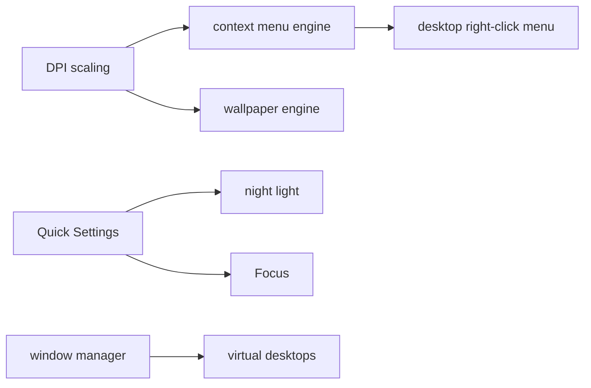

<!-- docs: covers=todo/08-graphics-ui/TODO-09-desktop-shell-features.md sources=src/desktop/desktop.c,include/desktop/desktop.h,src/kernel/registry.c,include/kernel/image.h reviewed=2026-09-29 order=9 -->
# Desktop Shell Features

## What is it?

This roadmap plans the desktop-level shell features that sit between the wallpaper and the windows: a shared context menu engine, the desktop right-click menu, a wallpaper engine that reacts to settings changes, DPI scaling, PrintScreen capture, a night light colour filter, Focus (do not disturb), the Quick Settings flyout and up to eight virtual desktops with Task View. It takes over the context menu and desktop menu work that the older [desktop shell roadmap](../../todo/06-desktop-foundation/TODO-05-desktop-shell.md) listed. None of its nine sections has shipped; only the wallpaper has groundwork in the code.

## How does it work?

**Today.** All shell code lives in [`desktop.c`](../../src/desktop/desktop.c), described in [Desktop Shell Today](../desktop/desktop-shell.md). What already exists toward this roadmap:

- **Wallpaper (partial, section 3).** `load_wallpaper()` reads `Wallpaper` and `WallpaperMode` from `HKLM\SYSTEM\Theme` once at startup, falling back to `C:\Impossible\Web\Wallpaper\default.jpg`, then decodes and scales the image with one of the five fit modes in [`image.h`](../../include/kernel/image.h). There is no reload, no Registry watch and no API to change it while running. The roadmap plans the Windows location (`HKCU\Control Panel\Desktop`), so the move from the shipped key is part of section 3.
- **Right-click (section 2).** None. `desktop_handle_click()` ignores every button except the left one, and the three desktop icons have no actions.
- **DPI, screenshots, night light, Focus, Quick Settings, virtual desktops.** No code. The generated [theme tokens](theme-system.md) already carry the spec sizes these sections will use (a 256 pixel menu, a 360 pixel flyout, the desktop icon grid), but no C file includes them yet.

**Planned design.** The Implementation Order builds DPI first because every later surface scales through it:

1. **Context menu engine**: an acrylic popup with icons, shortcut text, separators, checkmarks and one level of cascading submenus, reused by the taskbar and Start menu.
2. **Desktop right-click menu**: View, Sort by, Refresh, New, Display settings and Personalize.
3. **Wallpaper engine**: fill, fit, stretch, tile, center and span, with a Registry watch and a solid-colour fallback.
4. **DPI scaling**: 100 to 200 percent, a `DPI_SCALE()` helper and a broadcast when the scale changes.
5. **Screenshot**: PrintScreen, Alt+PrintScreen and Win+PrintScreen, saving PNG files and copying to the clipboard.
6. **Night light**: a warm colour pass in the compositor on a schedule.
7. **Focus**: suppresses toasts and sends them to the notification centre.
8. **Quick Settings**: the 360 pixel flyout of toggle tiles and sliders.
9. **Virtual desktops**: up to eight desktops, Win+Ctrl+arrow switching and a Task View overview.

## What are its interfaces?

| Interface | Status |
| --- | --- |
| `desktop_draw_wallpaper()`, `desktop_get_wallpaper_surface()`, `desktop_copy_wallpaper_rect()` | Shipped ([`desktop.h`](../../include/desktop/desktop.h)) |
| `image_load()`, `image_scale()`, `image_save_png()`, `image_fit_t` | Shipped ([`image.h`](../../include/kernel/image.h)) |
| `desktop_handle_click()` (left button only) | Shipped |
| `context_menu_show()`, `context_menu_hide()`, `struct menu_item` | Planned, section 1 |
| `wallpaper_set()`, `DPI_SCALE()`, `WM_DPI_CHANGED`, `screenshot_capture_full()` | Planned, sections 3 to 5 |
| `night_light_*()`, `focus_mode_*()`, `quick_settings_*()`, `vdesk_*()` | Planned, sections 6 to 9 |

## How do I use it?

Set `WallpaperMode` to `fill`, `fit`, `center`, `tile` or `stretch` under `HKLM\SYSTEM\Theme` and reboot to see the fit modes (`bash scripts/build.sh run`). No test reaches the shell code yet; the desktop suite (`bash scripts/test.sh SUITE=desktop`) covers the window manager and input around it.

## What is not implemented yet?

- [Context Menu Engine](../../todo/08-graphics-ui/TODO-09-desktop-shell-features.md#1-context-menu-engine-opus) and [Desktop Right-Click Menu](../../todo/08-graphics-ui/TODO-09-desktop-shell-features.md#2-desktop-right-click-menu-sonnet).
- [Wallpaper Engine](../../todo/08-graphics-ui/TODO-09-desktop-shell-features.md#3-wallpaper-engine-sonnet) and [DPI Scaling](../../todo/08-graphics-ui/TODO-09-desktop-shell-features.md#4-dpi-scaling-sonnet).
- [Screenshot](../../todo/08-graphics-ui/TODO-09-desktop-shell-features.md#5-screenshot-sonnet), [Night Light](../../todo/08-graphics-ui/TODO-09-desktop-shell-features.md#6-night-light-sonnet) and [Focus / Do Not Disturb](../../todo/08-graphics-ui/TODO-09-desktop-shell-features.md#7-focus--do-not-disturb-sonnet).
- [Quick Settings Panel](../../todo/08-graphics-ui/TODO-09-desktop-shell-features.md#8-quick-settings-panel-sonnet) and [Virtual Desktops](../../todo/08-graphics-ui/TODO-09-desktop-shell-features.md#9-virtual-desktops-opus).
- Menu and flyout motion comes from the [Animation Engine](animation-engine.md), colours from the [Theme System](theme-system.md), and the taskbar and Start menu that host these surfaces are the [Taskbar](taskbar.md) and [Start Menu, Tray and Notifications](start-menu-tray-notifications.md).

## How does it compare with Windows 11 and Linux?

Windows 11 draws context menus with `CreatePopupMenu` or a WinUI 3 `MenuFlyout` on Acrylic, scales through per-monitor DPI awareness and `WM_DPICHANGED`, and keeps the wallpaper under `HKCU\Control Panel\Desktop`. GNOME stores the wallpaper in `org.gnome.desktop.background` and has had a Quick Settings menu since GNOME 43. The plan follows Windows 11, and draws the virtual desktop fade as one alpha pass in the software renderer rather than on a GPU.

## See also

- [Desktop Shell Features roadmap](../../todo/08-graphics-ui/TODO-09-desktop-shell-features.md)
- [Shell design: desktop](../design/shell.md#desktop), [context menus](../design/shell.md#context-menus), [quick settings](../design/shell.md#quick-settings), [display scaling](../design/shell.md#display-scaling) and [Task View](../design/shell.md#task-view)
- [Desktop Shell Today](../desktop/desktop-shell.md)
- [Desktop Icons](../desktop/desktop-icons.md)
