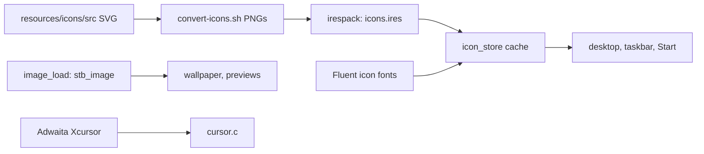

<!-- docs: covers=todo/08-graphics-ui/TODO-01-graphics-asset-foundation.md sources=include/gfx.h,src/kernel/gfx/gfx_core.c,src/kernel/gfx/gfx_effects.c,src/kernel/image.c,include/kernel/image.h,src/kernel/icon_store.c,include/icon_store.h,src/kernel/drivers/cursor.c,src/kernel/ico.c,tools/irespack.c reviewed=2026-09-29 order=1 -->
# 2D Graphics and Visual Assets

## What is it?

This is the drawing layer under the whole desktop: pixel surfaces and primitives, blur and frosted-glass effects, image decoding, and the icon and cursor stores. The roadmap turns today's collection of drawing functions into one substrate that the shell, apps and the Win32 GDI layer can share, with managed render targets, clipping and transforms, vector paths, an SVG-first icon pipeline with an icon engine, and a thumbnail cache. None of its nine sections has started; the pieces described below are the existing code those sections build on.

## How does it work?

**Surfaces and primitives.** A `gfx_surface_t` in [`gfx.h`](../../include/gfx.h) is a pixel pointer, width, height and stride in 32-bit BGRA. `gfx_surface_create()` in [`gfx_core.c`](../../src/kernel/gfx/gfx_core.c) allocates it with `kmalloc()`. Rectangles, lines, circles, rounded rectangles, gradients and alpha blits clip against the surface edges only; there is no clip stack and no transform. A 32-rectangle dirty tracker exists but the compositor does not use it.

**Effects.** [`gfx_effects.c`](../../src/kernel/gfx/gfx_effects.c) provides `gfx_acrylic()` (box blur, per-pixel noise, tint), `gfx_mica()` (desaturate and tint a sampled colour) and `gfx_drop_shadow()`. The acrylic noise comes from one global pseudo-random generator, so the grain changes every frame instead of staying fixed.

**Images.** [`image.c`](../../src/kernel/image.c) decodes PNG, JPEG, BMP and other formats with the vendored stb_image, rejecting files over 32 MB, converts to BGRA and scales with 16.16 fixed-point arithmetic (`image_load()`, `image_scale()` in [`image.h`](../../include/kernel/image.h)). An ICO decoder, [`ico.c`](../../src/kernel/ico.c), exists but nothing calls it.

**Icons.** [`icon_store.c`](../../src/kernel/icon_store.c) has two back ends. Monochrome UI glyphs are rasterised from the bundled Fluent System Icons fonts and tinted. Colour icons come from `icons.ires`, a pack built by [`irespack`](../../tools/irespack.c) from PNGs in nine sizes (16, 24, 32, 48, 64, 72, 96, 128 and 256 pixels); a request picks the nearest size. Rendered bitmaps sit in a 128-entry cache keyed by icon, size and colour. Only 10 of the 26 colour designs in `resources/icons/src` are wired to icon IDs.

**Cursors.** [`cursor.c`](../../src/kernel/drivers/cursor.c) loads 11 cursor shapes from the Adwaita X cursor files under `C:\Impossible\System\Cursors`, keeping one image per shape nearest 24 pixels, with built-in fallback sprites. It draws straight to the screen, saving the pixels underneath.

## What are its interfaces?

| Interface | Purpose |
| --- | --- |
| `gfx_surface_create()`, `gfx_fill_rect()`, `gfx_blit_alpha()` and the other `gfx_*` primitives | Drawing ([`gfx.h`](../../include/gfx.h)) |
| `gfx_acrylic()`, `gfx_mica()`, `gfx_drop_shadow()`, `gfx_blur_rect()` | Materials and shadows |
| `image_load()`, `image_load_mem()`, `image_scale()`, `image_save_png()` | Image files ([`image.h`](../../include/kernel/image.h)) |
| `icon_get()`, `icon_get_colored()`, `icon_draw()`, `icon_for_extension()` | Icons ([`icon_store.h`](../../include/icon_store.h)) |
| `cursor_set_shape()`, `cursor_draw()` | The pointer |

## How do I use it?

The desktop uses all of this at boot. Icon cache behaviour is tested in the desktop suite (`bash scripts/test.sh SUITE=desktop`). Rebuild colour icons after editing an SVG with `bash scripts/convert-icons.sh`, which also rewrites the render stamp that `python3 scripts/site/build.py --check` compares against the sources.

## What is not implemented yet?

- **Render targets and state**: [Render-Target Allocator](../../todo/08-graphics-ui/TODO-01-graphics-asset-foundation.md#1-render-target-allocator-views-and-cached-layers) and [Clip, Transform, and State Stack](../../todo/08-graphics-ui/TODO-01-graphics-asset-foundation.md#2-clip-transform-and-state-stack).
- **Vector drawing**: [Path, Stroke, Fill](../../todo/08-graphics-ui/TODO-01-graphics-asset-foundation.md#3-path-stroke-fill-and-svg-ready-vector-raster-contract) and [SVG Runtime Renderer](../../todo/08-graphics-ui/TODO-01-graphics-asset-foundation.md#7-svg-runtime-renderer-vendored-plutovg-and-plutosvg), which vendors plutovg and plutosvg.
- **Assets**: [Theme-Aware Icon, Cursor, and Scalable Asset Pipeline](../../todo/08-graphics-ui/TODO-01-graphics-asset-foundation.md#4-theme-aware-icon-cursor-and-scalable-asset-pipeline), which also owns defects found while writing this page (a cursor file whose nearest size exceeds 24 pixels overflows its slot, the cursor loader frees the wrong physical pages, and the ICO and `icons.ires` parsers do not bound every offset).
- **Caches and scenes**: [Thumbnail, Preview, and Multi-Size Asset Cache](../../todo/08-graphics-ui/TODO-01-graphics-asset-foundation.md#5-thumbnail-preview-and-multi-size-asset-cache) (it also owns a known stb_image reallocation defect) and [Recorded Scene Lists](../../todo/08-graphics-ui/TODO-01-graphics-asset-foundation.md#6-recorded-scene-lists-and-deterministic-re-render).
- **Icon engine**: [Icon Engine](../../todo/08-graphics-ui/TODO-01-graphics-asset-foundation.md#8-icon-engine-build-time-generator-and-validator) and [Missing Icons](../../todo/08-graphics-ui/TODO-01-graphics-asset-foundation.md#9-missing-icons----detect-draft-generate-and-queue-for-polish).

## How does it compare with Windows 11 and Linux?

Windows 11 draws with Direct2D and DirectComposition surfaces, clip and transform state, and ships icons and cursors as fixed-size ICO and CUR bitmaps. Linux desktops use Cairo or Skia surfaces with SVG icon and cursor themes following freedesktop conventions. Impossible OS has software primitives and effects today; its plan is SVG-first system icons and cursors generated by a build-time icon engine, which neither of the others does.

## See also

- [Graphics Asset Foundation roadmap](../../todo/08-graphics-ui/TODO-01-graphics-asset-foundation.md)
- [System Icons design](../design/icons.md), including [how icons are rendered](../design/icons.md#how-are-icons-rendered)
- [Shell design: materials](../design/shell.md#materials)
- [Theme System](theme-system.md)
- [Desktop Compositor](../desktop/compositor.md)
