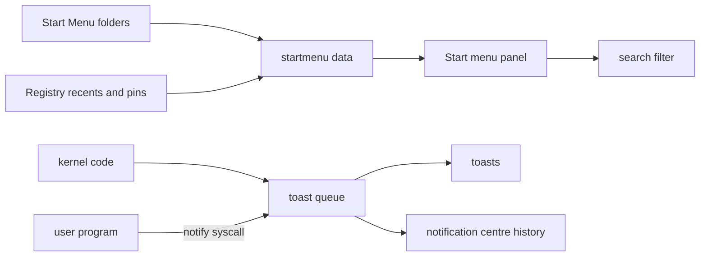

<!-- docs: covers=todo/08-graphics-ui/TODO-11-startmenu-tray-notifications.md sources=src/desktop/desktop.c,include/desktop/desktop.h,include/icon_store.h,src/kernel/drivers/keyboard.c reviewed=2026-09-29 order=11 -->
# Start Menu, System Tray and Notifications

## What is it?

This roadmap plans the Windows 11 Start menu, the system tray and the notification system. The Start menu gets a search box on top, a six by three grid of pinned apps with an All apps view, a Recommended list and a user and power footer, all loaded from real data. The tray gets an overflow chevron and a network, volume and battery cluster that opens Quick Settings. Notifications get toasts, a notification centre with a 100-entry history and per-app settings. It takes over the Start menu and tray work from the older [desktop shell roadmap](../../todo/06-desktop-foundation/TODO-05-desktop-shell.md). None of its seven sections has shipped; a static Start menu runs today.

## How does it work?

**Today.** The Start menu is drawn by `desktop_draw_start_menu()` in [`desktop.c`](../../src/desktop/desktop.c), described in [Desktop Shell Today](../desktop/desktop-shell.md). What already exists toward this roadmap:

- **Start menu (partial, sections 1 and 2).** A fixed two-column acrylic panel, 450 by 344 pixels, at the left edge 10 pixels above the taskbar. The left column holds a search box that does not accept input, then About, All Programs and Terminal; the right column holds seven folder shortcuts and two footer buttons. Every entry is hard-coded.
- **What the entries do.** Terminal opens a terminal window with a shell, About opens a small information window, and Power shuts the machine down at once through `acpi_shutdown()`, with no confirmation or restart option. All Programs, Settings and the seven folder shortcuts do nothing yet.
- **Opening.** Only the Start button opens it. There is no Windows key handling (the [keyboard driver](../../src/kernel/drivers/keyboard.c) recognises only Alt+F4 among shortcuts) and no open or close animation.
- **Tray and notifications (sections 4 to 7).** No code. The right end of the taskbar holds only the clock.
- **Assets ready for use.** The [icon store](graphics-assets.md) already has search, power, info and chevron icons, and the generated [theme tokens](theme-system.md) carry the spec sizes (a 640 by 720 menu, 364 pixel toasts), but no C file uses the tokens yet.

**Planned design.**

1. **Data loading**: pinned apps and All apps from the Start Menu folders, recent files from the Registry, the user name and picture.
2. **Interaction**: the Windows key, launching, a pin menu and a 250 millisecond rise animation.
3. **Search**: case-insensitive filtering of apps as the user types.
4. **System tray**: registered tray icons, an overflow chevron and the status cluster that opens [Quick Settings](desktop-shell-features.md).
5. **Toasts**: a kernel queue that kernel code and user programs share through a system call, stacked bottom right.
6. **Notification centre**: the history panel with a 100-entry Registry ring.
7. **Notification settings**: per-app switches, with Focus honoured.

## What are its interfaces?

| Interface | Status |
| --- | --- |
| `desktop_draw_start_menu()`, `desktop_handle_click()` | Shipped ([`desktop.h`](../../include/desktop/desktop.h)) |
| `icon_get()`, `icon_get_by_name()`, `ICON_SEARCH`, `ICON_POWER`, `ICON_CHEVRON_*` | Shipped ([`icon_store.h`](../../include/icon_store.h)) |
| `startmenu_*()`, `app_entry_t`, `recent_entry_t` | Planned, sections 1 to 3 |
| `tray_register()`, `tray_unregister()`, `tray_icon_t` | Planned, section 4 |
| `notify_send()`, `notify_send_action()`, the notification system call | Planned, section 5 |
| `notify_center_*()`, `notify_history_*()`, `notify_settings_*()` | Planned, sections 6 and 7 |

## How do I use it?

Boot the desktop (`bash scripts/build.sh run`), click the Start button and choose Terminal to open a shell. No test reaches the Start menu yet; the desktop suite (`bash scripts/test.sh SUITE=desktop`) covers the icon cache it draws from.

## What is not implemented yet?

- [Start Menu Data Loading](../../todo/08-graphics-ui/TODO-11-startmenu-tray-notifications.md#1-start-menu-data-loading-sonnet), [Start Menu Interaction](../../todo/08-graphics-ui/TODO-11-startmenu-tray-notifications.md#2-start-menu-interaction-sonnet) and [Start Menu Search](../../todo/08-graphics-ui/TODO-11-startmenu-tray-notifications.md#3-start-menu-search-sonnet).
- [System Tray Icons](../../todo/08-graphics-ui/TODO-11-startmenu-tray-notifications.md#4-system-tray-icons-sonnet).
- [Toast Notifications](../../todo/08-graphics-ui/TODO-11-startmenu-tray-notifications.md#5-toast-notifications-opus), [Notification Center](../../todo/08-graphics-ui/TODO-11-startmenu-tray-notifications.md#6-notification-center-sonnet) and [Notification Settings](../../todo/08-graphics-ui/TODO-11-startmenu-tray-notifications.md#7-notification-settings-sonnet).
- A confirmed shutdown and restart choice belongs to section 2; the Power button today powers off immediately.

## How does it compare with Windows 11 and Linux?

Windows 11 shows a centred Start menu with pinned apps and Recommended, searches as you type, and raises toasts through WinRT `ToastNotification` with actions and a notification centre. GNOME searches from the Activities overview, KDE uses Kickoff, and both send notifications over D-Bus through `libnotify` to a notification daemon. The plan follows Windows 11's layout and replaces the daemon with a kernel queue that kernel code and user programs share.

## See also

- [Start Menu, Tray and Notifications roadmap](../../todo/08-graphics-ui/TODO-11-startmenu-tray-notifications.md)
- [Shell design: Start menu](../design/shell.md#start-menu), [toast notifications](../design/shell.md#toast-notifications) and [notifications and calendar](../design/shell.md#notifications-and-calendar)
- [Taskbar](taskbar.md)
- [Desktop Shell Today](../desktop/desktop-shell.md)
