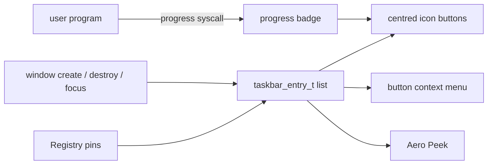

<!-- docs: covers=todo/08-graphics-ui/TODO-10-taskbar.md sources=src/desktop/desktop.c,include/desktop/desktop.h,include/desktop/wm.h,src/kernel/main/compositor.c reviewed=2026-09-29 order=10 -->
# Taskbar

## What is it?

This roadmap plans the full Windows 11 taskbar: a live window list shown as centred 40 pixel icon buttons with an indicator pill, a right-click menu on each button, Aero Peek, progress badges that user programs can set, pinned apps saved in the Registry, jump lists, auto-hide and the alignment and visibility settings. The bar stays 48 pixels tall and docked at the bottom. It takes over the taskbar work from the older [desktop shell roadmap](../../todo/06-desktop-foundation/TODO-05-desktop-shell.md). None of its eight sections has shipped, but a basic taskbar already runs.

## How does it work?

**Today.** [`desktop_draw_taskbar()`](../../src/desktop/desktop.c) draws a full-width 48 pixel acrylic bar, described in [Desktop Shell Today](../desktop/desktop-shell.md). What already exists toward this roadmap:

- **Start button.** A 48 by 40 pixel button with the 32 pixel logo, anchored at the left edge rather than centred. It toggles the Start menu.
- **Window list (partial, section 1).** One 100 by 42 pixel text button per open window, starting at x = 58 and stopping 120 pixels short of the right edge; the focused window's button is highlighted. There are no icons, no indicator pill, no flashing and no overflow. The draw, click and cursor code each compute this geometry on their own and disagree (100 against 120 pixel buttons, and only the cursor code skips hidden windows); the fix is filed in [Taskbar Window List](../../todo/08-graphics-ui/TODO-10-taskbar.md#1-taskbar-window-list-sonnet).
- **Clicks.** Clicking a window button raises and focuses that window. It never minimizes it, because minimize does not exist yet in the [window manager](window-manager.md). There is no right-click.
- **Clock.** Drawn at the right end; see [Kernel Time and Taskbar Clock](clock-time.md).
- **Work area.** `desktop_get_usable_height()` returns the screen height minus the bar, so maximized windows can stop above it once maximize exists.

**Planned design.**

1. **Window list**: a 64-entry `taskbar_entry_t` table kept in step with window create, destroy and focus, drawn as a centred icon group.
2. **Button menu**: pin, close window and the app's jump list items.
3. **Aero Peek**: after hovering, other windows fade to show the one under the pointer.
4. **Progress badges**: normal, paused, error and indeterminate bars under a button, settable through a new system call.
5. **Pinned apps**: up to 16 pins stored in the Registry.
6. **Jump lists**: a Registry ring of ten recent items per app.
7. **Auto-hide**: the bar slides away and returns when the pointer reaches the bottom edge.
8. **Customization**: left or centre alignment and whether Search and Task View show.

## What are its interfaces?

| Interface | Status |
| --- | --- |
| `desktop_draw_taskbar()`, `desktop_handle_click()`, `desktop_in_taskbar()`, `desktop_get_usable_height()`, `TASKBAR_HEIGHT` | Shipped ([`desktop.h`](../../include/desktop/desktop.h)) |
| `wm_raise_window()`, `wm_focus_window()` used by the window buttons | Shipped ([`wm.h`](../../include/desktop/wm.h)) |
| `taskbar_entry_t`, `taskbar_add_window()`, `taskbar_remove_window()`, `taskbar_set_active()`, `taskbar_flash()` | Planned, section 1 |
| `taskbar_peek_start()`, `taskbar_set_progress()`, the progress and jump list system calls | Planned, sections 3, 4 and 6 |
| `taskbar_pins_*()`, `jumplist_*()`, `taskbar_autohide_*()`, `taskbar_config_*()` | Planned, sections 5 to 8 |

## How do I use it?

Boot the desktop (`bash scripts/build.sh run`), open the terminal from the Start menu and click its taskbar button to bring it to the front. No test calls the taskbar code yet; the desktop suite (`bash scripts/test.sh SUITE=desktop`) covers the window manager state it reads.

## What is not implemented yet?

- [Taskbar Window List](../../todo/08-graphics-ui/TODO-10-taskbar.md#1-taskbar-window-list-sonnet), including the geometry defect above, and [Taskbar Button Context Menu](../../todo/08-graphics-ui/TODO-10-taskbar.md#2-taskbar-button-context-menu-sonnet).
- [Aero Peek](../../todo/08-graphics-ui/TODO-10-taskbar.md#3-aero-peek-opus) and [Taskbar Progress Badges](../../todo/08-graphics-ui/TODO-10-taskbar.md#4-taskbar-progress-badges-sonnet).
- [Pinned Apps](../../todo/08-graphics-ui/TODO-10-taskbar.md#5-pinned-apps-sonnet) and [Jump Lists](../../todo/08-graphics-ui/TODO-10-taskbar.md#6-jump-lists-sonnet).
- [Taskbar Auto-Hide](../../todo/08-graphics-ui/TODO-10-taskbar.md#7-taskbar-auto-hide-sonnet) and [Taskbar Customization](../../todo/08-graphics-ui/TODO-10-taskbar.md#8-taskbar-customization-sonnet).
- Button minimize and restore wait on [Minimize / Maximize / Restore](../../todo/08-graphics-ui/TODO-08-window-manager.md#1-minimize--maximize--restore-sonnet); the button menu uses the [context menu engine](desktop-shell-features.md).

## How does it compare with Windows 11 and Linux?

Windows 11 centres its taskbar icons by default, lets programs set progress through `ITaskbarList3::SetProgressValue`, builds jump lists with `ICustomDestinationList`, and composites Aero Peek on the GPU in DWM. KDE Plasma's task manager offers similar pins, progress and a Peek effect drawn by a GPU shader. The plan follows Windows 11's fixed bottom bar and does Peek as a per-window alpha blend in the software compositor.

## See also

- [Taskbar roadmap](../../todo/08-graphics-ui/TODO-10-taskbar.md)
- [Shell design: taskbar](../design/shell.md#taskbar) and [context menus](../design/shell.md#context-menus)
- [Desktop Shell Today](../desktop/desktop-shell.md)
- [Start Menu, Tray and Notifications](start-menu-tray-notifications.md)
