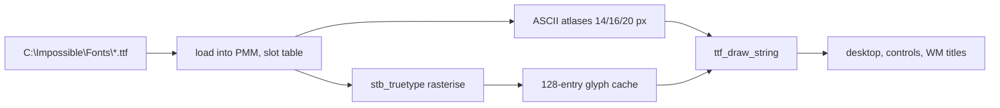

<!-- docs: covers=todo/08-graphics-ui/TODO-02-text-font-internationalization.md sources=src/kernel/gfx/gfx_text.c,include/font_mgr.h,src/desktop/font.c,resources/fonts reviewed=2026-09-29 order=2 -->
# Text and Fonts

## What is it?

The text stack turns strings into pixels. Today that is a small TrueType font manager built on the vendored stb_truetype, which draws Latin text in five fixed faces. This roadmap grows it into a full desktop text system: a font catalog with install and remove, fallback chains with emoji and colour fonts, shaping, bidirectional text and line breaking, caret and selection services, Win32 `DrawText` and `ChooseFont` wiring, and a shaped-run cache. The 2026-08-29 decision recorded in the roadmap is to vendor HarfBuzz for shaping and FreeType for rasterising, keeping today's renderer only as a bring-up fallback. None of its seven sections has started.

## How does it work?

The font manager in [`gfx_text.c`](../../src/kernel/gfx/gfx_text.c) loads fonts into numbered slots ([`font_mgr.h`](../../include/font_mgr.h), at most 8):

| Slot | Face | File |
| --- | --- | --- |
| `FONT_UI` | Selawik | `selawk.ttf` |
| `FONT_UI_BOLD` | Selawik Semibold | `selawksb.ttf` |
| `FONT_MONO` | Cascadia Code | `CascadiaCode-Regular.ttf` |
| `FONT_MONO_BOLD` | Cascadia Code Bold | `CascadiaCode-Bold.ttf` |
| `FONT_UI_HEAVY` | Selawik Bold | `selawkb.ttf` |

Each file is read whole from `C:\Impossible\Fonts\` into physical memory (16 MB cap). A missing file falls back to a second face: Inter for the UI slots, Selawik for the monospace ones. At startup the printable ASCII characters are pre-rendered at 14, 16 and 20 pixels into per-slot atlases. Outside those sizes the two draw calls differ. `ttf_draw_char()` keeps rasterised glyphs in a 128-entry cache of small bitmaps (a glyph too large for an entry is rasterised on every call), but `ttf_draw_string()` rasterises every character of an uncached size on every draw and frees it straight away, so text at other sizes, such as the taskbar's 12 pixel window titles, is re-rendered on every repaint.

Strings are treated as single bytes, not UTF-8, so only the first 256 Unicode code points can be drawn. Kerning comes from the font's kerning data; there is no shaping, no right-to-left support and no line wrapping. `ttf_get()` returns one shared object per slot and changes its pixel size on each call, so two callers asking for the same slot at different sizes share state.

The Command Prompt does not use this stack: it draws with the fixed 8 by 16 bitmap font in [`font.c`](../../src/desktop/font.c). The boot splash has its own embedded Selawik atlas. The design tokens name Selawik and Cascadia Code as the UI and monospace families and generate the type ramp (caption, body, subtitle, title and display sizes) into `theme_tokens.h`.

## What are its interfaces?

| Interface | Purpose |
| --- | --- |
| `ttf_mgr_init()` | Load the slot table at desktop start |
| `ttf_get(slot, px)` | A font handle at a pixel size |
| `ttf_draw_char()`, `ttf_draw_string()` | Draw into a surface |
| `ttf_measure_width()`, `ttf_line_height()` | Layout helpers |
| `font_get_glyph()` | The 8 by 16 bitmap font ([`font.c`](../../src/desktop/font.c)) |

## How do I use it?

Every label on the desktop, taskbar and window titles goes through `ttf_draw_string()`. Fonts ship in [`resources/fonts`](../../resources/fonts) with their licence files and are copied to `C:\Impossible\Fonts\` by the build.

## What is not implemented yet?

- [Font Catalog, Enumeration, Install/Remove, and Default Stacks](../../todo/08-graphics-ui/TODO-02-text-font-internationalization.md#1-font-catalog-enumeration-installremove-and-default-stacks). It also owns a defect found while writing this page: when a font file fails to parse, the loader releases its physical-memory buffer with the heap's `kfree()`, which does not own that memory.
- [Fallback Chains, Emoji, and Color-Font Support](../../todo/08-graphics-ui/TODO-02-text-font-internationalization.md#2-fallback-chains-emoji-and-color-font-support).
- [Shaping, Bidi, Line-Break, and Paragraph Layout](../../todo/08-graphics-ui/TODO-02-text-font-internationalization.md#3-shaping-bidi-line-break-and-paragraph-layout-engine) and [Caret, Hit-Test, Selection](../../todo/08-graphics-ui/TODO-02-text-font-internationalization.md#4-caret-hit-test-selection-and-composition-aware-text-editing-services).
- [Desktop and Win32 Wiring](../../todo/08-graphics-ui/TODO-02-text-font-internationalization.md#5-desktop-and-win32-wiring-drawtext-choosefont-wm_fontchange) and [Persistent Text-Run Cache](../../todo/08-graphics-ui/TODO-02-text-font-internationalization.md#6-persistent-text-run-cache-and-no-fpu-steady-state-draw-path).
- [Vendor FreeType and HarfBuzz](../../todo/08-graphics-ui/TODO-02-text-font-internationalization.md#7-vendor-freetype-and-harfbuzz-as-the-rasterizer-and-shaper).

## How does it compare with Windows 11 and Linux?

Windows 11 uses DirectWrite for its font catalog, fallback, shaping and layout, with RichEdit for editing services and `ChooseFont` for picking. Linux desktops combine Fontconfig for the catalog with HarfBuzz and FreeType underneath Pango or Qt. The plan puts Impossible OS on the same HarfBuzz and FreeType pair Linux uses, behind Win32-shaped APIs; today it draws Latin-1 text only.

## See also

- [Text, Font, and Internationalization roadmap](../../todo/08-graphics-ui/TODO-02-text-font-internationalization.md)
- [Controls design: typography rules](../design/controls.md#which-rules-apply-to-every-control)
- [UI Accessibility, Automation and IME](accessibility-ime.md)
- [2D Graphics and Visual Assets](graphics-assets.md)
