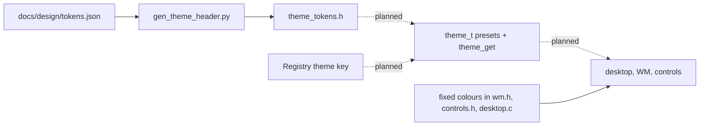

<!-- docs: covers=todo/08-graphics-ui/TODO-03-theme-system.md sources=include/desktop/theme_tokens.h,docs/design/tokens.json,scripts/site/gen_theme_header.py,src/kernel/registry.c,include/desktop/wm.h,src/desktop/wm.c reviewed=2026-09-29 order=3 -->
# Theme System

## What is it?

The theme system decides every colour, material and shadow on screen, so that switching between dark and light mode, or choosing an accent colour, changes the whole desktop at once. This roadmap builds it: a `theme_t` structure of named colour tokens behind `theme_get()`, built-in Dark and Light presets, settings saved in the Registry, accent variants computed from one colour, a pass that removes hard-coded colours from the desktop code, theme-aware shadows, live reloading, and a token corpus generated from Microsoft's Fluent design data. None of its nine sections has started. The design tokens themselves already exist and are generated into C.

## How does it work?

**The tokens exist.** [`docs/design/tokens.json`](../design/tokens.json) is the single source for the shell's colours, frosted materials, sizes, corner radii, spacing, elevation (shadow) and motion timings. [`gen_theme_header.py`](../../scripts/site/gen_theme_header.py) generates [`theme_tokens.h`](../../include/desktop/theme_tokens.h) from it, and the site check (`python3 scripts/site/build.py --check`, lint Check 30) fails a commit when the header drifts from the JSON. Each theme carries 74 colour tokens (`THEME_DARK_*` and `THEME_LIGHT_*`), including accent, text, fills, strokes, status colours, the terminal palette and taskbar attention colours. Materials carry blur, luminosity, noise, tint and tint opacity for the taskbar, Start, flyouts and menus, plus the Mica window tint. Motion includes `THEME_MOTION_FAST_MS` (83), `NORMAL` (167) and `SLOW` (250). The easing curves in the JSON are not emitted yet, because the generator skips list values.

**Nothing uses them yet.** No C file includes `theme_tokens.h`. The desktop draws with fixed colours instead: `WM_COLOR_*` in [`wm.h`](../../include/desktop/wm.h), `CTRL_COLOR_*` in the control library, and literal values in the desktop, terminal and gallery code. Window shadows use their own radius and alpha rather than the elevation tokens, and the Mica title bar tint is computed inside [`wm.c`](../../src/desktop/wm.c) instead of calling `gfx_mica()`.

**Settings.** `registry_populate_defaults()` in [`registry.c`](../../src/kernel/registry.c) seeds a theme key: `HKLM\SYSTEM\Theme` holds `DarkMode` (1), `AccentColor` (the string `#0078D4`), `Font`, `FontSize`, `CornerRadius`, `Wallpaper`, `WallpaperMode` and `EnableAnimations`. Only the wallpaper values are read by anything today. A kernel Registry change notification, `reg_notify_register()`, exists and is what a live theme reload would listen on.

## What are its interfaces?

| Interface | Status |
| --- | --- |
| `THEME_DARK_*`, `THEME_LIGHT_*`, `THEME_MAT_*`, `THEME_ELEV_*`, `THEME_SIZE_*`, `THEME_MOTION_*` | Shipped, generated constants |
| `python3 scripts/site/gen_theme_header.py` | Shipped: regenerate the header after editing the JSON |
| `HKLM\SYSTEM\Theme` values | Seeded; not yet read by a theme engine |
| `theme_t`, `theme_get()`, `theme_load()`, `theme_reload()`, `theme_compute_accent_variants()`, `WM_THEME_CHANGED` | Planned |

## How do I use it?

To change a design value, edit [`tokens.json`](../design/tokens.json), run `python3 scripts/site/gen_theme_header.py`, and commit both files; the process is described in [How do I change the design?](../design/index.md#how-do-i-change-the-design). The change reaches the screen only once the migration section moves the desktop onto the tokens.

## What is not implemented yet?

- **Engine**: [`theme_t` Struct](../../todo/08-graphics-ui/TODO-03-theme-system.md#1-theme_t-struct-sonnet), [`theme_get()` Singleton](../../todo/08-graphics-ui/TODO-03-theme-system.md#2-theme_get-singleton-sonnet) and [Built-in Presets](../../todo/08-graphics-ui/TODO-03-theme-system.md#3-built-in-presets-sonnet).
- **Settings**: [Registry Load](../../todo/08-graphics-ui/TODO-03-theme-system.md#4-registry-load-sonnet) and [Custom Accent Color](../../todo/08-graphics-ui/TODO-03-theme-system.md#5-custom-accent-color-sonnet).
- **Adoption**: [Migration Pass](../../todo/08-graphics-ui/TODO-03-theme-system.md#6-migration-pass-sonnet) and [Theme-Aware Shadow Rendering](../../todo/08-graphics-ui/TODO-03-theme-system.md#7-theme-aware-shadow-rendering-sonnet).
- **Live change**: [Hot-Reload](../../todo/08-graphics-ui/TODO-03-theme-system.md#8-hot-reload-sonnet). The window manager has no message system yet, so the broadcast this section describes needs one first.
- **Windows compatibility**: [Fluent Token Corpus and Win11 Personalization Contract](../../todo/08-graphics-ui/TODO-03-theme-system.md#9-fluent-token-corpus-and-win11-personalization-contract-opus), which adds Microsoft's personalisation Registry keys.

## How does it compare with Windows 11 and Linux?

Windows 11 stores light or dark mode and the accent colour under `HKCU\Software\Microsoft\Windows\CurrentVersion\Themes\Personalize`, exposes WinUI resource brushes and redraws every window live when you change them. GNOME keeps the colour scheme in GSettings and GTK and libadwaita apps reload named colours live. Impossible OS already has a generated, drift-checked token set shared by the website and the kernel headers, which neither of the others has, but nothing on screen reads it yet.

## See also

- [Theme System roadmap](../../todo/08-graphics-ui/TODO-03-theme-system.md)
- [Design system and the theme system](../design/index.md#how-does-this-relate-to-the-theme-system)
- [Shell design: materials](../design/shell.md#materials)
- [Animation Engine](animation-engine.md)
- [Core Widgets](widget-library.md)
