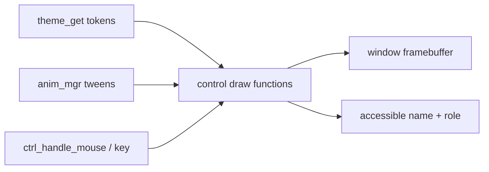

<!-- docs: covers=todo/08-graphics-ui/TODO-05-widget-library-core.md sources=src/desktop/controls.c,include/desktop/controls.h,src/desktop/gallery.c,include/desktop/theme_tokens.h reviewed=2026-09-29 order=5 -->
# Core Widgets

## What is it?

The core widgets are the everyday controls every settings page and dialog needs: check boxes, radio buttons, sliders, progress bars, drop-down lists and tabs. This roadmap adds them to the existing [control library](../desktop/control-library.md), coloured from the theme system instead of fixed values, with accessibility name and role stubs and a Windows 11 overlay scroll bar that expands on hover. It is the canonical owner of the controls that the older desktop control-library plan listed. None of its nine sections has started.

## How does it work?

**Today.** [`controls.h`](../../include/desktop/controls.h) defines four control types: button, label, text box and scroll bar. Each control is a slot in its window's table of 32, drawn by a per-type function in [`controls.c`](../../src/desktop/controls.c) with the 14 pixel UI font and colours from the `CTRL_COLOR_*` constants. Mouse input comes through `ctrl_handle_mouse()`; keyboard input reaches text boxes only, and only in principle, because nothing calls `ctrl_handle_key()` yet. The scroll bar is the classic kind, a thumb in a bordered track, always visible.

**Planned design.** Each new control is another `ctrl_type` with its own draw and input handler, sized from the design tokens and styled per the [controls design](../design/controls.md):

1. **Check box**: a 20 pixel box with 4 pixel corners, accent-filled with a check mark when checked, plus the shared two-ring keyboard focus visual every control uses.
2. **Radio button**: a group in which selecting one clears the others.
3. **Slider**: a 4 pixel rounded track, accent-filled up to a 20 pixel round thumb that you drag.
4. **Progress bar**: determinate, and an indeterminate mode that loops a tween from the [animation engine](animation-engine.md).
5. **Drop-down**: a 32 pixel field whose list opens as a menu-material flyout in its own top-most window, with keyboard navigation, closing when you click outside it.
6. **Tab strip**: up to 16 tabs 32 pixels tall with the Windows 11 selected-tab shape, moved between with the arrow keys.
7. **Theming**: every control, old and new, reads colours from `theme_get()`, and the `CTRL_COLOR_*` constants are deleted.
8. **Accessibility stubs**: a name and role for each control, the seed of the [accessibility tree](accessibility-ime.md).
9. **Overlay scroll bar**: a 2 pixel line that grows to a 6 pixel bar when the pointer comes near.

## What are its interfaces?

| Interface | Status |
| --- | --- |
| `ctrl_create_button()`, `_label()`, `_textbox()`, `_scrollbar()` | Shipped |
| `CTRL_CHECKBOX`, `CTRL_RADIO`, `CTRL_SLIDER`, `CTRL_PROGRESSBAR`, `CTRL_DROPDOWN`, `CTRL_TABSTRIP` and their create functions | Planned |
| `ctrl_get_accessible_name()`, `ctrl_get_accessible_role()` | Planned, section 8 |
| `THEME_SIZE_*` control sizes in [`theme_tokens.h`](../../include/desktop/theme_tokens.h) | Shipped as constants, unused |

## How do I use it?

It cannot be used yet. Each control will appear in the Control Gallery window as it lands.

## What is not implemented yet?

- [Checkbox](../../todo/08-graphics-ui/TODO-05-widget-library-core.md#1-checkbox-sonnet), which also carries defects in the existing library found while writing these pages: destroyed controls never free their slot, buttons fire on press so the pressed look never shows, and `ctrl_set_text()` does not accept a null string.
- [Radio Button](../../todo/08-graphics-ui/TODO-05-widget-library-core.md#2-radio-button-sonnet), [Slider / TrackBar](../../todo/08-graphics-ui/TODO-05-widget-library-core.md#3-slider--trackbar-sonnet) and [Progress Bar](../../todo/08-graphics-ui/TODO-05-widget-library-core.md#4-progress-bar-sonnet).
- [Dropdown / ComboBox](../../todo/08-graphics-ui/TODO-05-widget-library-core.md#5-dropdown--combobox-opus) and [Tab Strip](../../todo/08-graphics-ui/TODO-05-widget-library-core.md#6-tab-strip-sonnet).
- [Theming](../../todo/08-graphics-ui/TODO-05-widget-library-core.md#7-theming-sonnet), which waits for the [Theme System](theme-system.md).
- [Accessibility Stubs](../../todo/08-graphics-ui/TODO-05-widget-library-core.md#8-accessibility-stubs-sonnet) and [Overlay Scroll Bar](../../todo/08-graphics-ui/TODO-05-widget-library-core.md#9-overlay-scroll-bar-collapse-and-expand-on-hover).
- Keyboard operation of all controls depends on [Keyboard and Mouse Input](../desktop/input-system.md).

## How does it compare with Windows 11 and Linux?

Windows 11 provides every one of these as Win32 common controls and WinUI 3 controls, with themes and UI Automation support built in. GTK and Qt ship the same set with theming and AT-SPI accessibility. Impossible OS has four controls today; the plan reaches parity for this set and, unlike the Win32 common controls, draws every control from one token set so that dark and light mode are consistent by construction.

## See also

- [Core Controls roadmap](../../todo/08-graphics-ui/TODO-05-widget-library-core.md)
- [Controls design](../design/controls.md)
- [Control Library](../desktop/control-library.md)
- [Complex Controls and Dialogs](complex-controls-dialogs.md)
