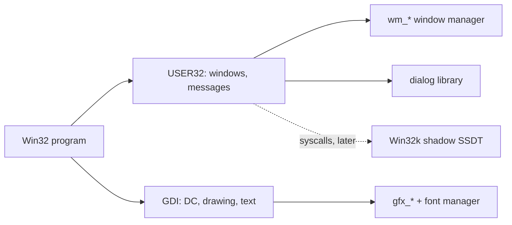

<!-- docs: covers=todo/08-graphics-ui/TODO-14-win32-gdi-user32-stubs.md sources=src/kernel/pe.c,include/gfx.h,include/desktop/wm.h,include/cursor.h,include/icon_store.h,user/include/win32.h reviewed=2026-09-29 order=14 -->
# Win32 GDI and USER32 Desktop API

## What is it?

This roadmap plans the first Win32 drawing and windowing APIs: GDI device contexts and bitmaps, drawing and text calls, `CreateWindowExA` and friends, a message loop with `GetMessageA`, cursors, icons and system metrics, and the standard dialogs, all built as thin wrappers over the kernel's existing graphics and window manager. Each export is tracked in the [USER32 export master table](../../todo/10-platform-services/TODO-A-user32-export-master-table.md). None of its eight sections has shipped, and no GDI or USER32 function exists yet.

## How does it work?

**Today.** Nothing of the GDI or USER32 layer exists, but everything it plans to wrap does:

- **Drawing.** [`gfx.h`](../../include/gfx.h) provides surfaces, rectangles, rounded rectangles, circles, lines, blits and alpha blits, described in [2D Graphics and Visual Assets](graphics-assets.md). Text comes from the [TrueType font manager](text-fonts.md).
- **Windows.** [`wm.h`](../../include/desktop/wm.h) creates, moves, resizes, raises, focuses and destroys windows. A window has no message queue or window procedure; input reaches it through the window manager's own callbacks. Minimize and maximize are planned in the [window manager roadmap](window-manager.md).
- **Cursors and icons.** [`cursor.h`](../../include/cursor.h) has the arrow, hand, text, move, resize, wait, crosshair and forbidden shapes, and [`icon_store.h`](../../include/icon_store.h) has 70 system icons (`ICON_TOTAL_COUNT`) plus `icon_for_extension()`.
- **Loading Win32 programs.** The PE loader in [`pe.c`](../../src/kernel/pe.c) resolves imports only from `kernel32.dll` (14 exports) and `ntdll.dll`; a program that imports `user32.dll` or `gdi32.dll` cannot load. The user-mode [`win32.h`](../../user/include/win32.h) is a small test shim, not GDI or USER32.

**Planned design.**

1. **Shell icon map**: Windows shell and `IDI_*` icon indexes mapped onto the system icons.
2. **Device contexts**: `HDC` and `HBITMAP` handles in a 256-slot table, `GetDC`, `CreateCompatibleDC`, `SelectObject`.
3. **Drawing**: `BitBlt`, `Rectangle`, `Ellipse`, `LineTo` and friends over `gfx_*`.
4. **Text**: `TextOutA`, `DrawTextA` and `CreateFontA` over the font manager.
5. **Windows**: `CreateWindowExA`, `ShowWindow`, `DestroyWindow` over `wm_*`.
6. **Message loop**: a per-window kernel queue with blocking `GetMessageA`, `DispatchMessageA` and `DefWindowProcA`.
7. **Cursors, icons, metrics**: `LoadCursorA`, `LoadIconA`, `GetSystemMetrics`.
8. **Dialogs**: `MessageBoxA`, `GetOpenFileNameA` and `ChooseColorA` forwarded to the [dialog library](complex-controls-dialogs.md).

## What are its interfaces?

| Interface | Status |
| --- | --- |
| `gfx_fill_rect()`, `gfx_draw_line()`, `gfx_blit()`, `gfx_blit_alpha()`, `ttf_draw_string()` | Shipped (wrapped primitives) |
| `wm_create_window()`, `wm_move_window()`, `wm_resize_window()`, `wm_focus_window()`, `wm_get_focused_window()` | Shipped (wrapped primitives) |
| `cursor_set_shape()`, `icon_get()`, `icon_for_extension()` | Shipped (wrapped primitives) |
| `GetDC()`, `CreateCompatibleDC()`, `SelectObject()`, `BitBlt()`, `TextOutA()`, `CreateFontA()` | Planned, sections 2 to 4 |
| `CreateWindowExA()`, `ShowWindow()`, `GetMessageA()`, `DispatchMessageA()`, `RegisterClassA()` | Planned, sections 5 and 6 |
| `LoadCursorA()`, `GetSystemMetrics()`, `MessageBoxA()`, `GetOpenFileNameA()` | Planned, sections 7 and 8 |

## How do I use it?

Nothing is callable yet. The primitives these calls will wrap are covered by `bash scripts/test.sh SUITE=desktop`.

## What is not implemented yet?

- [Win32 Shell Icon Index Map](../../todo/08-graphics-ui/TODO-14-win32-gdi-user32-stubs.md#1-win32-shell-icon-index-map-sonnet).
- [GDI Device Context Stubs](../../todo/08-graphics-ui/TODO-14-win32-gdi-user32-stubs.md#2-gdi-device-context-stubs-sonnet), [GDI Drawing Functions](../../todo/08-graphics-ui/TODO-14-win32-gdi-user32-stubs.md#3-gdi-drawing-functions-sonnet) and [GDI Text Functions](../../todo/08-graphics-ui/TODO-14-win32-gdi-user32-stubs.md#4-gdi-text-functions-sonnet).
- [USER32 Window Functions](../../todo/08-graphics-ui/TODO-14-win32-gdi-user32-stubs.md#5-user32-window-functions-sonnet) and [USER32 Message Loop](../../todo/08-graphics-ui/TODO-14-win32-gdi-user32-stubs.md#6-user32-message-loop-opus).
- [USER32 Cursor, Icon & System Metrics](../../todo/08-graphics-ui/TODO-14-win32-gdi-user32-stubs.md#7-user32-cursor-icon--system-metrics-sonnet) and [USER32 Dialogs](../../todo/08-graphics-ui/TODO-14-win32-gdi-user32-stubs.md#8-user32-dialogs-sonnet).
- The kernel side of these calls, the `NtGdi` and `NtUser` system calls, is the [Win32k Shadow SSDT](win32k-shadow-ssdt.md).

## How does it compare with Windows 11 and Linux?

Windows 11 implements GDI, USER32 and the common dialogs in user-mode DLLs that call into `win32k.sys`, with one message queue per thread. Linux has no Win32 layer of its own: native programs draw with Xlib, Cairo or GTK, and Win32 programs run through Wine's reimplementation. The plan wraps the kernel's own graphics and window manager, and gives each window its own queue instead of each thread.

## See also

- [Win32 GDI / USER32 Desktop API Stubs roadmap](../../todo/08-graphics-ui/TODO-14-win32-gdi-user32-stubs.md)
- [USER32 export master table](../../todo/10-platform-services/TODO-A-user32-export-master-table.md)
- [Design: system icons](../design/icons.md) and [window chrome](../design/shell.md#window-chrome)
- [Window Manager Enhancements](window-manager.md)
