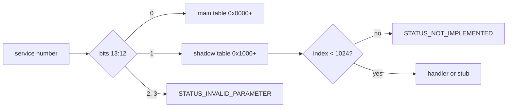

<!-- docs: covers=todo/08-graphics-ui/TODO-16-win32k-shadow-native-api.md sources=src/kernel/nt/ssdt.c,include/kernel/nt/ssdt.h,include/kernel/nt/syscall_filter.h,src/kernel/sched/syscall_fast.c reviewed=2026-09-29 order=16 -->
# Win32k Shadow Native API

## What is it?

This roadmap is the contract between the two system service tables: the main table from `0x0000` and the Win32k shadow table from `0x1000`. It fixes how a service number selects its table, what unimplemented and out-of-range numbers return, how the syscall filter and audit apply to both, which headers and static checks keep the numbering honest, how user mode learns the indexes, and how kernel-to-user callbacks will be reviewed. It owns no handlers; those are in the [Win32k Shadow SSDT](win32k-shadow-ssdt.md). None of its five sections is marked done, but much of the dispatch contract already holds in code.

## How does it work?

**Today.** Both system call entry points, `SYSCALL` in [`syscall_fast.c`](../../src/kernel/sched/syscall_fast.c) and `INT 0x2E`, hand the number to `ssdt_dispatch()` in [`ssdt.c`](../../src/kernel/nt/ssdt.c). What already holds toward this contract:

- **Table split (section 1).** Bits 13:12 select the table and bits 11:0 the index ([`ssdt.h`](../../include/kernel/nt/ssdt.h)). An index past a table's 1,024 slots returns `STATUS_NOT_IMPLEMENTED`, selectors 2 and 3 return `STATUS_INVALID_PARAMETER`, and every empty slot holds the not-implemented stub, so no number can reach an uninitialised handler.
- **Policy for both tables (section 3).** The per-process filter has a bitmap for each table and a switch that blocks the whole shadow table ([`syscall_filter.h`](../../include/kernel/nt/syscall_filter.h)); pledge and audit run on both.
- **Not built.** The `win32k_ssdt.h` header with `WIN32K_SERVICE_BASE` and a `WIN32K_SSDT_COUNT` static assert, `win32k_init()`, the user-mode index generator, `ZwGdi*` and `ZwUser*` aliases, and the callback review.

**Planned design.**

1. **Dispatch split and guard rails**: the base, the band and the stub policy written down and asserted.
2. **Status and buffer rules**: `NTSTATUS` returns and user-pointer probing shared with the main table.
3. **Static asserts, headers and audits**: `win32k_ssdt.h`, the count checked against the master table, and the audit tool extended to table 1.
4. **User-mode index contract**: generated index headers so `user32` and `gdi32` never hard-code numbers.
5. **Callback review**: how `KeUserModeCallback`, which lets the kernel call back into user mode for window procedures, is used safely.

## What are its interfaces?

| Interface | Status |
| --- | --- |
| `SSDT_TABLE_SHIFT`, `SSDT_INDEX_MASK`, `SSDT_TABLE_MAIN`, `SSDT_TABLE_SHADOW` | Shipped ([`ssdt.h`](../../include/kernel/nt/ssdt.h)) |
| `ssdt_dispatch()` routing and range checks | Shipped |
| `SYSCALL_FILTER_SHADOW_WORDS`, the disallow-Win32k filter switch | Shipped |
| `WIN32K_SERVICE_BASE`, `WIN32K_SSDT_COUNT`, `win32k_init()` | Planned, sections 1 and 3 |
| Generated user-mode index headers, `ZwGdi*` and `ZwUser*` | Planned, sections 3 and 4 |
| `KeUserModeCallback` use in Win32k | Planned, section 5 |

## How do I use it?

A user program issues a shadow call like any other system call, with the number in `EAX`. Today one that passes the syscall filter and the pledge gate returns `STATUS_NOT_IMPLEMENTED`; a filtered process gets `STATUS_ACCESS_DENIED`, and a pledged process is terminated, so a shadow call is never a harmless availability probe. The filter's shadow handling is covered by `bash scripts/test.sh SUITE=abi`.

## What is not implemented yet?

- [Dispatch split and guard rails](../../todo/08-graphics-ui/TODO-16-win32k-shadow-native-api.md#1-dispatch-split-and-guard-rails), including the 1,024-slot capacity against the 1,300 planned services.
- [NTSTATUS and user-buffer rules](../../todo/08-graphics-ui/TODO-16-win32k-shadow-native-api.md#2-ntstatus-and-user-buffer-rules) and [Static asserts, headers, and audits](../../todo/08-graphics-ui/TODO-16-win32k-shadow-native-api.md#3-static-asserts-headers-and-audits).
- [User-mode index contract](../../todo/08-graphics-ui/TODO-16-win32k-shadow-native-api.md#4-user-mode-index-contract) and [KeUserModeCallback integration review](../../todo/08-graphics-ui/TODO-16-win32k-shadow-native-api.md#5-keusermodecallback-integration-review).
- The callback mechanism itself is [Kernel-to-User-Mode Callback Dispatch](../../todo/02-kernel-core/TODO-12-native-api-ssdt.md#26-kernel-to-user-mode-callback-dispatch).

## How does it compare with Windows 11 and Linux?

Windows 11 keeps `ntoskrnl.exe` and `win32k.sys` services in separate tables chosen by the `0x1000` bit of the service number, and Win32k calls back into user mode with `KeUserModeCallback` for window procedures. Linux has a single linear `sys_call_table` with no table selector; its kernel graphics interface is the DRM/KMS `ioctl` set for display and buffers, with windowing left to user space. Impossible OS copies the Windows split, and already rejects out-of-range and unknown-table numbers at the dispatcher.

## See also

- [Win32k Shadow Native API roadmap](../../todo/08-graphics-ui/TODO-16-win32k-shadow-native-api.md)
- [Native API and the SSDT](../kernel/native-api-ssdt.md)
- [Win32k Shadow SSDT](win32k-shadow-ssdt.md)
- [Win32k Shadow SSDT Master Table](win32k-shadow-master-table.md)
